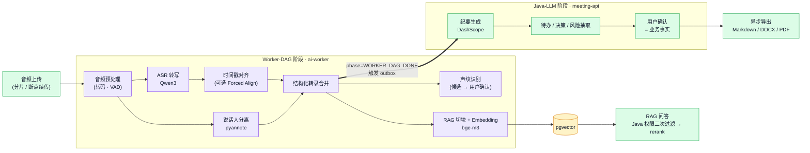
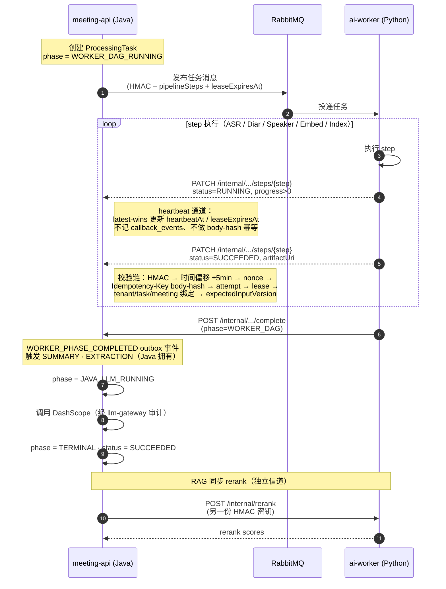

# 本地会议智能系统 · Meeting Intelligence

> **状态（2026-06-12）：v1.1.0 已发布（TOS 存储迁移 + Phase K 移除会议安全分级），生产就绪。**
> 变更详情见 [`RELEASE-NOTES-v1.1.0.md`](RELEASE-NOTES-v1.1.0.md)；Phase J 验收 runbook 在
> [`docs/runbooks/phase-j-acceptance.md`](docs/runbooks/phase-j-acceptance.md)。
>
> 把会议录音处理成结构化资料：上传 → 转写 → 分人 → 声纹识别 → 纪要 → 知识库 → RAG 问答 → 导出。
>
> 一期范围：本地 GPU 跑完 AI Pipeline；纪要 / 抽取 / 问答交给第三方 LLM；多租户 + RLS + 审计 + 信封加密；先做模块化单体，必要时再拆。

| 工作区 | 技术栈 | 角色 |
|---|---|---|
| [`apps/meeting-api`](apps/meeting-api/) | Java 17 · Spring Boot 3.3 · COLA-V5 多模块 Maven | 公开 API、SSE、内部回调接收、业务事实来源、任务编排（`:8080`） |
| [`apps/ai-worker`](apps/ai-worker/) | Python 3.11 · FastAPI · `uv` | GPU AI Pipeline（ASR / 分人 / 声纹 / Embedding / Rerank）+ 运维端 Workstation BFF（`:8090`） |
| [`apps/meeting-web`](apps/meeting-web/) | Node 20 · React 18 · Vite · TypeScript strict | 用户端 SPA，仅消费公开 API + SSE（`:5173`） |
| [`apps/ai-worker-web`](apps/ai-worker-web/) | Node 20 · React 18 · Vite · TypeScript strict | 运维端 Workstation SPA，由 ai-worker 挂载于 `/workstation/`（dev `:5174`） |
| [`packages/meeting-contracts`](packages/meeting-contracts/) | OpenAPI · JSON Schema · YAML 枚举 / 错误码 | 跨工程契约唯一事实源，驱动多语言 codegen |
| [`infra/meeting-infra`](infra/meeting-infra/) | Docker Compose · K8s · Terraform | 本地 + 部署定义，含可观测性栈 |

---

## 系统架构

边界很清楚：Java 写业务、判权限；Python 只跑计算。两边通过三条信道协作 —— RabbitMQ 任务下发、HMAC 内部回调、HMAC 同步 rerank。


**两个前端**：`meeting-web` 是用户端 SPA，只消费 meeting-api 的公开 REST + SSE；`ai-worker-web` 是运维端
Workstation，采用双后端模式——`/admin/*` 走 ai-worker 的 Admin BFF、`/api/*` 透传到 Java 公开 API，
认证用 Java 签发、ai-worker 校验的 JWT（`aud=ai-worker-admin`），构建产物挂载在 ai-worker 的 `/workstation/`。

更完整的逻辑视图（业务域 / 队列 / 模型层细分）见 [`docs/structure.md`](docs/structure.md)。

---

## 处理流水线

音频任务在 Java 这边拆成两段：Worker-DAG 阶段交给 Python（ASR / 分人 / 声纹 / Embedding / 索引），Java-LLM 阶段由 Java 自己跑（纪要、待办抽取）。AI 给出的结果默认只是建议，用户点击确认后才会写成业务事实。



**步骤归属**（写入 `processingStep` 时由 `source` 字段标记）：

| 步骤 | 拥有方 | callback `source` |
|---|---|---|
| `AUDIO_UPLOAD` | Java（任务创建时即标 `SUCCEEDED`） | — |
| `AUDIO_PREPROCESS` · `ASR` · `ALIGNMENT` · `DIARIZATION` · `SPEAKER_EMBEDDING` · `SPEAKER_MATCHING` · `TRANSCRIPT_MERGE` · `RAG_INDEXING` | ai-worker | `AI_WORKER_CALLBACK` |
| `SUMMARY` · `EXTRACTION` | Java `TaskStepProgressService` | `JAVA_TASK_SERVICE` |
| `EXPORT` | Java `export-queue` 消费者 | — |

> RabbitMQ 任务消息的 `pipelineSteps` **必须不包含** `AUDIO_UPLOAD` / `SUMMARY` / `EXTRACTION` / `EXPORT`，由 Schema 与 ai-worker fail-fast 双重保护。

---

## 回调与鉴权时序

Java 和 ai-worker 之间有两份独立的 HMAC 密钥 —— 方向不同、不能复用。Java 收到回调时按九步链路验签。



**双向 HMAC 密钥**（来源：`apps/meeting-api/.../application.yml` · `apps/ai-worker/.../config.py`）

| 配置键 | 用途 | 方向 |
|---|---|---|
| `meeting.callback.hmac-secret` ↔ `AI_WORKER_CALLBACK_HMAC_SECRET` | ai-worker → Java 内部回调 | 出站签名 / 入站验签 |
| `meeting.ai-worker.hmac-secret` ↔ `AI_WORKER_INTERNAL_API_HMAC_SECRET` | Java → ai-worker rerank / workflow control | 出站签名 / 入站验签 |

> ⚠️ HMAC `signing_string` 的 `URL_PATH_WITH_QUERY` 必须包含 `/internal` 前缀；servlet 相对路径会破坏验签。

---

## 仓库结构

```text
meeting/
├── apps/
│   ├── meeting-api/                          # Java 17 · Spring Boot 3.3 · COLA-V5
│   │   ├── meeting-api-start/                #   启动模块
│   │   ├── meeting-api-adapter/              #   HTTP / SSE / 协议翻译
│   │   ├── meeting-api-app/                  #   事务 · 权限编排 · Outbox
│   │   ├── meeting-api-domain/               #   聚合 · 事件 · 端口
│   │   ├── meeting-api-infrastructure/       #   Repo / MQ / KMS / TOS / DashScope
│   │   │   └── src/main/resources/db/migration/  # Flyway: 运行时 schema 事实源
│   │   └── meeting-api-client/               #   对外契约 + codegen 输出
│   ├── ai-worker/                            # Python 3.11 · FastAPI · uv（GPU Pipeline + Workstation BFF）
│   │   ├── ai_worker/                        #   应用代码（含 admin/ Workstation BFF）
│   │   ├── ai_worker/generated/              #   契约 codegen（勿手改）
│   │   └── tests/                            #   pytest
│   ├── meeting-web/                          # 用户端 SPA · React 18 · Vite · TS strict
│   │   └── src/shared/api/types.gen.ts       #   契约 codegen（勿手改）
│   └── ai-worker-web/                        # 运维端 Workstation SPA · 挂载于 /workstation/
│       └── src/shared/api/types.gen.ts       #   契约 codegen（勿手改）
├── packages/
│   └── meeting-contracts/                    # 跨工程契约唯一事实源
│       ├── openapi/                          #   public / internal-callback / ai-worker-internal
│       ├── schemas/                          #   RabbitMQ JSON Schema + 枚举/错误码 YAML
│       └── scripts/check-consistency.sh      #   CI 门禁
├── infra/meeting-infra/
│   ├── docker/compose/                       # 本地一键栈
│   ├── k8s/ · terraform/                     # 部署定义
│   └── observability/                        # Prom / Grafana 看板 / Loki
├── scripts/                                  # 各工程 start/stop/restart 统一无参入口（见 scripts/README.md）
├── deploy/                                   # 生产部署脚本 + DEPLOY.md
└── docs/
    ├── structure.md                          # 完整逻辑视图（详细 mermaid）
    ├── app-api-contracts.md                  # 跨工程 API / MQ / 回调契约
    ├── model-registry.md                     # 模型注册与版本
    ├── 本地会议智能系统技术方案文档-优化版.md   # 完整技术方案
    ├── runbooks/                             # 运维 / 验收 runbook
    ├── decisions/                            # 架构决策记录（ADR）
    └── ddls/                                 # PostgreSQL DDL 评审快照（非运行时事实源）
```

---

## 快速开始

### 前置依赖

> **JDK 必须是 17。** 后端 Maven enforcer 锁死 `[17,18)`，JDK 21 会直接构建失败。
> 跑 `apps/meeting-api` 下任何 `./mvnw` 命令前先 `java -version` 确认一下。macOS：
>
> ```bash
> export JAVA_HOME=$(/usr/libexec/java_home -v 17)
> ```

- **JDK 17** · 仓库自带 `./mvnw`，本机不用装 Maven
- **Node 20+** · 前端 + 契约 codegen
- **Python 3.11+** + [`uv`](https://docs.astral.sh/uv/)：`curl -LsSf https://astral.sh/uv/install.sh | sh`
- **Docker** + Docker Compose · 本地基础设施栈
- **NVIDIA GPU** · 24GB 显存起（RTX 3090 / 4090），只有 ai-worker 用；本机没 GPU 时可以跳过音频 Pipeline
- **DashScope API Key** · 生产环境用，本地开发可填占位

### 1 一次性配置（首次克隆后）

```bash
# 1.1 装上仓库自带的 git hooks（gitleaks + 改动文件的 YAML / Bash 语法 pre-commit）
bash scripts/install-git-hooks.sh

# 1.2 复制环境变量
cp .env.example .env

# 1.3 生成两份独立的 HMAC 密钥，写回 .env 替换 change-me-* 占位
openssl rand -hex 32   # → AI_WORKER_CALLBACK_HMAC_SECRET
openssl rand -hex 32   # → AI_WORKER_INTERNAL_API_HMAC_SECRET
```

两份 HMAC 用途相反，不要复用：

| 变量 | 出站方 | 入站验签方 |
|---|---|---|
| `AI_WORKER_CALLBACK_HMAC_SECRET` | ai-worker | Java（`/internal/processing-tasks/...` 系列回调） |
| `AI_WORKER_INTERNAL_API_HMAC_SECRET` | Java | ai-worker（`/internal/rerank` 等同步调用） |

### 2 启动本地基础设施

```bash
docker compose -f infra/meeting-infra/docker/compose/docker-compose.yml up -d
```

会拉起 PostgreSQL 15 + pgvector、RabbitMQ（含 seed 好的 7 个队列）、Vault-dev（KMS 替代）。要带监控就再加 `--profile observability`，会同时拉起 Prometheus + Grafana。对象存储（音频 / 中间产物 / 导出）走 OSS / TOS（由 `STORAGE_TYPE=oss|tos` 选择，需配置真实 endpoint 与密钥）——本地 compose 不内置 MinIO，ai-worker 本地默认用文件系统（`AI_WORKER_STORAGE_BACKEND=local`）。

健康检查样例：

```bash
COMPOSE="docker compose -f infra/meeting-infra/docker/compose/docker-compose.yml"

$COMPOSE exec postgres pg_isready
curl -s -u meeting:meeting_dev http://localhost:15672/api/queues/%2f | jq '.[].name'
# 应能看到 audio-cpu-queue / gpu-asr-queue / gpu-diar-queue / gpu-speaker-queue / embed-queue / llm-queue / export-queue
curl -s http://localhost:8200/v1/sys/health | jq -r '.sealed' # Vault 应为 false
```

排障细则见 [`infra/meeting-infra/README.md`](infra/meeting-infra/README.md)。

### 3 启动应用

**统一入口（推荐）**：`scripts/` 下每个工程一组固定命名、无需参数的启停脚本，详见
[`scripts/README.md`](scripts/README.md)。

```bash
./scripts/all-start.sh         # 一键启动全部：meeting-api → ai-worker → ai-worker-web → meeting-web
./scripts/all-stop.sh          # 一键停止全部（按相反顺序）
# 或单独控制：./scripts/meeting-api-start.sh / ai-worker-start.sh / meeting-web-restart.sh ...
```

**手动启动（开发调试）**：

```bash
# 业务层（:8080）—— 启动时 Flyway 自动应用 schema 迁移
cd apps/meeting-api
./mvnw -pl meeting-api-start -am install -DskipTests
java -jar meeting-api-start/target/meeting-api-start-0.1.0-SNAPSHOT.jar

# 计算层（:8090）—— GPU Pipeline + 运维端 Workstation BFF
cd apps/ai-worker
uv sync --extra dev
uv run ai-worker-api

# 用户端前端（:5173，开发服务器代理 /api → :8080）
cd apps/meeting-web
npm install
npm run dev

# 运维端 Workstation 前端（:5174，base /workstation/）
cd apps/ai-worker-web
npm install
npm run dev
```

> 启动 Java 之前如果默认 JDK 不是 17，先 `export JAVA_HOME=$(/usr/libexec/java_home -v 17)`。
> Java 首次启动会自动跑 `meeting-api-infrastructure/.../db/migration/V*.sql` 下的 Flyway 脚本。

### 4 测试与门禁

| 工作区 | 命令 | 范围 | 需要 Docker |
|---|---|---|---|
| `apps/meeting-api` | `./mvnw test` | 单元 + ArchUnit 边界（JDK 17） | 否 |
| `apps/meeting-api` | `./mvnw verify -q` | 全量 + Testcontainers 集成（JDK 17） | **是** |
| `apps/ai-worker` | `uv run pytest tests/` + `uv run pyright ai_worker/` | 单元 + 类型 | 否 |
| `apps/meeting-web` | `npm test` + `npx tsc --noEmit` + `npm run lint` | Vitest + 类型 + ESLint | 否 |
| `apps/ai-worker-web` | `npm run type-check && npm test && npm run build` | TS strict + Vitest + 构建（CI 门禁） | 否 |
| `packages/meeting-contracts` | `npm run check` + `npm run codegen:check-temp` | 契约一致性 + 无副作用 drift 检查（Java codegen 需 JDK 17） | 否 |

### 5 改了契约之后

只有动了 `packages/meeting-contracts/` 下的 YAML / Schema 才需要跑这一步：

```bash
cd packages/meeting-contracts
npm install                       # 一次性
npm run check                     # Spectral + JSON Schema + 枚举一致性 + fixtures
npm run codegen                   # 重写 TS / Python / Java 生成代码
git diff                          # 提交时生成产物的 diff 必须一并交上
```

CI 用 `npm run codegen:check-temp` 兜底：如果它在临时目录生成的产物和仓库里不一样，CI 直接红。

---

## 部署手册

> 本节是**面向部署的速查手册**：部署形态、统一入口、生产前置、关键配置（含多副本/可靠性可调项）、上线核对清单。
> 逐步流程、K8s 清单细节、Terraform、平台分流（Linux GPU / Apple Silicon / WSL2）、故障排查见 [`deploy/DEPLOY.md`](deploy/DEPLOY.md)；
> 各阶段验收 runbook 见 [`docs/runbooks/`](docs/runbooks/)。

### 1 部署形态

三种形态共用同一份镜像与契约，区别只在编排方式：

| 形态 | 适用 | 入口 | 说明 |
|---|---|---|---|
| **本地 Docker Compose** | 开发 / 联调 / smoke | `./deploy/deploy.sh local` | 拉起 PostgreSQL+pgvector、RabbitMQ（7 队列 + DLQ）、Vault-dev；ai-worker 默认 fake runtime |
| **Docker 镜像** | 自建主机 / 单机 GPU | `./deploy/deploy.sh build` → `push` | `meeting-api`、`meeting-web`、`ai-worker`（CPU/fake）与 `ai-worker:cuda`（真实模型）四类镜像 |
| **Kubernetes（kustomize）** | staging / 生产 | `./deploy/deploy.sh k8s-deps <env>` → `k8s-dev` / `k8s-prod` | `infra/meeting-infra/k8s/{base,overlays/{dev,prod}}`；meeting-api 走 Deployment+HPA，ai-worker 走 GPU StatefulSet |

边界不变量同样约束部署：**Java 持业务库 / KMS / LLM 凭证，ai-worker 只持两份 HMAC 密钥 + 只读对象存储凭证**（见下方「关键设计约束」）。

### 2 统一部署入口：`deploy/deploy.sh`

| 子命令 | 作用 |
|---|---|
| `local` / `local-down` / `local-status` / `clean` | 本地全栈起停 / 状态 / 清卷 |
| `build` / `push <registry> <tag>` | 构建 / 推送镜像（生产 ai-worker 推 `ai-worker:cuda-<tag>`，prod overlay 引用的就是这个 tag） |
| `health` / `logs <svc>` | 健康检查 / 跟日志 |
| `db-migrate <env>` | 触发 Flyway（重启 meeting-api，启动时自动迁移） |
| `k8s-deps <env>` | 命名空间内依赖（PostgreSQL+pgvector / RabbitMQ+definitions / 对象存储）—— **apply overlay 之前必须先跑** |
| `k8s-dev` / `k8s-prod` / `k8s-status <env>` / `k8s-destroy <env>` | 应用层部署 / 状态 / 销毁 |
| `terraform-plan <env>` / `terraform-apply <env>` | 云基础设施（RDS / S3 / KMS） |

平台专用一站式脚本：`deploy/meeting-api-java.sh`（JDK17/Flyway 三路径）、`deploy/ai-worker-apple-silicon.sh`（arm64 全量真实模型）。

### 3 生产前置（缺一即起不来）

1. **JDK 17 构建 meeting-api**：Maven enforcer 锁 `[17,18)`，JDK 21 直接构建失败（`export JAVA_HOME=$(/usr/libexec/java_home -v 17)`）。
2. **ai-worker 走 CUDA 镜像**：`docker build --build-arg UV_EXTRAS=real-models -f apps/ai-worker/Dockerfile .`；CPU/fake 镜像不含 FlagEmbedding/funasr/pyannote，首个真实任务会 crash。
3. **模型权重按版本目录落盘** PVC（checksum guard 依赖版本子目录）：`/opt/models/bge-m3/v1/`、`/opt/models/bge-reranker-v2-m3/v1/`、`/opt/models/qwen3-asr-1.7b/v2026.05.1/`、`/opt/models/pyannote/v3.1/`，并设 `AI_WORKER_*_EXPECTED_CHECKSUM=sha256:...`。
4. **两份独立 HMAC 密钥**（≥32 字节、互不相同）：`openssl rand -hex 32` 各生成一份；生产不要设 `AI_WORKER_ALLOW_INSECURE_SECRETS`（默认 false 时启动会对默认/过短密钥 fail-fast）。
5. **meeting-api prod profile**：prod overlay 注入 `SPRING_PROFILES_ACTIVE=prod`，`ProdProfileValidator` 会校验 HMAC 双密钥、`AI_WORKER_BASE_URL` 不含 localhost、`KMS_MASTER_KEY_ID` 非 demo 值、`SPRING_FLYWAY_BASELINE_ON_MIGRATE=false`（详见 [`deploy/DEPLOY.md`](deploy/DEPLOY.md) §5.7）。
6. **对象存储**：`STORAGE_TYPE=oss|tos` + 对应 endpoint/密钥（已无 MinIO）；ai-worker 读路径用只读 RAM 凭证（`AI_WORKER_STORAGE_BACKEND=tos`）。

### 4 关键配置项

完整清单见 `.env.example` 与 `apps/ai-worker/ai_worker/common/config.py`（前缀 `AI_WORKER_`）/ `apps/meeting-api/.../application.yml`。最常调整的：

**meeting-api（Java）**

| 变量 | 用途 |
|---|---|
| `SPRING_PROFILES_ACTIVE` | 生产置 `prod` 触发 `ProdProfileValidator` |
| `POSTGRES_HOST/PORT/DB`、`RABBITMQ_HOST/PORT` | 依赖端点（托管服务在 overlay 覆盖） |
| `STORAGE_TYPE` + `OSS_*` / TOS endpoint | 对象存储后端 |
| `DASHSCOPE_API_KEY` | LLM（经 llm-gateway 审计） |
| `KMS_MASTER_KEY_ID`、`MEETING_KMS_MASTER_KEY_BASE64` | 声纹 embedding 信封加密主密钥（本地实现不设则重启即失能） |
| `AI_WORKER_BASE_URL` | rerank 同步调用目标 |
| `AI_WORKER_CALLBACK_HMAC_SECRET` / `AI_WORKER_INTERNAL_API_HMAC_SECRET` | 两份 HMAC（绑定到 `meeting.callback.hmac-secret` / `meeting.ai-worker.hmac-secret`，方向见上方「双向 HMAC 密钥」表） |

**ai-worker（Python，前缀 `AI_WORKER_`）**

| 变量 | 默认 | 用途 |
|---|---|---|
| `CALLBACK_HMAC_SECRET` / `INTERNAL_API_HMAC_SECRET` | dev 占位 | 回调出站签名 / 内部 API 入站验签（与 Java 反向配对） |
| `MEETING_API_BASE_URL` | `http://localhost:8080` | 回调目标 |
| `RABBITMQ_HOST/PORT/...`、`RABBITMQ_TASK_QUEUES` | localhost / 5 队列 | 任务消费 |
| `USE_FAKE_RUNTIME` / `USE_FAKE_ASR_RUNTIME` / `USE_FAKE_DIARIZATION_RUNTIME` / `USE_FAKE_SPEAKER_RUNTIME` | `true` | **生产必须全置 `false`** |
| `*_MODELS_DIR` / `*_EXPECTED_CHECKSUM` | unset | 权重路径 + checksum guard |
| `STORAGE_BACKEND` + `TOS_*` | `local` | 读路径对象存储 |
| `HF_HUB_OFFLINE` / `TRANSFORMERS_OFFLINE` | — | 生产置 `1`，禁止运行时下载 |

### 5 多副本与可靠性可调项（本轮审查新增/收口）

| 变量 / 机制 | 默认 | 说明 |
|---|---|---|
| `AI_WORKER_NONCE_REDIS_URL` | unset（进程内） | **多副本生产必设**为共享 Redis，否则针对不同 Pod 的回放攻击不会被识破；Redis 抖动时降级为内存检查（不拒请求），且校验已移出事件循环 |
| `AI_WORKER_RABBITMQ_PREFETCH_COUNT` | `1` | 提到 >1 可让 CPU(embed) 任务在长 GPU(ASR/diar) 任务后流水线化；GPU 并发仍由各 `*_MAX_CONCURRENCY` 信号量限制 |
| `AI_WORKER_CALLBACK_MAX_RETRIES` | `3` | 回调重试上限（已按错误信封 `retryable` 标志区分瞬时/终态：401 时钟偏移、409 版本/租约冲突会重试，幂等回放为终态） |
| `AI_WORKER_MODEL_LOAD_TIMEOUT_SECONDS` | `600` | 模型加载超时（现已在每个 runtime 的 `ensure_loaded()` 生效） |
| `AI_WORKER_ASR_INFERENCE_TIMEOUT_{BASE,PER_AUDIO_MINUTE}_SECONDS` | `300` / `120` | ASR 推理超时按音频时长伸缩；卡死的步骤转为可重试终态而非永久 RUNNING |
| `AI_WORKER_DIARIZATION_INFERENCE_TIMEOUT_{BASE,PER_AUDIO_MINUTE}_SECONDS` | `300` / `120` | 分人推理超时 |
| `AI_WORKER_FFPROBE_TIMEOUT_SECONDS` | `30` | ffprobe 元数据探测超时（超时杀子进程） |
| `AI_WORKER_SPEAKER_MIN_CONFIDENCE` / `AI_WORKER_SPEAKER_TOP_K` | `0.35` / `5` | 声纹匹配阈值与候选数，换模型时按操作点调（此前写死，现可配） |

> 优雅停机：消费者已注册 SIGTERM/SIGINT，收到信号后排空在途 ack、等 TOS 备份上传完、关闭 httpx 连接——K8s `terminationGracePeriodSeconds` 给足（默认 30s 通常够；长任务在飞时可适当调大）。
> 发布可靠性：meeting-api 的 RabbitMQ 发布器启用了 publisher confirms + ReturnListener，发布失败/不可路由会标 `OUTBOX_PUBLISH_FAILED` 重试而非静默丢弃。

### 6 上线核对清单

- [ ] 两份 HMAC 密钥已生成、互不相同、≥32 字节；`AI_WORKER_ALLOW_INSECURE_SECRETS` 未设。
- [ ] meeting-api `SPRING_PROFILES_ACTIVE=prod` 且 `ProdProfileValidator` 全绿（KMS id 非 demo、`MEETING_KMS_MASTER_KEY_BASE64` 已固定、Flyway baseline=false）。
- [ ] ai-worker `USE_FAKE_*_RUNTIME=false`、`HF_HUB_OFFLINE=1`、模型权重 + `*_EXPECTED_CHECKSUM` 就位，`GET /internal/ready` 返回 200。
- [ ] 对象存储 `STORAGE_TYPE` + endpoint/密钥配好；ai-worker 用只读凭证。
- [ ] 多副本部署：`AI_WORKER_NONCE_REDIS_URL` 指向共享 Redis。
- [ ] RabbitMQ 7 队列 + DLQ 已 seed（`k8s-deps` 注入 `definitions.json`）。
- [ ] 依赖（PG / MQ / 对象存储 / Ingress / 模型 PVC）先于 overlay 就绪（`k8s-deps` 或托管服务 overlay 覆盖）。
- [ ] `kubectl rollout status` 三个工作负载全部 Ready；`GET /internal/health`、`/internal/hardware` 正常。
- [ ] 可观测性：`--profile observability`（本地）或托管 Prometheus/Grafana 已接 metrics/logs。

---

## 关键设计约束（跨文件不可见的不变量）

下面这些约束在单个文件里看不出来，但改动时必须心里有数。背景与完整技术方案见 [`docs/本地会议智能系统技术方案文档-优化版.md`](docs/本地会议智能系统技术方案文档-优化版.md)。

1. **Java 管业务，Python 管计算**：ai-worker 不持业务库凭证、不判权限、不调第三方 LLM。
2. **AI 产物 ≠ 业务事实**：纪要 / 待办 / 决策 / 风险默认是建议；重生成时给出 diff，不会静默覆盖用户已确认的字段。
3. **数据出网边界**：纪要 / 抽取 / RAG 问答统一经 llm-gateway 调 DashScope（一期不做脱敏）。会议**不做安全分级**——SecurityLevel 枚举与 LLM 阻断门已在 Phase K 移除，勿回加。音频、声纹音频、声纹 embedding、原始声纹模型输出一律不出网。
4. **声纹 embedding 一律 KMS 信封加密**：ai-worker 用 internal-TLS + HMAC 上送明文 `embedding.values`，Java 落库前过一次 KMS 信封加密。明文不进 TOS、不进日志、不进任何 Public DTO；回调拿到 ack 之后 ai-worker 清掉进程内引用。
5. **RAG 权限 Java 实时算**：pgvector 只是候选召回；检索结果再过一次 PG 权限过滤；只有 `status=ACTIVE AND stale_status=ACTIVE` 的 chunk 进入 rerank。
6. **STALE 与业务 status 分离**：编辑转录会级联把下游的纪要 / 事项 / RAG chunk 标 STALE；缓存键里带版本号区分。
7. **Outbox 模式**：领域事件和业务写在同一个事务进 `domain_events_outbox`；按聚合的 `sequence_no` 单调（`SELECT … FOR UPDATE`）；发布者用 `FOR UPDATE SKIP LOCKED` 抽。
8. **Heartbeat 走单独通道**：`PATCH .../steps/{step}` 带 `status=RUNNING && progress>0` 算心跳，latest-wins 更新，不记 `callback_events`、不做 body-hash 幂等；首个 `RUNNING(progress=0)` / `SUCCEEDED` / `FAILED` 还是走正常幂等表。
9. **RLS 全表强制**：所有租户表 `ENABLE + FORCE ROW LEVEL SECURITY`；每个事务前置写 `app.tenant_id` / `app.user_id` / `app.request_id`，连接归池时重置；缺租户上下文 fail-closed。
10. **回调九步校验链**：HMAC → 时间偏移 → nonce → `Idempotency-Key` body-hash → attempt-no → lease owner → tenant/task/meeting 绑定 → `expectedInputVersion`，缺一不可。
11. **Lease 生命周期**：Worker 持 `leaseOwner` + `leaseExpiresAt`，每 15–30s 心跳一次，TTL 120s；过期 → `ORPHANED` → 重入队；用户取消走 `CANCEL_PENDING` → `CANCELLED`。

---

## 契约即唯一事实源

[`packages/meeting-contracts/`](packages/meeting-contracts/) 是以下接口的唯一事实源：

- **HTTP / SSE**：`openapi/public-api.yaml` · `openapi/internal-callback-api.yaml` · `openapi/ai-worker-internal-api.yaml`
- **RabbitMQ**：`schemas/rabbitmq/processing-task-message.schema.json`（Java → ai-worker）· `schemas/rabbitmq/export-job-message.schema.json`（Java 内部 `export-queue` 消费）
- **跨语言枚举 / 错误码**：`schemas/common/enums.yaml` · `schemas/common/error-codes.yaml`

改契约的顺序：先改 YAML / Schema → `npm run check` → `npm run codegen` → 同步 `meeting-api-client` 里的手写 DTO → 提交。CI 会校验 `npm run codegen` 之后 `git diff` 是干净的。

统一响应信封：`{success, data, error: {code, message, retryable, details}|null, requestId, traceId}`。非登录写操作必带 `X-Request-Id` · `X-Trace-Id` · `Idempotency-Key`。JSON camelCase；时间戳 ISO-8601 UTC；音频偏移用毫秒整数（`startMs` / `endMs`）；置信度 ∈ [0,1]；枚举 SCREAMING_SNAKE。

---

## 一期范围

**必做**：内置账号 + 租户 + RLS · 会议创建 + 4h 音频分片上传 · 本地 AI Pipeline 全链路 · 声纹注册 / 授权 / 候选确认 · DashScope 纪要 + 抽取 · 文档知识库（PDF/DOCX/TXT/MD）· RAG 问答（pgvector + 权限 + citation）· Markdown/DOCX/PDF 异步导出 · 任务 SSE / 失败重试 / 幂等回调 · 删除 / legal hold / break-glass 审计。

**不做**：实时字幕 · 在线协同编辑 · 飞书 / 企微 / Jira 集成 · OCR · 全公司声纹搜索 · 会议安全分级（Phase K 移除）· 本地大模型。

完整技术方案见 [`docs/本地会议智能系统技术方案文档-优化版.md`](docs/本地会议智能系统技术方案文档-优化版.md)。

---

## 文档索引

| 文档 | 内容 |
|---|---|
| [`docs/本地会议智能系统技术方案文档-优化版.md`](docs/本地会议智能系统技术方案文档-优化版.md) | 完整技术方案：术语、目标、架构、选型、Pipeline、安全、部署 |
| [`docs/structure.md`](docs/structure.md) | 完整逻辑视图（详细业务域 + 队列 + 模型层 mermaid） |
| [`docs/app-api-contracts.md`](docs/app-api-contracts.md) | 跨工程契约：Public API、Internal Callback、RabbitMQ、TOS URI、幂等、版本 |
| [`docs/model-registry.md`](docs/model-registry.md) | AI 模型注册与版本策略 |
| [`docs/runbooks/`](docs/runbooks/) | 运维 / 验收 runbook（Apple Silicon、备份恢复、legal hold、阶段验收） |
| [`docs/decisions/`](docs/decisions/) | 架构决策记录（ADR） |
| [`docs/ddls/`](docs/ddls/) | PostgreSQL DDL 评审快照（非运行时事实源） |
| [`deploy/DEPLOY.md`](deploy/DEPLOY.md) | 生产部署手册（脚本 + 流程） |
| [`scripts/README.md`](scripts/README.md) | 各工程统一启停脚本说明 |
| [`RELEASE-NOTES-v1.1.0.md`](RELEASE-NOTES-v1.1.0.md) | v1.1.0 发布说明（TOS 迁移 + Phase K） |
| 各工程 `README.md` | [`meeting-api`](apps/meeting-api/) · [`ai-worker`](apps/ai-worker/) · [`meeting-web`](apps/meeting-web/) · [`ai-worker-web`](apps/ai-worker-web/) · [`meeting-contracts`](packages/meeting-contracts/) · [`meeting-infra`](infra/meeting-infra/) |

---

## License

[待定]
