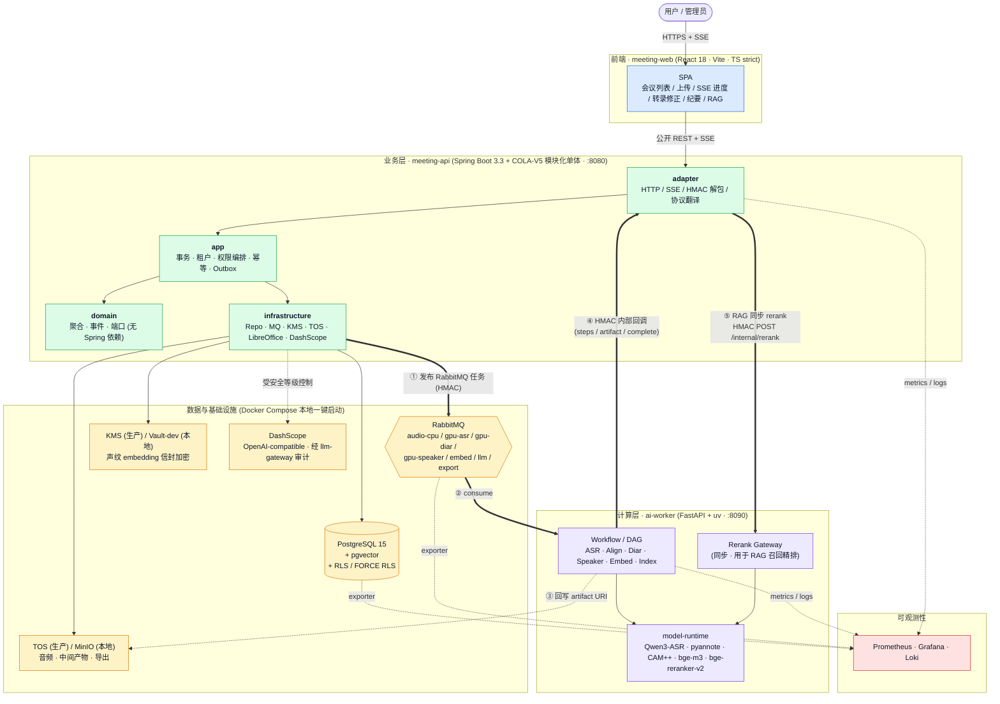
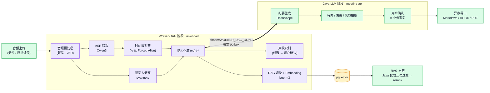
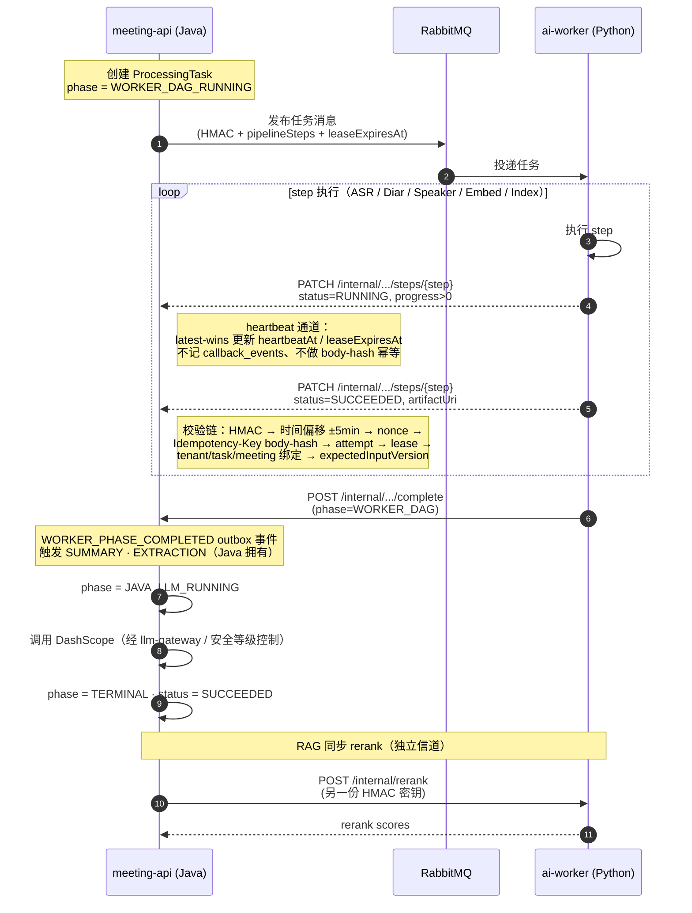

# 本地会议智能系统 · Meeting Intelligence

> **状态（2026-05-19）：v1 代码已完成，剩 Phase J 的预发布验收。**
> 收尾清单看 [`final-check.md`](final-check.md)；还有 9 项验收任务，做法见
> [`docs/runbooks/phase-j-acceptance.md`](docs/runbooks/phase-j-acceptance.md)。
>
> 把会议录音处理成结构化资料：上传 → 转写 → 分人 → 声纹识别 → 纪要 → 知识库 → RAG 问答 → 导出。
>
> 一期范围：本地 GPU 跑完 AI Pipeline；纪要 / 抽取 / 问答交给第三方 LLM；多租户 + RLS + 审计 + 信封加密；先做模块化单体，必要时再拆。

| 工作区 | 技术栈 | 角色 |
|---|---|---|
| [`apps/meeting-api`](apps/meeting-api/) | Java 17 · Spring Boot 3.3 · COLA-V5 多模块 Maven | 公开 API、SSE、内部回调接收、业务事实来源、任务编排 |
| [`apps/ai-worker`](apps/ai-worker/) | Python 3.11 · FastAPI · `uv` | GPU AI Pipeline（ASR / 分人 / 声纹 / Embedding / Rerank） |
| [`apps/meeting-web`](apps/meeting-web/) | Node 20 · React 18 · Vite · TypeScript strict | SPA 前端，仅消费公开 API + SSE |
| [`packages/meeting-contracts`](packages/meeting-contracts/) | OpenAPI · JSON Schema · YAML 枚举 / 错误码 | 跨工程契约唯一事实源，驱动多语言 codegen |
| [`infra/meeting-infra`](infra/meeting-infra/) | Docker Compose · K8s · Terraform | 本地 + 部署定义，含可观测性栈 |

---

## 系统架构

边界很清楚：Java 写业务、判权限；Python 只跑计算。两边通过三条信道协作 —— RabbitMQ 任务下发、HMAC 内部回调、HMAC 同步 rerank。



更完整的逻辑视图（业务域 / 队列 / 模型层细分）见 [`docs/structure.md`](docs/structure.md)。

---

## 处理流水线

音频任务在 Java 这边拆成两段：Worker-DAG 阶段交给 Python（ASR / 分人 / 声纹 / Embedding / 索引），Java-LLM 阶段由 Java 自己跑（纪要、待办抽取）。AI 给出的结果默认只是建议，用户点击确认后才会写成业务事实。



**步骤归属**（写入 `processingStep` 时由 `source` 字段标记）：

| 步骤 | 拥有方 | callback `source` |
|---|---|---|
| `AUDIO_UPLOAD` | Java（任务创建时即标 `SUCCEEDED`） | — |
| `AUDIO_PREPROCESS` · `ASR` · `ALIGNMENT` · `DIARIZATION` · `SPEAKER_EMBEDDING` · `SPEAKER_MATCHING` · `TRANSCRIPT_MERGE` · `RAG_INDEXING` | ai-worker | `AI_WORKER_CALLBACK` |
| `SUMMARY` · `EXTRACTION` | Java `TaskStepProgressService` | `JAVA_TASK_SERVICE` |
| `EXPORT` | Java `export-queue` 消费者 | — |

> RabbitMQ 任务消息的 `pipelineSteps` **必须不包含** `AUDIO_UPLOAD` / `SUMMARY` / `EXTRACTION` / `EXPORT`，由 Schema 与 ai-worker fail-fast 双重保护。

---

## 回调与鉴权时序

Java 和 ai-worker 之间有两份独立的 HMAC 密钥 —— 方向不同、不能复用。Java 收到回调时按九步链路验签。



**双向 HMAC 密钥**（来源：`apps/meeting-api/.../application.yml` · `apps/ai-worker/.../config.py`）

| 配置键 | 用途 | 方向 |
|---|---|---|
| `meeting.callback.hmac-secret` ↔ `AI_WORKER_CALLBACK_HMAC_SECRET` | ai-worker → Java 内部回调 | 出站签名 / 入站验签 |
| `meeting.ai-worker.hmac-secret` ↔ `AI_WORKER_INTERNAL_API_HMAC_SECRET` | Java → ai-worker rerank / workflow control | 出站签名 / 入站验签 |

> ⚠️ HMAC `signing_string` 的 `URL_PATH_WITH_QUERY` 必须包含 `/internal` 前缀；servlet 相对路径会破坏验签。

---

## 仓库结构

```text
meeting/
├── apps/
│   ├── meeting-api/                          # Java 17 · Spring Boot 3.3 · COLA-V5
│   │   ├── meeting-api-start/                #   启动模块
│   │   ├── meeting-api-adapter/              #   HTTP / SSE / 协议翻译
│   │   ├── meeting-api-app/                  #   事务 · 权限编排 · Outbox
│   │   ├── meeting-api-domain/               #   聚合 · 事件 · 端口
│   │   ├── meeting-api-infrastructure/       #   Repo / MQ / KMS / TOS / DashScope
│   │   │   └── src/main/resources/db/migration/  # Flyway: 运行时 schema 事实源
│   │   └── meeting-api-client/               #   对外契约 + codegen 输出
│   ├── ai-worker/                            # Python 3.11 · FastAPI · uv
│   │   ├── ai_worker/                        #   应用代码
│   │   ├── ai_worker/generated/              #   契约 codegen（勿手改）
│   │   └── tests/                            #   pytest
│   └── meeting-web/                          # React 18 · Vite · TS strict
│       └── src/shared/api/types.gen.ts       #   契约 codegen（勿手改）
├── packages/
│   └── meeting-contracts/                    # 跨工程契约唯一事实源
│       ├── openapi/                          #   public / internal-callback / ai-worker-internal
│       ├── schemas/                          #   RabbitMQ JSON Schema + 枚举/错误码 YAML
│       └── scripts/check-consistency.sh      #   CI 门禁
├── infra/meeting-infra/
│   ├── docker/compose/                       # 本地一键栈
│   ├── k8s/ · terraform/                     # 部署定义
│   └── observability/                        # Prom / Grafana 看板 / Loki
└── docs/
    ├── spec.md                               # 一期可执行规格
    ├── structure.md                          # 完整逻辑视图（详细 mermaid）
    ├── app-api-contracts.md                  # 跨工程 API / MQ / 回调契约
    ├── model-registry.md                     # 模型注册与版本
    └── ddls/                                 # PostgreSQL DDL 评审快照（非运行时事实源）
```

---

## 快速开始

### 前置依赖

> **JDK 必须是 17。** 后端 Maven enforcer 锁死 `[17,18)`，JDK 21 会直接构建失败。
> 跑 `apps/meeting-api` 下任何 `./mvnw` 命令前先 `java -version` 确认一下。macOS：
>
> ```bash
> export JAVA_HOME=$(/usr/libexec/java_home -v 17)
> ```

- **JDK 17** · 仓库自带 `./mvnw`，本机不用装 Maven
- **Node 20+** · 前端 + 契约 codegen
- **Python 3.11+** + [`uv`](https://docs.astral.sh/uv/)：`curl -LsSf https://astral.sh/uv/install.sh | sh`
- **Docker** + Docker Compose · 本地基础设施栈
- **NVIDIA GPU** · 24GB 显存起（RTX 3090 / 4090），只有 ai-worker 用；本机没 GPU 时可以跳过音频 Pipeline
- **DashScope API Key** · 生产环境用，本地开发可填占位

### 1 一次性配置（首次克隆后）

```bash
# 1.1 装上仓库自带的 git hooks（gitleaks + 改动文件的 YAML / Bash 语法 pre-commit）
bash scripts/install-git-hooks.sh

# 1.2 复制环境变量
cp .env.example .env

# 1.3 生成两份独立的 HMAC 密钥，写回 .env 替换 change-me-* 占位
openssl rand -hex 32   # → AI_WORKER_CALLBACK_HMAC_SECRET
openssl rand -hex 32   # → AI_WORKER_INTERNAL_API_HMAC_SECRET
```

两份 HMAC 用途相反，不要复用：

| 变量 | 出站方 | 入站验签方 |
|---|---|---|
| `AI_WORKER_CALLBACK_HMAC_SECRET` | ai-worker | Java（`/internal/processing-tasks/...` 系列回调） |
| `AI_WORKER_INTERNAL_API_HMAC_SECRET` | Java | ai-worker（`/internal/rerank` 等同步调用） |

### 2 启动本地基础设施

```bash
docker compose -f infra/meeting-infra/docker/compose/docker-compose.yml up -d
```

会拉起 PostgreSQL 15 + pgvector、RabbitMQ（含 seed 好的 7 个队列）、MinIO（TOS 替代）、Vault-dev（KMS 替代）。要带监控就再加 `--profile observability`，会同时拉起 Prometheus + Grafana。

健康检查样例：

```bash
COMPOSE="docker compose -f infra/meeting-infra/docker/compose/docker-compose.yml"

$COMPOSE exec postgres pg_isready
curl -s -u meeting:meeting_dev http://localhost:15672/api/queues/%2f | jq '.[].name'
# 应能看到 audio-cpu-queue / gpu-asr-queue / gpu-diar-queue / gpu-speaker-queue / embed-queue / llm-queue / export-queue
curl -fs http://localhost:9000/minio/health/live              # MinIO
curl -s http://localhost:8200/v1/sys/health | jq -r '.sealed' # Vault 应为 false
```

排障细则见 [`infra/meeting-infra/README.md`](infra/meeting-infra/README.md)。

### 3 启动三个应用

```bash
# 业务层（:8080）—— 启动时 Flyway 自动应用 schema 迁移
cd apps/meeting-api
./mvnw -pl meeting-api-start -am install -DskipTests
java -jar meeting-api-start/target/meeting-api-start-0.1.0-SNAPSHOT.jar

# 计算层（:8090）
cd apps/ai-worker
uv sync --extra dev
uv run ai-worker-api

# 前端（:5173，开发服务器代理 /api → :8080）
cd apps/meeting-web
npm install
npm run dev
```

> 启动 Java 之前如果默认 JDK 不是 17，先 `export JAVA_HOME=$(/usr/libexec/java_home -v 17)`。
> Java 首次启动会自动跑 `meeting-api-infrastructure/.../db/migration/V*.sql` 下的 Flyway 脚本。

### 4 测试与门禁

| 工作区 | 命令 | 范围 | 需要 Docker |
|---|---|---|---|
| `apps/meeting-api` | `./mvnw test` | 单元 + ArchUnit 边界（JDK 17） | 否 |
| `apps/meeting-api` | `./mvnw verify -q` | 全量 + Testcontainers 集成（JDK 17） | **是** |
| `apps/ai-worker` | `uv run pytest tests/` + `uv run pyright ai_worker/` | 单元 + 类型 | 否 |
| `apps/meeting-web` | `npm test` + `npx tsc --noEmit` + `npm run lint` | Vitest + 类型 + ESLint | 否 |
| `packages/meeting-contracts` | `npm run check` + `npm run codegen:check-temp` | 契约一致性 + 无副作用 drift 检查（Java codegen 需 JDK 17） | 否 |

### 5 改了契约之后

只有动了 `packages/meeting-contracts/` 下的 YAML / Schema 才需要跑这一步：

```bash
cd packages/meeting-contracts
npm install                       # 一次性
npm run check                     # Spectral + JSON Schema + 枚举一致性 + fixtures
npm run codegen                   # 重写 TS / Python / Java 生成代码
git diff                          # 提交时生成产物的 diff 必须一并交上
```

CI 用 `npm run codegen:check-temp` 兜底：如果它在临时目录生成的产物和仓库里不一样，CI 直接红。

---

## 关键设计约束（跨文件不可见的不变量）

下面这些约束在单个文件里看不出来，但改动时必须心里有数。完整说明在 [`CLAUDE.md`](CLAUDE.md)。

1. **Java 管业务，Python 管计算**：ai-worker 不持业务库凭证、不判权限、不调第三方 LLM。
2. **AI 产物 ≠ 业务事实**：纪要 / 待办 / 决策 / 风险默认是建议；重生成时给出 diff，不会静默覆盖用户已确认的字段。
3. **安全等级控制 LLM 出网**：`PUBLIC` / `INTERNAL` 可调 DashScope；`CONFIDENTIAL` / `SECRET` 一期 fail-closed → `SECURITY_LEVEL_BLOCKED`。音频、声纹音频、声纹 embedding、原始声纹模型输出一律不出网。
4. **声纹 embedding 一律 KMS 信封加密**：ai-worker 用 internal-TLS + HMAC 上送明文 `embedding.values`，Java 落库前过一次 KMS 信封加密。明文不进 TOS、不进日志、不进任何 Public DTO；回调拿到 ack 之后 ai-worker 清掉进程内引用。
5. **RAG 权限 Java 实时算**：pgvector 只是候选召回；检索结果再过一次 PG 权限过滤；只有 `status=ACTIVE AND stale_status=ACTIVE` 的 chunk 进入 rerank。
6. **STALE 与业务 status 分离**：编辑转录会级联把下游的纪要 / 事项 / RAG chunk 标 STALE；缓存键里带版本号区分。
7. **Outbox 模式**：领域事件和业务写在同一个事务进 `domain_events_outbox`；按聚合的 `sequence_no` 单调（`SELECT … FOR UPDATE`）；发布者用 `FOR UPDATE SKIP LOCKED` 抽。
8. **Heartbeat 走单独通道**：`PATCH .../steps/{step}` 带 `status=RUNNING && progress>0` 算心跳，latest-wins 更新，不记 `callback_events`、不做 body-hash 幂等；首个 `RUNNING(progress=0)` / `SUCCEEDED` / `FAILED` 还是走正常幂等表。
9. **RLS 全表强制**：所有租户表 `ENABLE + FORCE ROW LEVEL SECURITY`；每个事务前置写 `app.tenant_id` / `app.user_id` / `app.request_id`，连接归池时重置；缺租户上下文 fail-closed。
10. **回调九步校验链**：HMAC → 时间偏移 → nonce → `Idempotency-Key` body-hash → attempt-no → lease owner → tenant/task/meeting 绑定 → `expectedInputVersion`，缺一不可。
11. **Lease 生命周期**：Worker 持 `leaseOwner` + `leaseExpiresAt`，每 15–30s 心跳一次，TTL 120s；过期 → `ORPHANED` → 重入队；用户取消走 `CANCEL_PENDING` → `CANCELLED`。

---

## 契约即唯一事实源

[`packages/meeting-contracts/`](packages/meeting-contracts/) 是以下接口的唯一事实源：

- **HTTP / SSE**：`openapi/public-api.yaml` · `openapi/internal-callback-api.yaml` · `openapi/ai-worker-internal-api.yaml`
- **RabbitMQ**：`schemas/rabbitmq/processing-task-message.schema.json`（Java → ai-worker）· `schemas/rabbitmq/export-job-message.schema.json`（Java 内部 `export-queue` 消费）
- **跨语言枚举 / 错误码**：`schemas/common/enums.yaml` · `schemas/common/error-codes.yaml`

改契约的顺序：先改 YAML / Schema → `npm run check` → `npm run codegen` → 同步 `meeting-api-client` 里的手写 DTO → 提交。CI 会校验 `npm run codegen` 之后 `git diff` 是干净的。

统一响应信封：`{success, data, error: {code, message, retryable, details}|null, requestId, traceId}`。非登录写操作必带 `X-Request-Id` · `X-Trace-Id` · `Idempotency-Key`。JSON camelCase；时间戳 ISO-8601 UTC；音频偏移用毫秒整数（`startMs` / `endMs`）；置信度 ∈ [0,1]；枚举 SCREAMING_SNAKE。

---

## 一期范围

**必做**：内置账号 + 租户 + RLS · 会议创建 + 4h 音频分片上传 · 本地 AI Pipeline 全链路 · 声纹注册 / 授权 / 候选确认 · DashScope 纪要 + 抽取 · 文档知识库（PDF/DOCX/TXT/MD）· RAG 问答（pgvector + 权限 + citation）· Markdown/DOCX/PDF 异步导出 · 任务 SSE / 失败重试 / 幂等回调 · 删除 / legal hold / break-glass 审计。

**不做**：实时字幕 · 在线协同编辑 · 飞书 / 企微 / Jira 集成 · OCR · 全公司声纹搜索 · `CONFIDENTIAL` / `SECRET` 自动 LLM · 本地大模型。

详见 [`docs/spec.md`](docs/spec.md)。

---

## 文档索引

| 文档 | 内容 |
|---|---|
| [`CLAUDE.md`](CLAUDE.md) | 给 AI 协作者的工程上下文：命令、架构、跨文件不变量 |
| [`docs/spec.md`](docs/spec.md) | 一期可执行规格：API、数据模型、RAG、验收、错误码、默认配置 |
| [`docs/structure.md`](docs/structure.md) | 完整逻辑视图（详细业务域 + 队列 + 模型层 mermaid） |
| [`docs/app-api-contracts.md`](docs/app-api-contracts.md) | 跨工程契约：Public API、Internal Callback、RabbitMQ、TOS URI、幂等、版本 |
| [`docs/model-registry.md`](docs/model-registry.md) | AI 模型注册与版本策略 |
| [`docs/本地会议智能系统技术方案文档-优化版.md`](docs/本地会议智能系统技术方案文档-优化版.md) | 完整技术方案：术语、目标、架构、选型、Pipeline、安全、部署 |
| [`apps/meeting-api/SPEC.md`](apps/meeting-api/SPEC.md) | Java 后端工程规格 |
| [`apps/ai-worker/SPEC.md`](apps/ai-worker/SPEC.md) | Python AI Worker 工程规格 |
| [`apps/meeting-web/SPEC.md`](apps/meeting-web/SPEC.md) | 前端工程规格 |
| [`packages/meeting-contracts/SPEC.md`](packages/meeting-contracts/SPEC.md) | 跨工程契约规格 |
| [`infra/meeting-infra/SPEC.md`](infra/meeting-infra/SPEC.md) | 基础设施工程规格 |

---

## License

[待定]
