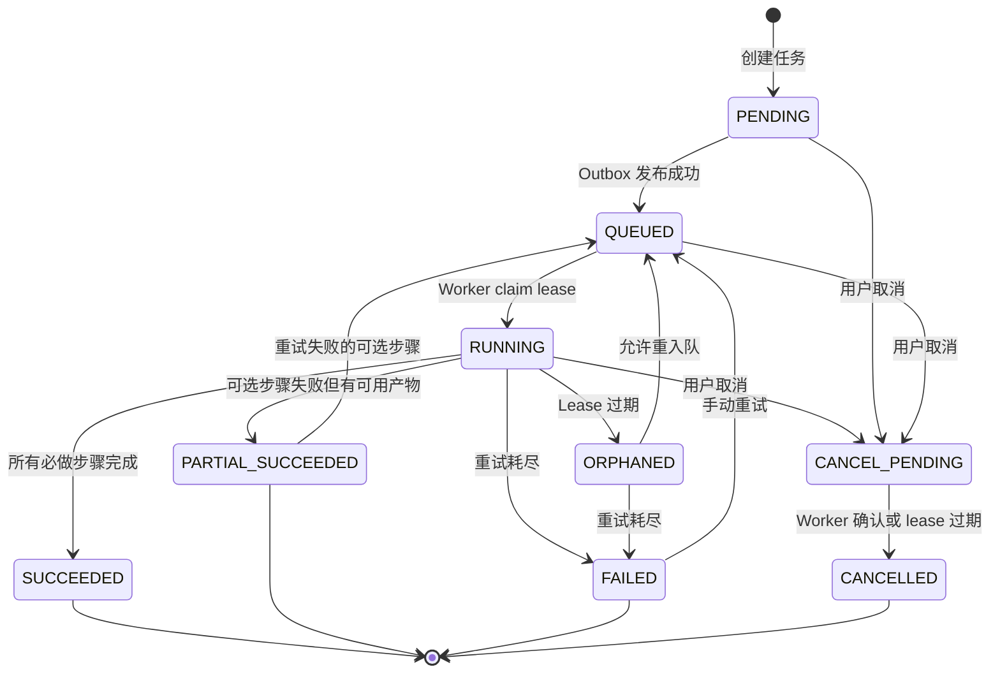
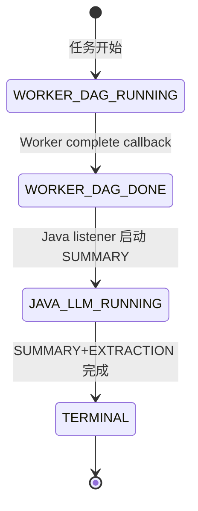
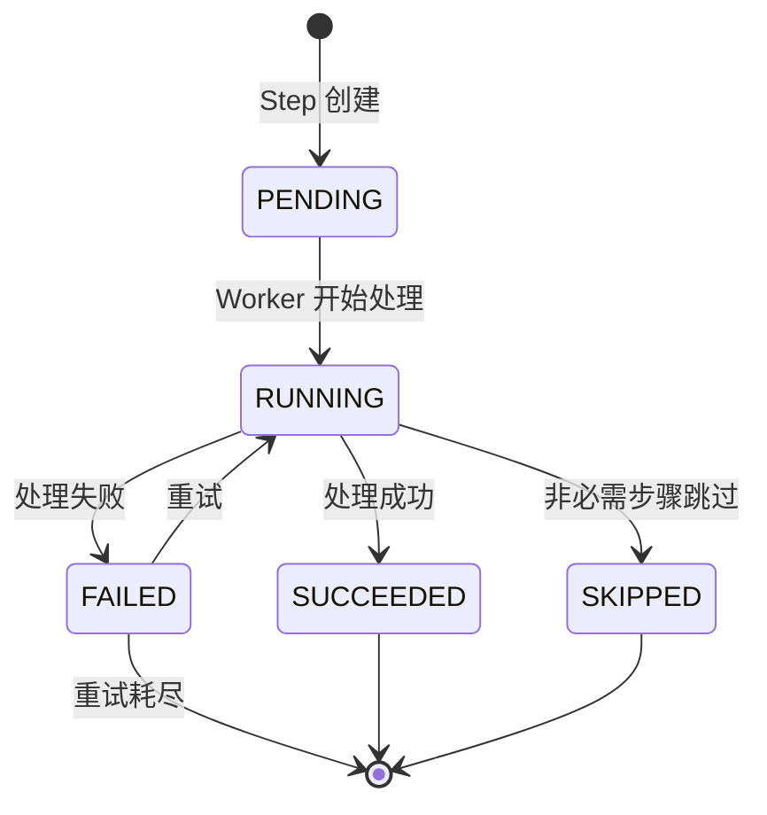
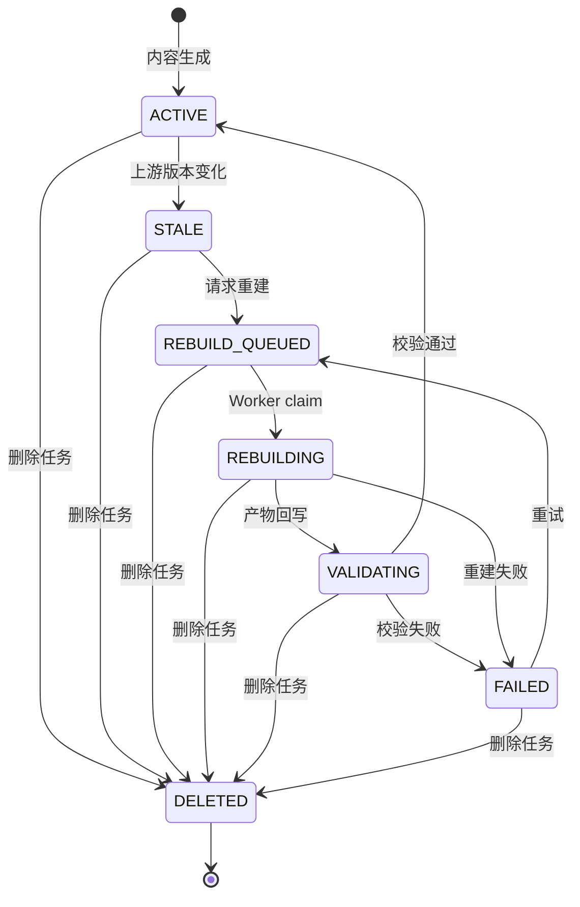
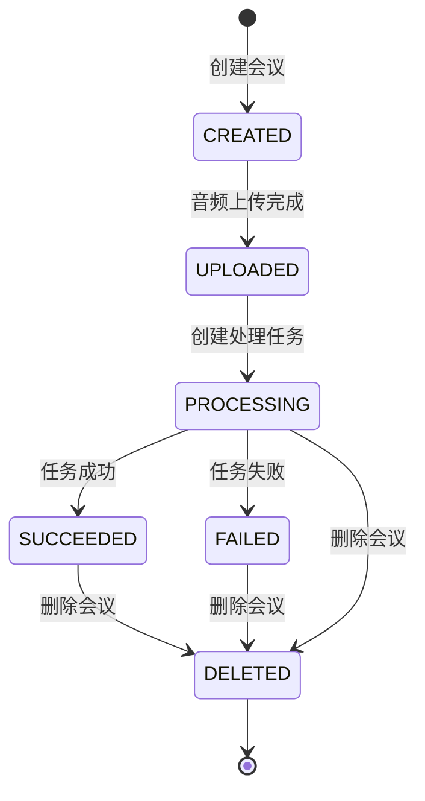
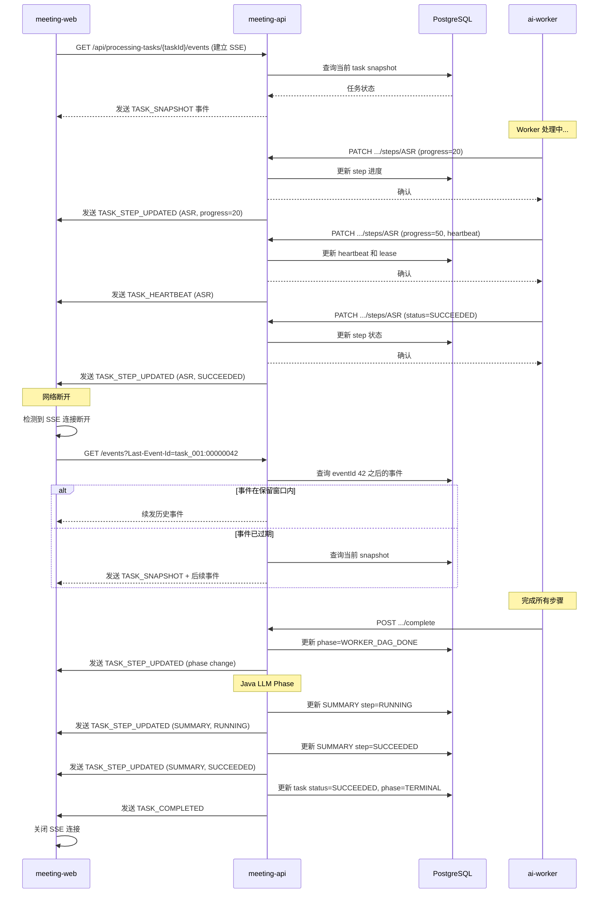
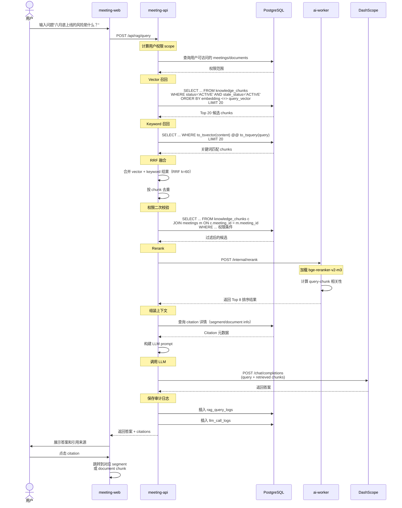

# 会议智能系统完整流程分析

> 生成日期：2026-06-11  
> 范围：从用户登录到会议纪要生成的完整链路  
> 版本：v1.1 (Phase K Complete)

## 目录

1. [系统概览](#1-系统概览)
2. [核心流程](#2-核心流程)
3. [状态机定义](#3-状态机定义)
4. [时序图](#4-时序图)
5. [前端交互详解](#5-前端交互详解)
6. [关键技术点](#6-关键技术点)

---

## 1. 系统概览

### 1.1 架构组成

本系统采用 Java + Python 分层架构：

| 组件 | 技术栈 | 职责 |
|---|---|---|
| **meeting-web** | React 18.3 + Vite + TypeScript | 用户界面，消费 Public API + SSE |
| **meeting-api** | Java 17 + Spring Boot 3.3 + COLA-V5 | 业务逻辑、权限控制、任务编排、LLM 调用 |
| **ai-worker** | Python 3.11 + FastAPI + Dramatiq + Prefect | GPU 计算（ASR、说话人分离、声纹、Embedding） |
| **PostgreSQL** | PostgreSQL 15 + pgvector | 业务数据存储、向量检索 |
| **RabbitMQ** | RabbitMQ 3.x | 异步任务队列 |
| **TOS** | 火山引擎 TOS | 音频、产物、导出文件存储 |
| **DashScope** | 阿里云 DashScope | LLM 服务（纪要生成、结构化抽取） |

### 1.2 数据流向

```
用户 → meeting-web → meeting-api → PostgreSQL (业务数据)
                                  → RabbitMQ (异步任务)
                                  → TOS (文件存储)
                                  → DashScope (LLM 调用)

ai-worker ← RabbitMQ (消费任务)
          → TOS (读音频、写产物)
          → meeting-api (Internal Callback 回写结果)
```

---

## 2. 核心流程

### 2.1 端到端主流程概览

```
┌─────────────┐
│ 1. 用户登录 │
└──────┬──────┘
       │
       ▼
┌─────────────────┐
│ 2. 创建会议     │
└──────┬──────────┘
       │
       ▼
┌─────────────────┐
│ 3. 上传音频     │ (分片上传 TOS)
└──────┬──────────┘
       │
       ▼
┌─────────────────────────┐
│ 4. 创建处理任务         │
│    - Java 创建 task     │
│    - 投递 RabbitMQ      │
└──────┬──────────────────┘
       │
       ▼
┌────────────────────────────────┐
│ 5. Worker 处理 (ai-worker)    │
│    - 音频预处理                │
│    - ASR (语音识别)            │
│    - Diarization (说话人分离)  │
│    - Speaker Matching (声纹匹配)│
│    - Transcript Merge (转录合并)│
│    - RAG Indexing (知识入库)   │
└──────┬─────────────────────────┘
       │
       ▼
┌────────────────────────────────┐
│ 6. Java LLM Phase             │
│    - SUMMARY (生成纪要)        │
│    - EXTRACTION (抽取事项)     │
│    - 入库结构化数据            │
└──────┬─────────────────────────┘
       │
       ▼
┌─────────────────┐
│ 7. 用户查看结果 │
│    - 转录       │
│    - 纪要       │
│    - 待办/决策  │
│    - RAG 问答   │
│    - 导出       │
└─────────────────┘
```

### 2.2 详细步骤说明

#### 步骤 1：用户登录

**前端操作：**
1. 用户在 `/login` 页面输入用户名和密码
2. 点击"登录"按钮

**API 调用：**
```http
POST /api/auth/login
Content-Type: application/json

{
  "username": "alice@example.com",
  "password": "example-password"
}
```

**响应：**
```json
{
  "success": true,
  "data": {
    "accessToken": "jwt_access_token",
    "refreshToken": "jwt_refresh_token",
    "expiresAt": "2026-05-11T08:30:00Z",
    "user": {
      "userId": "u_001",
      "tenantId": "t_001",
      "displayName": "Alice",
      "roles": ["TENANT_ADMIN"]
    }
  }
}
```

**前端处理：**
- 将 `accessToken` 存储在**内存状态**（不存 localStorage/sessionStorage）
- 将 `refreshToken` 作为 HttpOnly Cookie 由后端设置
- 跳转到会议列表页 `/meetings`

#### 步骤 2：创建会议

**前端操作：**
1. 用户点击"创建会议"按钮，进入 `/meetings/new` 页面
2. 填写会议信息：
   - 会议标题
   - 预定开始时间
   - 安全等级（PUBLIC/INTERNAL/CONFIDENTIAL/SECRET）
   - 参会人员
3. 点击"创建"按钮

**API 调用：**
```http
POST /api/meetings
Authorization: Bearer <access_token>
X-Request-Id: req_003
X-Trace-Id: trace_001
Content-Type: application/json

{
  "title": "方案评审会",
  "scheduledStartAt": "2026-05-11T07:00:00Z",
  "securityLevel": "INTERNAL",
  "language": "zh",
  "participants": [
    {"personId": "person_001", "displayName": "Alice", "role": "HOST"},
    {"personId": "person_002", "displayName": "Bob", "role": "PARTICIPANT"}
  ]
}
```

**后端处理（meeting-api）：**
1. 校验登录态和权限
2. 设置租户上下文（从 JWT 解析）
3. 创建 `meetings` 表记录
4. 初始化会议状态为 `CREATED`
5. 返回会议 ID

**响应：**
```json
{
  "success": true,
  "data": {
    "meetingId": "m_001",
    "tenantId": "t_001",
    "title": "方案评审会",
    "securityLevel": "INTERNAL",
    "status": "CREATED",
    "transcriptVersion": 0,
    "minutesVersion": 0,
    "createdAt": "2026-05-11T06:30:00Z"
  }
}
```

**前端处理：**
- 跳转到音频上传页 `/meetings/m_001/audio`

#### 步骤 3：上传音频

**前端操作：**
1. 用户选择音频文件（最大 4 小时，约 3GB）
2. 前端计算文件 SHA256
3. 发起分片上传流程

**3.1 初始化上传**

```http
POST /api/meetings/m_001/files/audio/uploads
Authorization: Bearer <access_token>
X-Request-Id: req_004
X-Trace-Id: trace_001

{
  "fileName": "review-meeting.wav",
  "contentType": "audio/wav",
  "sizeBytes": 734003200,
  "sha256": "b1946ac92492d2347c6235b4d2611184",
  "durationMs": 7200000
}
```

**响应：**
```json
{
  "success": true,
  "data": {
    "uploadId": "upload_001",
    "fileId": "file_001",
    "bucket": "meeting-audio",
    "objectKey": "tenant/t_001/meeting/m_001/raw/file_001.wav",
    "partSizeBytes": 8388608,  // 8 MiB
    "expiresAt": "2026-05-11T07:30:00Z"
  }
}
```

**3.2 上传分片（循环）**

对文件每个 8MB 分片，前端执行：

```http
POST /api/meetings/m_001/files/audio/uploads/upload_001/parts
{
  "partNumber": 1,
  "sizeBytes": 8388608,
  "sha256": "part_hash_001"
}
```

返回 TOS 预签名 URL，前端直传到 TOS。

**3.3 完成上传**

所有分片上传完成后：

```http
POST /api/meetings/m_001/files/audio/uploads/upload_001/complete
{
  "parts": [
    {"partNumber": 1, "etag": "etag_part_001", "sha256": "part_hash_001"},
    {"partNumber": 2, "etag": "etag_part_002", "sha256": "part_hash_002"}
  ],
  "fileSha256": "b1946ac92492d2347c6235b4d2611184"
}
```

**后端处理：**
1. 校验所有分片完整性
2. 在 TOS 完成 multipart 合并
3. 更新 `meeting_files` 表
4. 更新会议状态为 `UPLOADED`

**前端处理：**
- 显示上传成功
- 引导用户创建处理任务

#### 步骤 4：创建处理任务

**前端操作：**
1. 用户点击"开始处理"按钮

**API 调用：**
```http
POST /api/meetings/m_001/processing-tasks
Authorization: Bearer <access_token>
X-Request-Id: req_007
X-Trace-Id: trace_001
Idempotency-Key: idempotent_key_001

{
  "taskType": "MEETING_FULL_PIPELINE",
  "audioFileId": "file_001",
  "options": {
    "enableAsr": true,
    "enableDiarization": true,
    "enableSpeakerRecognition": true,
    "enableRagIndexing": true
  }
}
```

**后端处理（meeting-api）：**

1. **创建任务记录**
   - 插入 `processing_tasks` 表
   - 状态：`PENDING`
   - Phase: `WORKER_DAG_RUNNING`
   - 初始化 `AUDIO_UPLOAD` step 为 `SUCCEEDED`

2. **写入 Outbox**
   - 插入 `domain_events_outbox` 表
   - 事件类型：`TASK_CREATED`
   - 状态：`PENDING`

3. **Outbox Publisher 异步处理**
   - 后台线程使用 `SELECT ... FOR UPDATE SKIP LOCKED` 扫描
   - 将任务消息投递到 RabbitMQ
   - 更新任务状态为 `QUEUED`
   - 更新 outbox 状态为 `PUBLISHED`

**RabbitMQ 消息体：**
```json
{
  "taskId": "task_001",
  "taskType": "MEETING_FULL_PIPELINE",
  "tenantId": "t_001",
  "meetingId": "m_001",
  "audioFileId": "file_001",
  "audioUri": "oss://meeting-audio/tenant/t_001/meeting/m_001/raw/file_001.wav",
  "securityLevel": "INTERNAL",
  "attemptNo": 1,
  "language": "zh",
  "knownParticipants": ["person_001", "person_002"],
  "options": {
    "enableAsr": true,
    "enableDiarization": true,
    "enableSpeakerRecognition": true,
    "enableRagIndexing": true
  },
  "traceId": "trace_001"
}
```

**响应：**
```json
{
  "success": true,
  "data": {
    "taskId": "task_001",
    "meetingId": "m_001",
    "status": "QUEUED",
    "phase": "WORKER_DAG_RUNNING",
    "attemptNo": 1,
    "estimatedWaitSeconds": 120
  }
}
```

**前端处理：**
- 跳转到任务进度页 `/meetings/m_001/tasks/task_001`
- 建立 SSE 连接监听进度

#### 步骤 5：Worker 处理（ai-worker）

**5.1 消费任务**

ai-worker 的 Dramatiq worker 从 RabbitMQ 消费任务：

1. **Claim Lease**
   - 回调 Java 更新 `leaseOwner` 和 `leaseExpiresAt`
   - 任务状态变为 `RUNNING`

2. **启动 Workflow**
   - 使用 Prefect 编排 DAG
   - 按顺序执行各个 step

**5.2 处理步骤详解**

##### 5.2.1 AUDIO_PREPROCESS

```python
# 步骤内容
1. 从 TOS 下载原始音频
2. 使用 ffprobe 检测音频信息
3. 识别并保存 channel_map
4. 音频质量检测：
   - 采样率 < 16kHz → 拒绝
   - 信噪比 < 5dB → 标记 AUDIO_QUALITY_LOW
5. 转换为 16kHz mono WAV
6. 上传标准化音频到 TOS
```

**回调 Java：**
```http
PATCH /internal/processing-tasks/task_001/steps/AUDIO_PREPROCESS
X-Worker-Id: worker_gpu_001
X-Attempt-No: 1
X-Lease-Owner: lease_task_001_attempt_1
X-Timestamp: 2026-05-11T06:34:00Z
X-Signature: hmac-sha256=...
Idempotency-Key: task_001:AUDIO_PREPROCESS:1:v1

{
  "tenantId": "t_001",
  "meetingId": "m_001",
  "taskId": "task_001",
  "stepName": "AUDIO_PREPROCESS",
  "attemptNo": 1,
  "status": "SUCCEEDED",
  "progress": 100,
  "workerId": "worker_gpu_001",
  "startedAt": "2026-05-11T06:33:00Z",
  "finishedAt": "2026-05-11T06:34:00Z"
}
```

##### 5.2.2 ASR (语音识别)

```python
# 步骤内容
1. 加载 Qwen3-ASR 模型到 GPU
2. VAD 识别有效语音区间
3. 按 60s chunk（overlap 0.5s）切片
4. 对每个 chunk 执行 ASR
5. 生成原始 ASR JSON
6. 上传 artifact 到 TOS
```

**回调进度（多次）：**
```json
{
  "stepName": "ASR",
  "status": "RUNNING",
  "progress": 42,
  "heartbeatAt": "2026-05-11T06:36:00Z"
}
```

**完成时回调：**
```json
{
  "stepName": "ASR",
  "status": "SUCCEEDED",
  "progress": 100,
  "finishedAt": "2026-05-11T06:40:00Z"
}
```

**回写 Artifact：**
```http
POST /internal/processing-tasks/task_001/artifacts

{
  "artifactType": "RAW_ASR_JSON",
  "artifactUri": "oss://meeting-artifacts/.../asr/task_001.json",
  "sha256": "artifact_hash_001",
  "metadata": {
    "modelVersion": "qwen3-asr-local-2026.05.1",
    "pipelineVersion": "2026.05.1"
  }
}
```

##### 5.2.3 DIARIZATION (说话人分离)

```python
# 步骤内容
1. 加载 pyannote.audio 模型
2. 执行说话人分离
3. 生成匿名 speaker labels（SPEAKER_00, SPEAKER_01...）
4. 输出 diarization turns JSON
5. 上传到 TOS
```

##### 5.2.4 SPEAKER_EMBEDDING (声纹提取)

```python
# 步骤内容
1. 加载 3D-Speaker CAM++ 模型
2. 为每个 speaker 提取 embedding
3. 生成 192 维向量
```

##### 5.2.5 SPEAKER_MATCHING (声纹匹配)

```python
# 步骤内容
1. 调用 Java 获取参考声纹
   POST /internal/speakers/reference-embeddings
   Body: {"tenantId": "t_001", "personIds": ["person_001", "person_002"]}

2. 计算余弦相似度
3. 置信度阈值过滤（通常 > 0.85）
4. 生成候选列表
```

**回写 Speaker Candidates：**
```http
POST /internal/processing-tasks/task_001/speaker-candidates

{
  "tenantId": "t_001",
  "meetingId": "m_001",
  "taskId": "task_001",
  "attemptNo": 1,
  "speakerCandidates": [
    {
      "speakerLabel": "SPEAKER_01",
      "candidates": [
        {
          "personId": "person_002",
          "speakerProfileId": "profile_002",
          "confidence": 0.92,
          "matchStatus": "CANDIDATE"
        }
      ],
      "embedding": {
        "format": "FLOAT32_ARRAY",
        "dimension": 192,
        "values": [0.0123, -0.0456, 0.0789, ...],
        "modelVersion": "local-speaker-v1",
        "plaintextTransport": "INTERNAL_TLS_HMAC_CALLBACK"
      }
    }
  ]
}
```

**Java 处理：**
- 使用 KMS 信封加密 embedding
- 存储密文到 `speaker_embeddings` 表
- 不保存明文向量

##### 5.2.6 TRANSCRIPT_MERGE (转录合并)

```python
# 步骤内容
1. 合并 ASR 结果和 Diarization 结果
2. 生成结构化转录 segments
3. 每个 segment 包含：
   - segmentId
   - startMs / endMs
   - speakerLabel
   - text
   - confidence 分数
```

**回写 Transcript：**
```http
POST /internal/processing-tasks/task_001/transcript

{
  "tenantId": "t_001",
  "meetingId": "m_001",
  "taskId": "task_001",
  "attemptNo": 1,
  "transcriptVersion": 1,
  "segments": [
    {
      "segmentId": "seg_001",
      "startMs": 13000,
      "endMs": 28000,
      "speakerLabel": "SPEAKER_01",
      "text": "预算这块目前还有二十万缺口，如果要按六月底上线，需要这周确认供应商。",
      "asrConfidence": 0.91,
      "diarizationConfidence": 0.84,
      "timestampPrecision": "SEGMENT"
    }
  ],
  "metadata": {
    "asrModelVersion": "local-asr-v1",
    "diarizationModelVersion": "local-diar-v1",
    "pipelineVersion": "2026.05.1"
  }
}
```

**Java 处理：**
- 插入 `transcript_segments` 表
- 更新 `meetings.transcript_version = 1`
- 发布 `TRANSCRIPT_READY` SSE 事件

##### 5.2.7 RAG_INDEXING (知识入库)

```python
# 步骤内容
1. 加载 bge-m3 embedding 模型
2. 将转录按策略切 chunk（300 tokens, overlap 50）
3. 生成每个 chunk 的 1024 维 embedding
4. 批量回写到 Java
```

**回写 Embeddings：**
```http
POST /internal/processing-tasks/task_001/embeddings

{
  "tenantId": "t_001",
  "taskId": "task_001",
  "embeddingBatchId": "emb_batch_001",
  "sourceType": "PRIMARY_TRANSCRIPT",
  "embeddingModelVersion": "bge-m3-local-v1",
  "items": [
    {
      "chunkId": "chunk_001",
      "sourceId": "m_001",
      "sourceVersion": 1,
      "contentHash": "sha256:chunk_hash_001",
      "embedding": {
        "format": "FLOAT32_ARRAY",
        "dimension": 1024,
        "values": [0.011, -0.022, ...]
      }
    }
  ]
}
```

**Java 处理：**
- 插入 `knowledge_chunks` 表
- 使用 pgvector 存储 embedding
- 设置 `status=ACTIVE`, `stale_status=ACTIVE`

**5.3 完成 Worker Phase**

所有 worker-owned steps 完成后：

```http
POST /internal/processing-tasks/task_001/complete

{
  "tenantId": "t_001",
  "meetingId": "m_001",
  "taskId": "task_001",
  "attemptNo": 1,
  "phase": "WORKER_DAG",
  "status": "SUCCEEDED",
  "completedSteps": [
    "AUDIO_PREPROCESS",
    "ASR",
    "DIARIZATION",
    "SPEAKER_EMBEDDING",
    "SPEAKER_MATCHING",
    "TRANSCRIPT_MERGE",
    "RAG_INDEXING"
  ],
  "skippedSteps": [
    {"stepName": "ALIGNMENT", "reason": "NOT_REQUIRED"}
  ],
  "finishedAt": "2026-05-11T06:55:00Z"
}
```

**Java 处理：**
1. 更新 task `phase = WORKER_DAG_DONE`
2. 写入 `WORKER_PHASE_COMPLETED` outbox 事件
3. **Callback 响应不等待 LLM**（立即返回）
4. Java listener 异步消费 outbox 事件，启动 SUMMARY/EXTRACTION

#### 步骤 6：Java LLM Phase

**6.1 触发机制**

Java `WORKER_PHASE_COMPLETED` outbox listener 消费事件后：

1. 将 task `phase` 更新为 `JAVA_LLM_RUNNING`
2. 推进 `SUMMARY` step 到 `RUNNING`

**6.2 SUMMARY Step（生成纪要）**

**调用 LLM Gateway：**

```java
// meeting-api-app/src/main/java/com/meeting/api/app/task/TaskStepProgressService.java

1. 读取 transcript_segments
2. 读取 meeting 参会人、glossary_terms
3. 读取关联的 reference documents（如有）
4. 组装 Prompt
5. 调用 llm-gateway → DashScope
```

**Prompt 输入示例：**
```json
{
  "templateId": "meeting_minutes_zh",
  "templateVersion": "2026.05.1",
  "context": {
    "meetingTitle": "方案评审会",
    "participants": ["Alice", "Bob"],
    "glossaryTerms": [
      {"term": "CMDB", "aliases": ["配置管理数据库"]},
      {"term": "RTO", "aliases": ["恢复时间目标"]}
    ],
    "transcriptSegments": [
      {
        "startMs": 13000,
        "endMs": 28000,
        "speaker": "SPEAKER_01",
        "text": "预算这块目前还有二十万缺口，如果要按六月底上线，需要这周确认供应商。"
      }
    ]
  }
}
```

**LLM 调用（DashScope OpenAI-compatible API）：**
```http
POST https://dashscope.aliyuncs.com/compatible-mode/v1/chat/completions
Authorization: Bearer <api_key>

{
  "model": "qwen-plus",
  "messages": [
    {"role": "system", "content": "你是会议纪要助手..."},
    {"role": "user", "content": "根据以下转录生成会议纪要..."}
  ],
  "temperature": 0.2,
  "top_p": 0.8,
  "max_tokens": 4096,
  "response_format": {"type": "json_object"}
}
```

**DashScope 返回：**
```json
{
  "id": "chatcmpl-xxx",
  "model": "qwen-plus-2026-05-01",
  "choices": [{
    "message": {
      "role": "assistant",
      "content": "{\"summary\":\"本次会议确认六月底上线目标不变...\",\"sections\":[...]}"
    }
  }],
  "usage": {
    "prompt_tokens": 12000,
    "completion_tokens": 1800,
    "total_tokens": 13800
  }
}
```

**Java 处理：**
1. 解析 JSON 输出
2. 校验 Schema
3. 校验 evidence（segment 必须存在）
4. 插入 `meeting_minutes` 表
5. 保存到 `llm_call_logs` 和 `artifact_manifests`
6. 更新 `SUMMARY` step 为 `SUCCEEDED`
7. 发布 `TASK_STEP_UPDATED` SSE 事件
8. 发布 `MinutesGeneratedEvent` outbox 事件

**6.3 EXTRACTION Step（抽取结构化事项）**

接续 SUMMARY 完成后：

**调用流程：**
1. 将 `EXTRACTION` step 状态设为 `RUNNING`
2. 使用独立 Prompt 模板调用 DashScope
3. 分别抽取：
   - 待办事项（action items）
   - 决策事项（decisions）
   - 风险事项（risks）

**LLM 输出示例：**
```json
{
  "actionItems": [
    {
      "title": "确认供应商",
      "assigneeDisplayName": "李四",
      "dueDate": "2026-05-15",
      "status": "SUGGESTED",
      "evidence": [
        {
          "segmentId": "seg_001",
          "startMs": 13000,
          "endMs": 28000,
          "evidenceTextSnapshot": "需要这周确认供应商。"
        }
      ]
    }
  ],
  "decisions": [
    {
      "title": "六月底上线目标不变",
      "status": "PROPOSED",
      "evidence": [...]
    }
  ],
  "risks": [
    {
      "title": "预算存在二十万缺口",
      "severity": "HIGH",
      "status": "OPEN",
      "evidence": [...]
    }
  ]
}
```

**Java 处理：**
1. 插入 `meeting_action_items` 表
2. 插入 `meeting_decisions` 表
3. 插入 `meeting_risks` 表
4. 所有记录 `status` 初始为 `SUGGESTED` 或 `PROPOSED`
5. 必须保存 `evidence_segment_ids` 和 `evidence_text_snapshot`
6. 更新 `EXTRACTION` step 为 `SUCCEEDED`

**6.4 重建纪要相关 RAG Chunks**

`MinutesGeneratedEvent` listener 触发：

1. 标记旧的 `sourceType=MINUTES` chunks 为 `DELETED`
2. 将新纪要按章节切 chunk
3. 调用 ai-worker embedding（通过新任务或同步调用）
4. 插入新 chunks，`sourceType=MINUTES`, `stale_status=ACTIVE`

**6.5 完成 Task**

所有 Java-owned steps 完成后：

1. 更新 task `phase = TERMINAL`
2. 更新 task `status = SUCCEEDED`
3. 发布 `TASK_COMPLETED` SSE 事件
4. 更新 meeting `status = SUCCEEDED`

---

## 3. 状态机定义

### 3.1 Processing Task 状态机



**状态说明：**

| 状态 | 含义 | 可转换目标 |
|---|---|---|
| `PENDING` | 任务已创建，等待 outbox 发布 | QUEUED, CANCEL_PENDING |
| `QUEUED` | 已发布到 RabbitMQ，等待 worker 领取 | RUNNING, CANCEL_PENDING |
| `RUNNING` | Worker 已 claim lease，正在处理 | SUCCEEDED, PARTIAL_SUCCEEDED, FAILED, ORPHANED, CANCEL_PENDING |
| `ORPHANED` | Lease 过期，等待重入队或失败 | QUEUED, FAILED |
| `PARTIAL_SUCCEEDED` | 部分成功，可选步骤失败但有可用产物 | QUEUED (重试), 终态 |
| `SUCCEEDED` | 所有必做步骤成功完成 | 终态 |
| `FAILED` | 重试耗尽或致命错误 | QUEUED (手动重试), 终态 |
| `CANCEL_PENDING` | 取消请求已发出，等待确认 | CANCELLED |
| `CANCELLED` | 已取消 | 终态 |

### 3.2 Task Phase 状态机



**Phase 说明：**

| Phase | 负责方 | 包含步骤 |
|---|---|---|
| `WORKER_DAG_RUNNING` | ai-worker | AUDIO_PREPROCESS, ASR, DIARIZATION, SPEAKER_EMBEDDING, SPEAKER_MATCHING, TRANSCRIPT_MERGE, RAG_INDEXING |
| `WORKER_DAG_DONE` | Java（过渡） | Worker 完成，等待 Java LLM |
| `JAVA_LLM_RUNNING` | Java | SUMMARY, EXTRACTION |
| `TERMINAL` | Java（终态） | 任务完成 |

### 3.3 Processing Step 状态机



**Step 分类：**

| Step | Owner | 必需性 | 失败影响 |
|---|---|---|---|
| `AUDIO_UPLOAD` | Java | 必需 | Task FAILED |
| `AUDIO_PREPROCESS` | ai-worker | 必需 | Task FAILED |
| `ASR` | ai-worker | 必需 | Task FAILED |
| `ALIGNMENT` | ai-worker | 可选 | 可 SKIP |
| `DIARIZATION` | ai-worker | 必需 | Task FAILED |
| `SPEAKER_EMBEDDING` | ai-worker | 必需 | Task FAILED |
| `SPEAKER_MATCHING` | ai-worker | 可选 | 可 SKIP |
| `TRANSCRIPT_MERGE` | ai-worker | 必需 | Task FAILED |
| `SUMMARY` | Java | 必需 | Task FAILED 或 PARTIAL_SUCCEEDED |
| `EXTRACTION` | Java | 可选 | PARTIAL_SUCCEEDED |
| `RAG_INDEXING` | ai-worker | 可选 | PARTIAL_SUCCEEDED |
| `EXPORT` | Java | 独立任务 | 不影响主任务 |

### 3.4 Stale Status 状态机



**触发 STALE 的场景：**

1. **转录编辑** → 纪要、待办、决策、风险、RAG chunks 标记 STALE
2. **Speaker 确认/拒绝** → 相关 RAG chunks 标记 STALE
3. **声纹授权撤销** → 历史 person_id 软屏蔽，RAG chunks 标记 STALE
4. **Chunk 策略版本变更** → 旧策略 chunks 标记 STALE

### 3.5 Meeting 状态机



---

## 4. 时序图

### 4.1 完整端到端时序图

```mermaid
sequenceDiagram
    actor User as 用户
    participant Web as meeting-web
    participant API as meeting-api
    participant DB as PostgreSQL
    participant MQ as RabbitMQ
    participant Worker as ai-worker
    participant TOS as TOS 存储
    participant LLM as DashScope

    %% 登录
    User->>Web: 输入用户名密码
    Web->>API: POST /api/auth/login
    API->>DB: 查询用户，校验密码
    DB-->>API: 用户信息
    API-->>Web: 返回 JWT token
    Web->>Web: 存储 token 到内存

    %% 创建会议
    User->>Web: 点击"创建会议"
    Web->>API: POST /api/meetings
    API->>DB: 插入 meetings 表
    DB-->>API: 会议 ID
    API-->>Web: 返回会议信息

    %% 上传音频
    User->>Web: 选择音频文件
    Web->>API: POST /api/meetings/{id}/files/audio/uploads
    API->>TOS: 创建 multipart upload
    TOS-->>API: Upload ID
    API-->>Web: 返回 upload session

    loop 每个分片
        Web->>API: POST /uploads/{id}/parts
        API->>TOS: 生成预签名 URL
        TOS-->>API: 签名 URL
        API-->>Web: 返回签名 URL
        Web->>TOS: 直传分片数据
        TOS-->>Web: 上传成功
    end

    Web->>API: POST /uploads/{id}/complete
    API->>TOS: 完成 multipart upload
    TOS-->>API: 确认完成
    API->>DB: 更新 meeting_files
    API-->>Web: 上传完成

    %% 创建处理任务
    User->>Web: 点击"开始处理"
    Web->>API: POST /api/meetings/{id}/processing-tasks
    API->>DB: 插入 processing_tasks (PENDING)
    API->>DB: 插入 domain_events_outbox
    DB-->>API: 任务 ID
    API-->>Web: 返回任务信息

    %% Outbox 发布
    API->>DB: Outbox publisher 扫描
    DB-->>API: 未发布事件
    API->>MQ: 投递任务消息
    MQ-->>API: 确认接收
    API->>DB: 更新 task status=QUEUED
    API->>DB: 更新 outbox status=PUBLISHED

    %% Worker 处理
    Worker->>MQ: 消费任务消息
    MQ-->>Worker: 任务详情
    Worker->>API: PATCH /internal/tasks/{id}/steps/AUDIO_PREPROCESS (claim lease)
    API->>DB: 更新 lease_owner, status=RUNNING
    API-->>Worker: 确认

    Worker->>TOS: 下载原始音频
    TOS-->>Worker: 音频数据
    Worker->>Worker: 音频预处理（标准化）
    Worker->>TOS: 上传标准化音频
    Worker->>API: PATCH .../AUDIO_PREPROCESS (status=SUCCEEDED)
    API->>DB: 更新 step 状态
    API-->>Worker: 确认

    Worker->>Worker: 加载 ASR 模型
    Worker->>Worker: 执行语音识别
    loop 进度更新
        Worker->>API: PATCH .../ASR (progress=42, heartbeat)
        API->>DB: 更新进度和 lease
        API-->>Worker: 确认
    end
    Worker->>TOS: 上传 ASR artifact
    Worker->>API: POST /internal/tasks/{id}/artifacts (ASR_JSON)
    API->>DB: 插入 artifact_manifests
    Worker->>API: PATCH .../ASR (status=SUCCEEDED)

    Worker->>Worker: 执行 Diarization
    Worker->>TOS: 上传 Diarization artifact
    Worker->>API: PATCH .../DIARIZATION (status=SUCCEEDED)

    Worker->>Worker: 提取 Speaker Embedding
    Worker->>API: POST /internal/speakers/reference-embeddings
    API->>DB: 查询参考声纹（KMS 解密）
    DB-->>API: 参考 embedding
    API-->>Worker: 返回参考向量
    Worker->>Worker: 计算相似度，生成候选
    Worker->>API: POST /internal/tasks/{id}/speaker-candidates
    API->>DB: KMS 信封加密 embedding
    API->>DB: 插入 meeting_speakers
    API-->>Worker: 确认

    Worker->>Worker: 合并 ASR + Diarization
    Worker->>API: POST /internal/tasks/{id}/transcript
    API->>DB: 插入 transcript_segments
    API->>DB: 更新 meetings.transcript_version
    API->>Web: 发送 TRANSCRIPT_READY SSE 事件
    API-->>Worker: 确认

    Worker->>Worker: 生成 text embeddings
    Worker->>API: POST /internal/tasks/{id}/embeddings
    API->>DB: 插入 knowledge_chunks (pgvector)
    API-->>Worker: 确认
    Worker->>API: PATCH .../RAG_INDEXING (status=SUCCEEDED)

    Worker->>API: POST /internal/tasks/{id}/complete (phase=WORKER_DAG)
    API->>DB: 更新 task phase=WORKER_DAG_DONE
    API->>DB: 插入 WORKER_PHASE_COMPLETED outbox
    API-->>Worker: 确认（立即返回，不等待 LLM）

    %% Java LLM Phase
    API->>DB: Listener 消费 outbox
    API->>DB: 更新 task phase=JAVA_LLM_RUNNING
    API->>DB: 更新 SUMMARY step=RUNNING
    API->>DB: 读取转录、参会人、glossary
    API->>LLM: POST /chat/completions (纪要生成)
    LLM-->>API: 返回结构化纪要
    API->>DB: 插入 meeting_minutes
    API->>DB: 插入 llm_call_logs
    API->>DB: 更新 SUMMARY step=SUCCEEDED
    API->>Web: 发送 TASK_STEP_UPDATED SSE

    API->>DB: 更新 EXTRACTION step=RUNNING
    API->>LLM: POST /chat/completions (抽取事项)
    LLM-->>API: 返回待办/决策/风险
    API->>DB: 插入 meeting_action_items
    API->>DB: 插入 meeting_decisions
    API->>DB: 插入 meeting_risks
    API->>DB: 更新 EXTRACTION step=SUCCEEDED

    API->>DB: 更新 task phase=TERMINAL, status=SUCCEEDED
    API->>Web: 发送 TASK_COMPLETED SSE
    Web->>User: 显示处理完成

    %% 用户查看结果
    User->>Web: 点击"查看转录"
    Web->>API: GET /api/meetings/{id}/transcript
    API->>DB: 查询 transcript_segments
    DB-->>API: 转录数据
    API-->>Web: 返回转录
    Web->>User: 展示转录内容

    User->>Web: 点击"查看纪要"
    Web->>API: GET /api/meetings/{id}/minutes
    API->>DB: 查询 meeting_minutes
    DB-->>API: 纪要数据
    API-->>Web: 返回纪要
    Web->>User: 展示纪要内容
```



### 4.2 SSE 进度推送时序图



### 4.3 RAG 问答时序图



---

## 5. 前端交互详解

### 5.1 登录页 (`/login`)

**页面元素：**
- 用户名输入框
- 密码输入框
- "登录"按钮
- 错误提示区域

**用户操作流程：**
1. 用户在浏览器访问 `http://localhost:5173/login`
2. 输入用户名（如 `alice@example.com`）
3. 输入密码
4. 点击"登录"按钮

**前端处理：**
```typescript
// src/features/auth/pages/LoginPage.tsx
const handleLogin = async (credentials) => {
  try {
    const response = await authApi.login(credentials);
    // 存储 access token 到内存（Zustand store）
    authStore.setAccessToken(response.data.accessToken);
    // refresh token 由后端设置为 HttpOnly cookie
    navigate('/meetings');
  } catch (error) {
    if (error.code === 'AUTH_REQUIRED') {
      showError('用户名或密码错误');
    } else if (error.code === 'ACCOUNT_LOCKED') {
      showError('账号已锁定，请联系管理员');
    } else {
      showError('登录失败，请稍后重试');
    }
  }
};
```

**错误处理：**
- `AUTH_REQUIRED` (401) → "用户名或密码错误"
- `ACCOUNT_LOCKED` (423) → "账号已锁定"
- 网络错误 → "登录失败，请稍后重试"

**成功后跳转：**
- 跳转到会议列表页 `/meetings`

---

### 5.2 会议列表页 (`/meetings`)

**页面元素：**
- 顶部导航栏（用户头像、退出）
- "创建会议"按钮
- 搜索框（按标题搜索）
- 筛选器：
  - 状态（全部/进行中/已完成/失败）
  - 安全等级（全部/PUBLIC/INTERNAL/CONFIDENTIAL/SECRET）
- 会议列表（虚拟滚动）
  - 每项显示：标题、时间、状态、参会人数、操作按钮

**用户操作：**
1. 点击"创建会议" → 跳转到 `/meetings/new`
2. 点击会议项 → 跳转到 `/meetings/{id}`
3. 使用搜索/筛选 → 重新加载列表

**前端实现：**
```typescript
// src/features/meetings/pages/MeetingListPage.tsx
const { data, isLoading } = useQuery({
  queryKey: ['meetings', filters],
  queryFn: () => meetingApi.list(filters)
});

// 虚拟滚动（react-window）
<VirtualList
  height={600}
  itemCount={data.items.length}
  itemSize={80}
  renderItem={({ index }) => (
    <MeetingListItem meeting={data.items[index]} />
  )}
/>
```

---

### 5.3 创建会议页 (`/meetings/new`)

**页面元素：**
- 会议标题输入框
- 预定时间选择器（datetime-local）
- 安全等级选择器（单选）
  - ⚪ PUBLIC
  - ⚪ INTERNAL
  - ⚪ CONFIDENTIAL（灰色，带提示"一期不支持自动 LLM"）
  - ⚪ SECRET（灰色，带提示"一期不支持自动 LLM"）
- 参会人选择器（多选）
- "取消"按钮
- "创建"按钮

**用户操作：**
1. 填写表单
2. 点击"创建"按钮

**前端校验：**
```typescript
// react-hook-form + zod
const schema = z.object({
  title: z.string().min(1, '标题不能为空').max(200, '标题过长'),
  scheduledStartAt: z.string().datetime(),
  securityLevel: z.enum(['PUBLIC', 'INTERNAL', 'CONFIDENTIAL', 'SECRET']),
  participants: z.array(z.object({
    personId: z.string(),
    displayName: z.string(),
    role: z.enum(['HOST', 'PARTICIPANT'])
  })).min(1, '至少需要一名参会人')
});
```

**创建成功后：**
- 显示成功提示
- 跳转到音频上传页 `/meetings/{id}/audio`

### 5.4 音频上传页 (`/meetings/{id}/audio`)

**页面元素：**
- 会议信息展示（标题、时间、参会人）
- 文件选择区域（拖拽或点击选择）
- 上传进度条
  - 显示当前分片 / 总分片数
  - 显示百分比
  - 显示上传速度
- "取消上传"按钮
- "开始处理"按钮（上传完成后显示）

**用户操作流程：**
1. 拖拽音频文件到页面，或点击选择
2. 前端自动开始上传
3. 上传完成后，点击"开始处理"

**前端实现：**
```typescript
// src/features/meetings/components/AudioUploader.tsx
const handleFileSelect = async (file: File) => {
  // 1. 计算文件 SHA256
  const sha256 = await calculateFileSHA256(file);
  
  // 2. 初始化上传
  const uploadSession = await uploadApi.initiate({
    fileName: file.name,
    sizeBytes: file.size,
    sha256,
    contentType: file.type,
    durationMs: await getAudioDuration(file)
  });
  
  // 3. 分片上传
  const partSize = uploadSession.partSizeBytes; // 8 MiB
  const totalParts = Math.ceil(file.size / partSize);
  
  for (let i = 0; i < totalParts; i++) {
    const start = i * partSize;
    const end = Math.min(start + partSize, file.size);
    const chunk = file.slice(start, end);
    const chunkSHA256 = await calculateSHA256(chunk);
    
    // 获取预签名 URL
    const { uploadUrl } = await uploadApi.getPart({
      uploadId: uploadSession.uploadId,
      partNumber: i + 1,
      sizeBytes: chunk.size,
      sha256: chunkSHA256
    });
    
    // 直传到 TOS
    await fetch(uploadUrl, {
      method: 'PUT',
      body: chunk,
      headers: { 'Content-Type': file.type }
    });
    
    // 更新进度
    setProgress({
      current: i + 1,
      total: totalParts,
      percent: ((i + 1) / totalParts) * 100
    });
  }
  
  // 4. 完成上传
  await uploadApi.complete({
    uploadId: uploadSession.uploadId,
    parts: partsInfo,
    fileSha256: sha256
  });
  
  setUploadComplete(true);
};
```

**错误处理：**
- 文件过大（> 3GB） → "文件超过 3GB 限制"
- 格式不支持 → "仅支持 WAV、MP3、MP4 等格式"
- 上传超时 → 自动重试 3 次
- 网络错误 → 显示"上传失败，是否重试？"

**上传完成后：**
- 显示"开始处理"按钮
- 点击后跳转到任务进度页

---

### 5.5 任务进度页 (`/meetings/{id}/tasks/{taskId}`)

**页面元素：**
- 任务总体状态（QUEUED / RUNNING / SUCCEEDED / FAILED）
- Phase 指示器：
  - 🔄 Worker 处理中 (WORKER_DAG_RUNNING)
  - ✅ Worker 完成 (WORKER_DAG_DONE)
  - 🔄 生成纪要中 (JAVA_LLM_RUNNING)
  - ✅ 已完成 (TERMINAL)
- 步骤列表（展开/折叠）
  - 每个步骤显示：
    - ✅/🔄/❌ 状态图标
    - 步骤名称（中文）
    - 进度条（RUNNING 时）
    - 开始时间、完成时间
    - 错误信息（失败时）
- "重试"按钮（失败时显示）
- "取消"按钮（进行中时显示）
- "查看转录"按钮（转录完成后显示）
- "查看纪要"按钮（纪要完成后显示）

**步骤显示映射：**
```typescript
const stepDisplayNames = {
  AUDIO_UPLOAD: '音频上传',
  AUDIO_PREPROCESS: '音频预处理',
  ASR: '语音识别',
  ALIGNMENT: '对齐校准',
  DIARIZATION: '说话人分离',
  SPEAKER_EMBEDDING: '声纹提取',
  SPEAKER_MATCHING: '声纹匹配',
  TRANSCRIPT_MERGE: '转录合并',
  SUMMARY: '生成纪要',
  EXTRACTION: '抽取事项',
  RAG_INDEXING: '知识入库',
  EXPORT: '导出文件'
};
```

**SSE 连接：**
```typescript
// src/features/tasks/hooks/useTaskProgress.ts
useEffect(() => {
  const eventSource = new EventSource(
    `/api/processing-tasks/${taskId}/events`,
    { withCredentials: true }
  );
  
  eventSource.addEventListener('TASK_STEP_UPDATED', (event) => {
    const data = JSON.parse(event.data);
    updateStep(data.stepName, {
      status: data.status,
      progress: data.progress
    });
  });
  
  eventSource.addEventListener('TASK_COMPLETED', (event) => {
    setTaskStatus('SUCCEEDED');
    showSuccessNotification('处理完成！');
  });
  
  eventSource.onerror = () => {
    eventSource.close();
    // 降级为轮询
    startPolling();
  };
  
  return () => eventSource.close();
}, [taskId]);
```

**实时更新示例：**
```
当前状态：RUNNING
Phase: WORKER_DAG_RUNNING

✅ 音频上传          100%  [已完成] 06:30-06:30
✅ 音频预处理        100%  [已完成] 06:33-06:34
🔄 语音识别          42%   [进行中] 06:34-进行中
   ⏱ 心跳: 06:36
⚪ 说话人分离         0%   [等待中]
⚪ 声纹提取           0%   [等待中]
⚪ 声纹匹配           0%   [等待中]
⚪ 转录合并           0%   [等待中]
⚪ 生成纪要           0%   [等待中]
⚪ 抽取事项           0%   [等待中]
⚪ 知识入库           0%   [等待中]
```

### 5.6 转录查看页 (`/meetings/{id}/transcript`)

**页面元素：**
- 顶部工具栏：
  - 搜索框（全文搜索）
  - 按说话人筛选
  - "编辑模式"开关
  - "重新生成"按钮
- STALE 状态提示（如有）
  - ⚠️ "转录已过期，下游内容可能不一致"
  - "重新生成下游内容"按钮
- 音频播放器
  - 播放/暂停
  - 进度条
  - 倍速控制
- 转录片段列表（虚拟滚动）
  - 每个片段：
    - 时间戳（可点击跳转）
    - 说话人标签（可点击确认身份）
    - 转录文本
    - 置信度指示器
    - 编辑按钮（编辑模式下）

**用户操作：**
1. **播放音频**：点击播放按钮，音频从头播放
2. **跳转到特定时间**：点击片段时间戳，音频跳转并高亮对应片段
3. **搜索文本**：输入关键词，高亮匹配片段
4. **按说话人筛选**：选择 SPEAKER_01，只显示该说话人的片段
5. **编辑文本**：
   - 开启编辑模式
   - 点击片段编辑按钮
   - 修改文本
   - 保存（自动标记下游 STALE）
6. **确认说话人**：
   - 点击说话人标签
   - 弹出候选人列表（带置信度）
   - 选择正确人员并确认

**编辑实现：**
```typescript
// src/features/transcript/components/TranscriptSegment.tsx
const handleEdit = async (segmentId: string, editedText: string) => {
  try {
    await transcriptApi.updateSegment(meetingId, segmentId, {
      expectedTranscriptVersion: currentVersion,
      editedText,
      editReason: '人工校对'
    });
    
    // 显示 STALE 警告
    showWarning('转录已更新，纪要和知识库将标记为过期');
    
    // 刷新转录
    refetch();
  } catch (error) {
    if (error.code === 'VERSION_CONFLICT') {
      showError('转录已被他人修改，请刷新后重试');
    }
  }
};
```

**虚拟滚动实现：**
```typescript
// 转录可能有数千个 segment，必须虚拟化
<VirtualList
  height={800}
  itemCount={segments.length}
  itemSize={100}
  scrollToIndex={currentPlayingIndex}
  renderItem={({ index }) => (
    <TranscriptSegment
      segment={segments[index]}
      isPlaying={index === currentPlayingIndex}
      onEdit={handleEdit}
    />
  )}
/>
```

---

### 5.7 纪要查看页 (`/meetings/{id}/minutes`)

**页面元素：**
- STALE 状态横幅（如有）
  - ⚠️ "转录已修改，纪要可能不是最新"
  - "重新生成纪要"按钮
- 纪要版本信息
  - 版本号
  - 生成时间
  - 基于转录版本
- 纪要内容（Markdown 渲染）
  - 会议信息
  - 参会人
  - 核心结论
  - 议题讨论
  - 已决定事项（带 evidence 链接）
  - 待办事项（带 evidence 链接）
  - 风险与阻塞
- 导出按钮（PDF/DOCX/Markdown）

**Evidence 链接：**
```typescript
// 点击 evidence 链接
const handleEvidenceClick = (segmentId: string, startMs: number) => {
  // 跳转到转录页，定位到对应片段
  navigate(`/meetings/${meetingId}/transcript`, {
    state: { scrollToSegment: segmentId, playFrom: startMs }
  });
};
```

**重新生成：**
```typescript
const handleRegenerate = async () => {
  const confirmed = await confirm(
    '重新生成将创建新版本纪要，已确认的事项不会被覆盖。是否继续？'
  );
  
  if (!confirmed) return;
  
  const task = await minutesApi.regenerate(meetingId, {
    expectedTranscriptVersion: currentTranscriptVersion,
    regenerateMode: 'DIFF_ONLY',
    reason: '转录修改后重新生成'
  });
  
  // 跳转到任务进度页
  navigate(`/meetings/${meetingId}/tasks/${task.taskId}`);
};
```

---

### 5.8 待办事项页 (`/meetings/{id}/items`)

**页面元素：**
- 标签页切换：
  - 待办事项
  - 决策事项
  - 风险事项
- 状态筛选：
  - 全部
  - AI 建议（SUGGESTED）
  - 已接受（ACCEPTED）
  - 已拒绝（REJECTED）
- 每个事项卡片：
  - 标题
  - 状态标签
  - 负责人（待办）/ 严重程度（风险）
  - 截止日期（待办）
  - Evidence 片段引用
  - 操作按钮：
    - "接受"（SUGGESTED 时）
    - "拒绝"（SUGGESTED 时）
    - "编辑"（ACCEPTED 时）

**用户操作：**
1. **接受 AI 建议的待办**：
   - 点击"接受"按钮
   - 可修改负责人和截止日期
   - 确认后状态变为 ACCEPTED

2. **拒绝 AI 建议**：
   - 点击"拒绝"按钮
   - 输入拒绝理由
   - 状态变为 REJECTED

**实现：**
```typescript
const handleAccept = async (itemId: string) => {
  const result = await openDialog({
    title: '接受待办事项',
    fields: [
      { name: 'assignee', label: '负责人', type: 'person-select' },
      { name: 'dueDate', label: '截止日期', type: 'date' }
    ]
  });
  
  if (result) {
    await actionItemsApi.accept(meetingId, itemId, {
      expectedVersion: item.version,
      assigneePersonId: result.assignee,
      dueDate: result.dueDate
    });
    
    showSuccess('待办事项已接受');
    refetch();
  }
};
```

### 5.9 RAG 问答页 (`/rag`)

**页面元素：**
- 范围选择器
  - 可选择多个会议
  - 可选择多个文档
  - "全部"选项
- 对话历史（虚拟滚动）
- 问题输入框
- "提问"按钮
- 每个回答卡片：
  - 问题文本
  - Coverage 标签（TRANSCRIPT_ONLY / FULL）
  - 答案文本（Markdown）
  - Citation 列表
    - 会议 citation：标题、时间戳、说话人、片段文本
    - 文档 citation：标题、页码、片段文本
  - "有帮助" / "无帮助" 反馈按钮

**用户操作：**
1. **选择范围**：勾选相关会议和文档
2. **输入问题**：在输入框输入"六月底上线的最大风险是什么？"
3. **查看答案**：
   - 答案显示在卡片中
   - Coverage 标签提示数据完整性
   - Citation 可点击跳转
4. **点击 Citation**：
   - 会议 citation → 跳转到转录页对应片段
   - 文档 citation → 跳转到文档详情页对应位置

**实现：**
```typescript
// src/features/rag/pages/RagQueryPage.tsx
const handleQuery = async (query: string) => {
  setLoading(true);
  
  try {
    const result = await ragApi.query({
      query,
      scope: {
        meetingIds: selectedMeetings,
        documentIds: selectedDocuments
      },
      topK: 8,
      includeCitations: true
    });
    
    // 显示 coverage 提示
    if (result.coverage === 'TRANSCRIPT_ONLY') {
      showInfo('当前仅基于转录内容回答，纪要和事项尚未纳入');
    }
    
    // 添加到对话历史
    appendConversation({
      query,
      answer: result.answer,
      citations: result.citations,
      coverage: result.coverage
    });
  } catch (error) {
    if (error.code === 'RERANK_UNAVAILABLE') {
      showWarning('排序服务暂时不可用，已使用基础排序');
    } else if (error.code === 'RATE_LIMIT_EXCEEDED') {
      showError('查询频率过高，请稍后再试');
    }
  } finally {
    setLoading(false);
  }
};
```

**Citation 跳转：**
```typescript
const handleCitationClick = (citation: Citation) => {
  if (citation.type === 'MEETING_SEGMENT') {
    navigate(`/meetings/${citation.meetingId}/transcript`, {
      state: {
        scrollToSegment: citation.segmentId,
        playFrom: citation.startMs
      }
    });
  } else if (citation.type === 'DOCUMENT_CHUNK') {
    navigate(`/documents/${citation.documentId}`, {
      state: {
        scrollToChunk: citation.chunkId,
        page: citation.page
      }
    });
  }
};
```

---

### 5.10 导出页 (`/meetings/{id}/exports`)

**页面元素：**
- "创建导出"按钮
- 导出任务列表
  - 每个任务：
    - 格式（PDF/DOCX/Markdown）
    - 创建时间
    - 状态（QUEUED/RUNNING/SUCCEEDED/FAILED）
    - 进度条（RUNNING 时）
    - "下载"按钮（SUCCEEDED 时）
    - "撤销短链"按钮
    - "重试"按钮（FAILED 时）

**创建导出对话框：**
- 格式选择（单选）
  - ⚪ PDF
  - ⚪ DOCX
  - ⚪ Markdown
- 包含内容（多选）
  - ☑ 转录
  - ☑ 纪要
  - ☑ 待办事项
  - ☑ 决策和风险
  - ☑ 引用来源
- "确认"按钮

**用户操作：**
1. 点击"创建导出"
2. 选择格式和内容
3. 确认创建
4. 等待处理完成（通过轮询或 SSE）
5. 点击"下载"

**实现：**
```typescript
const handleCreateExport = async (options: ExportOptions) => {
  // 检查内容是否 STALE
  if (minutesStaleStatus === 'STALE') {
    const confirmed = await confirm(
      '纪要内容已过期，是否仍要导出？建议先重新生成纪要。'
    );
    if (!confirmed) return;
  }
  
  const exportJob = await exportApi.create(meetingId, {
    format: options.format,
    includeTranscript: options.includeTranscript,
    includeCitations: options.includeCitations,
    includeActionItems: options.includeActionItems
  });
  
  // 开始轮询状态
  startPolling(exportJob.exportId);
};

// 轮询导出状态
const pollExportStatus = async (exportId: string) => {
  const interval = setInterval(async () => {
    const status = await exportApi.getStatus(exportId);
    
    if (status.status === 'SUCCEEDED') {
      clearInterval(interval);
      showSuccess('导出完成！');
      refetch();
    } else if (status.status === 'FAILED') {
      clearInterval(interval);
      showError(`导出失败：${status.errorCode}`);
    }
  }, 2000);
};
```

**下载和撤销：**
```typescript
const handleDownload = (downloadUrl: string) => {
  // downloadUrl 是 TOS 预签名 URL
  window.open(downloadUrl, '_blank');
};

const handleRevokeLink = async (exportId: string) => {
  const confirmed = await confirm(
    '撤销短链后将无法再次下载，是否继续？'
  );
  
  if (confirmed) {
    await exportApi.revokeLink(exportId);
    showSuccess('短链已撤销');
    refetch();
  }
};
```

---

## 6. 关键技术点

### 6.1 安全与权限

#### 6.1.1 Token 管理

**Access Token：**
- 存储位置：**内存**（Zustand store）
- 有效期：60 分钟
- 用途：API 请求认证
- 刷新：使用 refresh token 自动刷新

**Refresh Token：**
- 存储位置：**HttpOnly Cookie**
- 有效期：30 天
- 用途：刷新 access token
- 保护：SameSite=Lax, Secure

**为什么不用 localStorage？**
- 防止 XSS 攻击窃取 token
- 内存存储在页面关闭后自动清除
- 符合安全最佳实践

#### 6.1.2 租户隔离（RLS）

**数据库层面：**
```sql
-- 所有租户表必须启用 RLS
ALTER TABLE meetings ENABLE ROW LEVEL SECURITY;
ALTER TABLE meetings FORCE ROW LEVEL SECURITY;

-- 创建租户隔离策略
CREATE POLICY tenant_isolation_meetings ON meetings
USING (tenant_id = current_setting('app.tenant_id', true)::text)
WITH CHECK (tenant_id = current_setting('app.tenant_id', true)::text);
```

**应用层面：**
```java
// 每个请求开始时设置租户上下文
@Around("@annotation(TenantScoped)")
public Object setTenantContext(ProceedingJoinPoint pjp) {
    String tenantId = extractTenantFromJWT();
    
    // 设置 PostgreSQL session variable
    jdbcTemplate.execute(
        "SET LOCAL app.tenant_id = '" + tenantId + "'"
    );
    
    try {
        return pjp.proceed();
    } finally {
        // 连接归还前重置
        jdbcTemplate.execute("RESET app.tenant_id");
    }
}
```

**验证：**
- 即使 SQL 漏写 WHERE tenant_id = ?，RLS 也会自动过滤
- 故意跨租户查询会返回空结果
- 防御 SQL 注入等安全问题

#### 6.1.3 声纹数据加密

**KMS 信封加密：**
```java
// ai-worker 回写明文 embedding
POST /internal/processing-tasks/{taskId}/speaker-candidates
Body: {
  "embedding": {
    "values": [0.123, -0.456, ...],  // 192 维明文向量
    "dimension": 192
  }
}

// Java 接收后立即加密
public void saveSpeakerEmbedding(Embedding embedding) {
    // 1. 调用 KMS 生成 Data Key
    GenerateDataKeyResult result = kms.generateDataKey(masterKeyId);
    byte[] plaintextKey = result.getPlaintext();
    byte[] wrappedKey = result.getCiphertext();
    
    // 2. 使用 Data Key 加密 embedding
    Cipher cipher = Cipher.getInstance("AES/GCM/NoPadding");
    byte[] nonce = generateNonce(12);
    cipher.init(Cipher.ENCRYPT_MODE, 
        new SecretKeySpec(plaintextKey, "AES"),
        new GCMParameterSpec(128, nonce));
    
    byte[] ciphertext = cipher.doFinal(serializeEmbedding(embedding));
    byte[] tag = extractAuthTag(ciphertext);
    
    // 3. 清零明文 key
    Arrays.fill(plaintextKey, (byte) 0);
    
    // 4. 只保存密文到数据库
    db.save(SpeakerEmbedding.builder()
        .embeddingCiphertext(ciphertext)
        .embeddingNonce(nonce)
        .embeddingTag(tag)
        .embeddingDekWrapped(wrappedKey)
        .kmsKeyId(masterKeyId)
        .build());
}
```

**为什么这样做？**
- 数据库 dump 不包含明文向量
- DBA 无法直接读取 embedding
- 即使数据泄露也需要 KMS 权限才能解密
- 符合数据安全合规要求

### 6.2 幂等性保证

#### 6.2.1 API 幂等

**客户端：**
```typescript
// 写操作自动生成幂等键
const idempotencyKey = generateIdempotencyKey(operation, params);

fetch('/api/meetings', {
  method: 'POST',
  headers: {
    'Idempotency-Key': idempotencyKey,
    'X-Request-Id': requestId
  },
  body: JSON.stringify(data)
});

// 重试时使用相同的 key
```

**服务端：**
```java
@Around("@annotation(Idempotent)")
public Object handleIdempotency(ProceedingJoinPoint pjp) {
    String key = request.getHeader("Idempotency-Key");
    
    // 查询缓存
    IdempotencyRecord record = cache.get(key);
    if (record != null) {
        // 相同 key + 相同 body hash → 返回缓存响应
        if (record.getBodyHash().equals(currentBodyHash)) {
            return record.getResponse();
        } else {
            // 相同 key + 不同 body → 409 冲突
            throw new IdempotencyConflictException();
        }
    }
    
    // 执行业务逻辑
    Object result = pjp.proceed();
    
    // 缓存响应（30 天）
    cache.put(key, IdempotencyRecord.builder()
        .bodyHash(currentBodyHash)
        .response(result)
        .build());
    
    return result;
}
```

#### 6.2.2 Callback 幂等

**Idempotency-Key 格式：**
```
{taskId}:{stepName}:{attemptNo}:{payloadVersion}
```

示例：
- `task_001:ASR:1:v1` - 第一次报告 ASR 状态
- `task_001:ASR:1:v2` - 第二次报告（payload 变化，版本递增）
- `task_001:ASR:2:v1` - 重试后新 attempt

**服务端处理：**
```java
public void handleCallback(CallbackRequest request) {
    String key = request.getIdempotencyKey();
    
    // 查询历史 callback
    CallbackEvent event = db.findByIdempotencyKey(key);
    
    if (event != null) {
        if (event.getRequestBodyHash().equals(currentHash)) {
            // 完全相同 → 返回缓存响应（幂等重放）
            return event.getResponse();
        } else {
            // Key 相同但 body 不同 → 409 冲突
            throw new CallbackIdempotencyConflictException();
        }
    }
    
    // 首次处理
    processCallback(request);
    
    // 记录到 callback_events 表（保留 30 天）
    db.save(CallbackEvent.builder()
        .idempotencyKey(key)
        .requestBodyHash(currentHash)
        .responseBodyHash(responseHash)
        .httpStatus(200)
        .build());
}
```

### 6.3 Outbox 模式

#### 6.3.1 为什么需要 Outbox？

**问题场景：**
```java
// ❌ 错误做法
@Transactional
public void createTask(Task task) {
    db.save(task);              // 1. 写数据库
    rabbitMQ.publish(task);     // 2. 发消息
}
// 如果第 2 步失败，数据库已提交但消息未发送 → 数据不一致
```

**Outbox 解决方案：**
```java
// ✅ 正确做法
@Transactional
public void createTask(Task task) {
    db.save(task);              // 1. 写业务数据
    db.save(OutboxEvent.builder()
        .aggregateType("Task")
        .aggregateId(task.getId())
        .eventType("TASK_CREATED")
        .payload(task)
        .status("PENDING")
        .build());              // 2. 写 outbox（同一事务）
}
// 业务数据和事件原子性提交
```

#### 6.3.2 Outbox Publisher 实现

**后台线程扫描：**
```java
@Scheduled(fixedDelay = 500)  // 每 500ms 扫描一次
public void publishPendingEvents() {
    List<OutboxEvent> events = jdbcTemplate.query(
        "SELECT * FROM domain_events_outbox " +
        "WHERE status = 'PENDING' " +
        "ORDER BY created_at " +
        "LIMIT 100 " +
        "FOR UPDATE SKIP LOCKED",  // 避免锁等待
        eventRowMapper
    );
    
    for (OutboxEvent event : events) {
        try {
            // 发送到 RabbitMQ
            rabbitTemplate.convertAndSend(
                getExchange(event),
                getRoutingKey(event),
                event.getPayload()
            );
            
            // 标记已发布
            jdbcTemplate.update(
                "UPDATE domain_events_outbox " +
                "SET status = 'PUBLISHED', published_at = ? " +
                "WHERE id = ?",
                Instant.now(), event.getId()
            );
        } catch (Exception e) {
            // 记录错误，下次重试
            jdbcTemplate.update(
                "UPDATE domain_events_outbox " +
                "SET retry_count = retry_count + 1, " +
                "    last_error_message = ? " +
                "WHERE id = ?",
                e.getMessage(), event.getId()
            );
        }
    }
}
```

**关键点：**
- `FOR UPDATE SKIP LOCKED`：多个 publisher 实例并发扫描，跳过已锁定行
- 同一聚合内按 `sequence_no` 顺序发布
- 失败重试，重试耗尽进入 DLQ
- 已发布事件保留 90 天供审计

### 6.4 Lease 机制与 Worker 心跳

#### 6.4.1 Worker Lease 生命周期

```
Worker claim lease
    ↓
设置 lease_owner 和 lease_expires_at
    ↓
每 20 秒发送 heartbeat
    ↓
更新 heartbeat_at 和 lease_expires_at
    ↓
处理完成 → 释放 lease
```

**Claim Lease：**
```python
# ai-worker
async def claim_lease(task_id: str, worker_id: str):
    response = await callback_client.patch(
        f"/internal/processing-tasks/{task_id}/steps/{step_name}",
        json={
            "status": "RUNNING",
            "workerId": worker_id,
            "leaseOwner": f"lease_{task_id}_attempt_{attempt_no}",
            "leaseExpiresAt": now + timedelta(seconds=120)
        }
    )
    return response
```

**Heartbeat：**
```python
# 每 20 秒发送一次
async def send_heartbeat():
    while not done:
        await callback_client.patch(
            f"/internal/processing-tasks/{task_id}/steps/{step_name}",
            json={
                "status": "RUNNING",
                "progress": current_progress,
                "heartbeatAt": datetime.utcnow().isoformat(),
                "leaseExpiresAt": now + timedelta(seconds=120)
            }
        )
        await asyncio.sleep(20)
```

**Lease 过期扫描：**
```java
// Java 后台任务
@Scheduled(fixedDelay = 30000)  // 每 30 秒扫描
public void scanOrphanedTasks() {
    List<Task> orphaned = jdbcTemplate.query(
        "SELECT * FROM processing_tasks " +
        "WHERE status = 'RUNNING' " +
        "  AND lease_expires_at < ? " +
        "FOR UPDATE SKIP LOCKED",
        Instant.now()
    );
    
    for (Task task : orphaned) {
        if (task.getAttemptCount() < task.getMaxAttempts()) {
            // 标记 ORPHANED，重新入队
            task.setStatus("ORPHANED");
            task.setLeaseOwner(null);
            db.save(task);
            requeue(task);
        } else {
            // 重试耗尽，标记失败
            task.setStatus("FAILED");
            task.setErrorCode("WORKER_LEASE_EXPIRED");
            db.save(task);
        }
    }
}
```

### 6.5 STALE 机制与重建

#### 6.5.1 STALE 触发场景

```
转录编辑
    ↓
纪要、待办、决策、风险、RAG chunks 标记 STALE
    ↓
用户看到 ⚠️ "内容已过期" 提示
    ↓
用户点击"重新生成"
    ↓
创建重建任务，状态 REBUILD_QUEUED
    ↓
Worker 处理，状态 REBUILDING
    ↓
回写新版本，状态 VALIDATING
    ↓
校验通过，新版本变为 ACTIVE，旧版本归档
```

#### 6.5.2 版本冲突处理

**场景：**用户编辑转录后，立即触发重建。重建进行中，用户又编辑了转录。

**处理：**
```java
public void handleRebuildComplete(RebuildResult result) {
    // 检查版本
    if (result.getExpectedTranscriptVersion() != currentTranscriptVersion) {
        // 版本已变化，不覆盖当前 ACTIVE
        result.setStatus("STALE_REBUILD_VERSION_MISMATCH");
        db.save(result);
        
        // 记录审计
        audit.log("Rebuild completed but transcript version changed");
        return;
    }
    
    // 版本匹配，应用新结果
    oldVersion.setStatus("SUPERSEDED");
    newVersion.setStatus("ACTIVE");
    newVersion.setStaleStatus("ACTIVE");
    db.save(oldVersion, newVersion);
}
```

### 6.6 性能优化

#### 6.6.1 虚拟滚动

**问题：**转录可能有数千个 segment，全部渲染会导致页面卡顿。

**解决：**使用 react-window 虚拟滚动
```typescript
import { FixedSizeList } from 'react-window';

<FixedSizeList
  height={800}          // 视口高度
  itemCount={segments.length}  // 总条目数
  itemSize={100}        // 每项高度
  width="100%"
>
  {({ index, style }) => (
    <div style={style}>
      <TranscriptSegment segment={segments[index]} />
    </div>
  )}
</FixedSizeList>
```

**效果：**
- 只渲染可见区域 + 上下缓冲区的项
- 支持数千条数据流畅滚动
- 内存占用恒定

#### 6.6.2 RAG 检索优化

**pgvector HNSW 索引：**
```sql
CREATE INDEX idx_knowledge_chunks_embedding ON knowledge_chunks
USING hnsw (embedding vector_cosine_ops)
WITH (m = 16, ef_construction = 64);

-- 查询时设置
SET hnsw.ef_search = 80;
```

**参数说明：**
- `m = 16`：每个节点连接数（越大召回率越高，但索引越大）
- `ef_construction = 64`：构建时搜索宽度
- `ef_search = 80`：查询时搜索宽度（越大召回率越高，但越慢）

**查询性能：**
- 10 万 chunk：~50ms
- 100 万 chunk：~200ms
- 满足一期需求

#### 6.6.3 前端 Bundle 优化

**目标：**首屏 JS gzip < 200KB

**措施：**
1. **路由级代码分割**
```typescript
// vite.config.ts
export default defineConfig({
  build: {
    rollupOptions: {
      output: {
        manualChunks: {
          'vendor': ['react', 'react-dom'],
          'ui': ['@radix-ui/react-dialog', '@radix-ui/react-select'],
          'query': ['@tanstack/react-query'],
          'transcript': ['./src/features/transcript'],
          'rag': ['./src/features/rag']
        }
      }
    }
  }
});
```

2. **动态导入**
```typescript
const TranscriptPage = lazy(() => import('./features/transcript/pages/TranscriptPage'));
const RagPage = lazy(() => import('./features/rag/pages/RagPage'));
```

3. **Tree Shaking**
```typescript
// ❌ 导入整个库
import _ from 'lodash';

// ✅ 只导入需要的函数
import debounce from 'lodash/debounce';
```

---

## 总结

本文档详细梳理了会议智能系统从用户登录到会议纪要生成的完整流程，包括：

1. **系统架构**：Java + Python 分层架构，职责清晰
2. **核心流程**：7 个主要步骤，涵盖登录、创建会议、上传音频、Worker 处理、Java LLM Phase、用户查看
3. **状态机**：Processing Task、Phase、Step、Stale Status、Meeting 五大状态机
4. **时序图**：端到端、SSE、RAG 三个关键时序图
5. **前端交互**：10 个主要页面的详细操作流程
6. **关键技术**：安全、幂等、Outbox、Lease、STALE、性能优化

本系统通过 Outbox 模式、Lease 机制、STALE 状态、幂等保证等设计，实现了高可靠、高一致性的异步任务处理能力。

