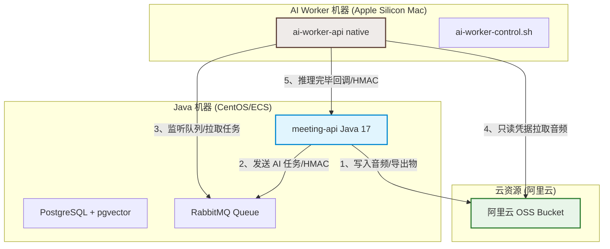

# Apple Silicon 上的 ai-worker 部署运行手册

本文档说明如何在 Apple Silicon Mac 上原生运行 `ai-worker`，并与部署在另一台独立机器（如 CentOS/ECS）上的 `meeting-api` Java 服务进行生产标准的联调部署。

本文档已针对**两机部署拓扑**、**阿里云 OSS 生产级只读凭据**、**后台守护进程控制脚本**进行深度优化，提供一步一步超详细的部署与运维指南。

---

## 0. 部署决策与两机拓扑

### 0.1 部署边界与生产交接
> [!IMPORTANT]
> - **这不是生产 serving 路径**。生产 `ai-worker` 必须使用 Linux + NVIDIA + CUDA 镜像和 GPU 节点池（详见 `deploy/DEPLOY.md` §5.5.2.A）。
> - **两机联调目的**：在 Apple Silicon Mac 上利用 MPS (Metal Performance Shaders) 验证真实模型推理逻辑、ASR、说话人分离（Diarization）、HMAC 签名回调、RabbitMQ 异步任务以及阿里云 OSS 真实音频读取路径，确保业务链路完全打通，实现**生产级演练**。

### 0.2 两机部署标准拓扑架构

两机部署要求将 Java 核心服务与 AI 权重推理服务彻底分离。两者通过受控网络及一致的 HMAC 密钥进行双向通信。



两机联调必须配置双方均能访问的内网 IP、VPN IP 或域名。**禁止在跨机器配置中使用 `localhost` 或 `127.0.0.1`**。

| 方向 | 正确配置 | 禁止值 |
|------|----------|--------|
| **Java -> Mac worker** | Java 侧 `AI_WORKER_BASE_URL=http://<apple-mac-ip-or-vpn-name>:8090` | `localhost`, `127.0.0.1`, `host.docker.internal` |
| **Mac worker -> Java** | Mac 侧 `AI_WORKER_MEETING_API_BASE_URL=http://<centos-ip-or-domain>:8080` | `localhost`, `127.0.0.1` |
| **Mac worker -> RabbitMQ** | Mac 侧 `AI_WORKER_RABBITMQ_HOST=<centos-ip-or-vpn-name>` | 对公网开放的 RabbitMQ 物理端口 |
| **Mac worker -> OSS** | Mac 侧 `AI_WORKER_STORAGE_BACKEND=oss` + 只读 RAM 凭据 | 复用 Java 侧写权限的主账号/RAM 凭据 |

---

## 1. 一步一步超详细部署步骤 (Mac 侧)

本指南针对全新 Apple Silicon Mac 编写。请严格按顺序逐步执行。

### 第一步：确认机器硬件与系统

在 Mac 终端中运行以下命令，确认系统是否为 Apple Silicon 架构且空间充足：

```bash
# 1. 确认系统内核架构 (必须返回 arm64)
uname -m

# 2. 确认系统版本 (建议 macOS 13+)
sw_vers

# 3. 检查系统盘可用空间 (建议 100 GB 以上，大容量模型和依赖占用多)
df -h "$HOME"
```

> [!WARNING]
> 如果 `uname -m` 返回 `x86_64`，说明当前终端可能运行在 Rosetta 兼容模式下，或者当前 Mac 是 Intel 芯片。请勿继续，必须在原生 arm64 终端下运行。

---

### 第二步：安装 Xcode Command Line Tools 和 Homebrew

```bash
# 1. 安装 Xcode 命令行工具 (如已安装会提示已存在)
xcode-select --install

# 2. 安装 Mac 软件包管理工具 Homebrew (如果还没有)
/bin/bash -c "$(curl -fsSL https://raw.githubusercontent.com/Homebrew/install/HEAD/install.sh)"

# 3. 配置 Homebrew 环境变量到 Shell
eval "$(/opt/homebrew/bin/brew shellenv)"
echo 'eval "$(/opt/homebrew/bin/brew shellenv)"' >> ~/.zshrc

# 4. 验证 Homebrew 前缀 (Apple Silicon 标准前缀为 /opt/homebrew)
which brew
```

---

### 第三步：安装系统原生依赖与 uv 工具

`ai-worker` 推理及音频库在编译部分 C 依赖时，需要系统 native 库支持：

```bash
# 安装基础包 (uv 用于超快速 Python 包管理，libsndfile 和 ffmpeg 用于音频处理)
brew install git uv python@3.11 ffmpeg cmake pkg-config libsndfile jq openssl
```

---

### 第四步：拉取源码与配置目录

```bash
# 1. 克隆项目仓库到本地
git clone https://github.com/JAHSEH618/meeting.git
cd meeting

# 2. 准备统一的模型权重保存目录 (确保磁盘可用空间 > 50G)
# 默认路径是当前用户家目录下的 meeting-models。如果想存在外置硬盘，可指向如 /Volumes/External/meeting-models
export AI_WORKER_MODELS_ROOT="$HOME/meeting-models"
mkdir -p "$AI_WORKER_MODELS_ROOT"
```

---

### 第五步：模型权重就位 (二选一)

#### 选项 A：Stage 快速 Mock 权重（用于无网/快速流程验证）
此路径不下载任何大模型，仅生成结构完整、哈希确定的 Mock 权重文件，供服务无缝启动并跑通 API / 签名检查流程。

```bash
# 执行 Mock 权重生成脚本，会自动在 deploy 下写入 env.checksums 校验文件
./deploy/ai-worker-apple-silicon.sh stage
```

#### 选项 B：下载生产级真实模型权重（用于真实 ASR、说话人分离演示）
> [!NOTE]
> 下载 pyannote 权重需要 HuggingFace Token，且需提前在浏览器中登录 HuggingFace 并手动接受模型使用条款：
> [pyannote/speaker-diarization-3.1 条款页](https://huggingface.co/pyannote/speaker-diarization-3.1)

```bash
# 使用您的 HuggingFace Token 下载全部真实权重：
# BGE / Qwen3-ASR / Qwen3-ForcedAligner / pyannote 子模型 / CAM++ 声纹模型
export HF_TOKEN="hf_xxxxxxxxxxxxxxxxxxxxxxxxxxxxx"
./deploy/ai-worker-apple-silicon.sh weights
```

---

### 第六步：配置两机联调环境参数

我们必须从 Java 机器的配置文件（如 `deploy/.meeting-api-prod.env`）中获取 RabbitMQ 连接参数及双向 HMAC 密钥，并在 Mac 侧配置副本。

```bash
# 1. 复制或创建 CentOS 联调专用环境配置文件
cp deploy/.ai-worker-apple-silicon.env deploy/.ai-worker-apple-silicon.env.centos 2>/dev/null || ./deploy/ai-worker-apple-silicon.sh env
# 此时会生成 deploy/.ai-worker-apple-silicon.env，我们将其复制为 centos 后端配置
cp deploy/.ai-worker-apple-silicon.env deploy/.ai-worker-apple-silicon.env.centos
```

编辑 `deploy/.ai-worker-apple-silicon.env.centos`，将其修改为如下内容（**必须与 Java 侧配置完全同步**）：

```bash
# ==============================================================================
# AI Worker 跨机器联调配置参数 (CentOS 目标机)
# ==============================================================================

# 1. 远程 RabbitMQ 队列连接 (指向 CentOS 服务器)
AI_WORKER_RABBITMQ_HOST=<centos-server-ip-or-vpn-ip>
AI_WORKER_RABBITMQ_PORT=5672
AI_WORKER_RABBITMQ_USERNAME=meeting
AI_WORKER_RABBITMQ_PASSWORD=<CentOS 侧生成的真实 rabbitmq_password>

# 2. 远程 meeting-api 基础服务地址 (指向 CentOS 服务器)
AI_WORKER_MEETING_API_BASE_URL=http://<centos-server-ip-or-vpn-ip>:8080
AI_WORKER_JAVA_API_BASE_URL=http://<centos-server-ip-or-vpn-ip>:8080

# 3. 生产标准双向安全 HMAC Secret (必须与 Java 侧完全一致，且两组 Secret 彼此不同)
AI_WORKER_CALLBACK_HMAC_SECRET=<CentOS 侧生成的 32 字节十六进制 callback_secret>
AI_WORKER_INTERNAL_API_HMAC_SECRET=<CentOS 侧生成的 32 字节十六进制 internal_secret>
AI_WORKER_ADMIN_JWT_SECRET=<本地随机的 32 字节 admin_secret>

# 4. 阿里云 OSS 生产标准只读访问凭据 (只允许 GetObject, HeadObject)
AI_WORKER_STORAGE_BACKEND=oss
AI_WORKER_OSS_ENDPOINT=https://oss-cn-hangzhou.aliyuncs.com
AI_WORKER_OSS_REGION=cn-hangzhou
AI_WORKER_OSS_ACCESS_KEY_ID=<worker 专用 OSS 只读 RAM AK>
AI_WORKER_OSS_ACCESS_KEY_SECRET=<worker 专用 OSS 只读 RAM SK>
```

> [!CAUTION]
> 绝对不要把 Java 端的读写 AccessKey 暴露给 Worker！Worker 应当只被赋予最小化只读 RAM Policy 权限。

---

## 2. 后台守护进程控制脚本 (`ai-worker-control.sh`)

为了方便快速启动、停止和重启服务，不再占用前台终端，我们编写了高度可靠的后台控制脚本 `deploy/ai-worker-control.sh`。

### 2.1 控制脚本命令矩阵

在 Mac 侧，使用以下命令对服务进行管理：

| 操作 | 运行命令 | 场景说明 |
|------|----------|----------|
| **启动 (本地模式)** | `./deploy/ai-worker-control.sh start` | 用于单机 localhost 测试，读取 `.ai-worker-apple-silicon.env` |
| **启动 (联调模式)** | `./deploy/ai-worker-control.sh start centos` | 用于两机部署联调，读取 `.ai-worker-apple-silicon.env.centos` |
| **停止服务** | `./deploy/ai-worker-control.sh stop` | 安全、优雅地杀掉后台的 uv 和 python 推理进程 |
| **重启服务** | `./deploy/ai-worker-control.sh restart [local/centos]` | 一键平滑重启服务并重新加载对应环境参数 |
| **查看状态** | `./deploy/ai-worker-control.sh status` | 查看进程运行状态、端口监听情况、以及 Actuator API 响应 |
| **查看日志** | `./deploy/ai-worker-control.sh logs` | 实时追踪后台输出流，Ctrl-C 退出跟踪但不停止后台服务 |

---

### 2.2 启动与运行管理示例

```bash
# 1. 以后台守护进程模式启动，连接 CentOS 机器
./deploy/ai-worker-control.sh start centos

# 2. 检查后台进程状态、端口监听与 API readiness
./deploy/ai-worker-control.sh status

# 3. 追踪启动日志，观察 Python 推理环境初始化
./deploy/ai-worker-control.sh logs
```

后台日志文件默认保存在 `deploy/ai-worker.log`，PID 保存在 `deploy/ai-worker.pid`。

---

## 3. 设备路由与性能预期

本手册在 Apple Silicon 原生运行时，模型计算资源分配策略如下：

| 模型 / 能力 | 物理运行设备 | 精度类型 | 硬件分配决策理由 |
|-------------|--------------|-------|------------------|
| **BGE-m3 Embedding** | **MPS (GPU)** | `fp32` | FlagEmbedding 原生支持 MPS 加速；fp16 在 arm 架构有数值溢出风险 |
| **BGE-reranker-v2** | **MPS (GPU)** | `fp32` | 同样使用 MPS 加速，大幅缩短 RAG 阶段耗时 |
| **Qwen3-ASR (funasr)**| **CPU** | `fp32` | Funasr 涉及的算子集在 PyTorch 2.5 MPS 下支持不全，强切易 Crash |
| **pyannote diarization**| **CPU** | `fp32` | 分离模型常触发 CPU Fallback 回退警告，直接运行在 CPU 上反而最稳定 |

性能预期参考：
- **Embedding / Rerank**：毫秒至亚秒级响应，完全无感。
- **ASR (语音转文字)**：在 M 系列芯片上运行吞吐大约为 `0.5× 实时` (即处理 1 分钟音频需要约 2 分钟)。
- **Diarization (说话人分离)**：M2/M3 等芯片大约可达到 `1× 实时`。
- **内存建议**：运行真实权重建议 Mac 物理内存 >= 32GB。运行前关闭 Xcode、Docker Desktop 等高内存开销任务。

---

## 4. 排障与日志审计

在两机部署拓扑下，请仔细对照以下矩阵定位并排除故障：

| 现象 / 报警 | 常见病因分析 | 推荐处理步骤 |
|------------|-------------|------------|
| **端口 8090 未监听，status 显示死进程** | 未下载完整权重文件，导致 PyTorch 在启动时抛出文件缺失异常 | 检查 `deploy/ai-worker.log` 日志，确认 `AI_WORKER_MODELS_ROOT` 下是否有缺失目录；可运行 `stage` 子命令做 Mock 冒烟排除硬件包故障。 |
| **Java 端日志显示：HMAC rejected / 401** | Mac 端与 CentOS 端的两组 HMAC 密钥没有保持一致 | 重新校对 Mac 的 `.env.centos` 和 CentOS 的 `.env`，确保 `AI_WORKER_CALLBACK_HMAC_SECRET` 和 `AI_WORKER_INTERNAL_API_HMAC_SECRET` 在两边完全相同。 |
| **Worker 进程被 OOM 强行 Kill** | 统一内存空间压力过大，macOS 自动触发杀进程机制 | 关闭无关的大型软件，若内存实在不足，建议临时切换回 `stage` Mock 模型模式进行链路演练。 |
| **ASR 任务处理失败：OSS connection timeout** | Worker 无法直连公网 OSS，或者使用了不支持的 internal 端点 | 跨机运行时，Mac Worker 必须配置 OSS 的**公网 Endpoint**（例如 `https://oss-cn-hangzhou.aliyuncs.com`），因为 Mac 通常不在阿里云内网 VPC。 |
| **ASR 任务处理失败：OSS 403 Forbidden** | 传入的只读 RAM AK/SK 权限配置错误，或者 bucket 跨域限制未放开 | 1. 登录阿里云控制台，验证 Worker 的 RAM 账号确实具备对这三个 bucket 的 `oss:GetObject` 和 `oss:HeadObject` 权限。<br>2. 确认 bucket CORS 设置中包含了 Mac Worker 以及 API 的域名地址。 |

---

## 5. 验收清理

如果在演示或排产验证完毕后需要清理 Mac 本地环境，运行以下命令：

```bash
# 1. 停止后台 AI Worker 进程
./deploy/ai-worker-control.sh stop

# 2. 清理临时环境文件 (保留 centos 配置文件副本)
rm -f deploy/.ai-worker-apple-silicon.env
rm -f deploy/.ai-worker-apple-silicon.env.checksums

# 3. 清理生成的本地日志与 PID 文件
rm -f deploy/ai-worker.log deploy/ai-worker.pid

# 4. 根据需要清理模型权重 (若磁盘吃紧)
rm -rf "$HOME/meeting-models"
```

相关参考文档：
- `docs/runbooks/meeting-api-java.md` (Java 部署与阿里云 OSS 权限设置)
- `deploy/DEPLOY.md`
- `deploy/ai-worker-control.sh`
