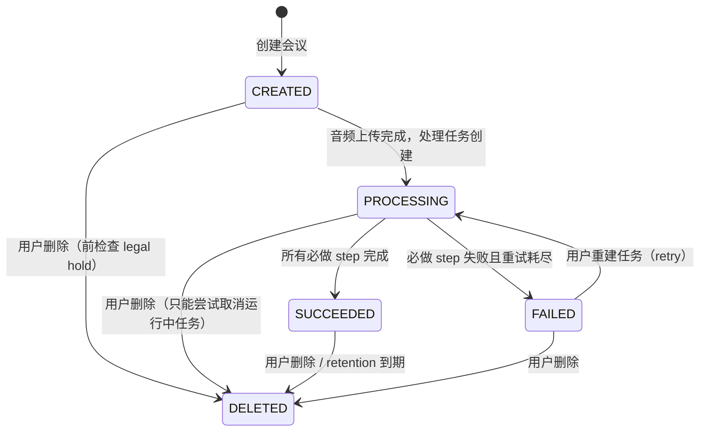

# Spec 修正补丁 · A5/A6/A7/A8/A9/A10/A11/A12

> 状态：历史决策记录。
> 当前开发不再把本文作为第二套权威规格读取；活动规则以 `docs/spec.md`、`docs/app-api-contracts.md`、`packages/meeting-contracts/**` 和各子项目 `SPEC.md` 为准。
> 如果本文与活动规格或可校验事实源冲突，以活动规格和事实源为准。

---

## A5. Heartbeat 幂等键逻辑修正

**问题**：原 spec 规定所有 callback 走 `Idempotency-Key` + `request_body_hash` 校验，
但 heartbeat body 含时间戳所以 hash 每次都不同，第二次心跳即 409。

**修正**：

callback 按 idempotency 策略分为两类：

| callback 路径 | method | idempotency 策略 |
|---|---|---|
| `PATCH .../steps/{stepName}` | 进度/心跳 | **不入幂等表**。仅校验 attempt + lease，状态写最新值（latest-wins）。`payloadVersion` 固定为 `v1`。 |
| `PATCH .../steps/{stepName}` | 开始/完成/失败 | 入幂等表，正常 body-hash 校验。 |
| `POST .../artifacts` | — | 入幂等表 |
| `POST .../transcript` | — | 入幂等表 |
| `POST .../speaker-candidates` | — | 入幂等表 |
| `POST .../embeddings` | — | 入幂等表 |
| `POST .../complete` | — | 入幂等表 |
| `POST .../fail` | — | 入幂等表 |

区分规则：`PATCH .../steps/{stepName}` 中，`status=RUNNING` 且 `progress > 0` 时为进度/心跳，
不走 body-hash 校验。`status=SUCCEEDED / FAILED` 或首次 `RUNNING (progress=0)` 时入幂等表。

幂等键格式维持不变：`{taskId}:{stepName}:{attemptNo}:{payloadVersion}`。

对于不入幂等表的 heartbeat：
- 仅校验 `X-Attempt-No == current attempt_no`、`X-Lease-Owner == current lease_owner`
- 更新 `heartbeat_at`、`progress`、`lease_expires_at`
- 不存在幂等冲突

---

## A6. SUMMARY / EXTRACTION step 推进方

**问题**：`processingStep` 枚举含 `SUMMARY` 和 `EXTRACTION`，
但 `ai-worker` Pipeline DAG 不含这两个 step，也没有 spec 说谁负责更新它们的 step status。

**修正**：

- `SUMMARY` 和 `EXTRACTION` 的 step status 由 **Java `meeting-api-app` 模块**更新。
- 流程：
  1. `ai-worker` callback `TRANSCRIPT_MERGE` 完成后，Java task 模块将转录落库。
  2. Java meeting 模块触发 `llm-gateway` 调用 DashScope 生成纪要和结构化事项。
  3. Java `task` 模块通过内部 service 接口更新 `processing_task_steps` 表中 `SUMMARY` / `EXTRACTION` step 的 status（PENDING → RUNNING → SUCCEEDED / FAILED）。
  4. 这些 step 状态变化产生 `TASK_STEP_UPDATED` SSE 事件，前端可观测。
- `ai-worker` 不参与 `SUMMARY` / `EXTRACTION` 的推进。
- Java task 模块提供内部 service 接口 `TaskStepProgressService`：
  ```java
  void updateStepStatus(taskId, stepName, status, progress, errorCode);
  ```
  供 meeting/llm-gateway 模块调用。

---

## A7. stepStatus.SKIPPED 落点

**问题**：`stepStatus.SKIPPED` 存在于枚举但 DDL 无约束、spec 未说何时写入。

**修正**：

- `SKIPPED` 仅在 worker callback `/complete` 的 `skippedSteps` 中声明时写入。
- Java task 模块处理 `/complete` callback 时，
  对于 `skippedSteps` 中的每个 step，将其 `processing_task_steps.status` 更新为 `SKIPPED`。
- DDL 中 `processing_task_steps.status` 列使用 `step_status` PostgreSQL enum type
  （已通过 V202605110001 创建）。
- `taskStatus` 仅用于 `processing_tasks.status`，`stepStatus` 仅用于 `processing_task_steps.status`。

---

## A8. HMAC 签名路径与 OpenAPI server prefix

**问题**：`internal-callback-api.yaml` 中 `servers: [{url: /internal}]`，
路径定义不含 `/internal` 前缀。但 spec 要求 signing_string 中 `URL_PATH_WITH_QUERY`
必须包含 `/internal`。

**修正**：

- SDK 生成的 client 拼接 URL 时使用 `{server.url}/{path}`，
  即 `/internal/processing-tasks/{taskId}/steps/{stepName}`。
- signing_string 中的 `URL_PATH_WITH_QUERY` 必须使用拼接后的完整路径
  （含 `/internal` 前缀）。
- Java 服务端签名校验使用收到请求的原始 URI path（含 `/internal`）。
- 约束：使用 OpenAPI codegen 生成的 client 必须在构造 HMAC 签名前，
  使用完整请求 URL 的 path 部分（含 server prefix），而非仅 OpenAPI paths 中定义的相对路径。

---

## A9. chunkStrategyVersion 默认来源

**问题**：`processing-task-message.schema.json` 中 `expectedInputVersion.chunkStrategyVersion` 必填，
但首次创建任务时没有 spec 规定此值从哪来。

**修正**：

- `chunkStrategyVersion` 的默认值由 Java `meeting.chunk.strategy-version` 配置项提供。
- 配置示例：`meeting.chunk.strategy-version: "chunk-2026.05.1"`
- 首次创建 `MEETING_FULL_PIPELINE` 任务时，Java task 模块从配置读取并填入消息。
- 重建/重索引任务使用当前 `knowledge_chunks` 表中的 `chunk_strategy_version` 或更高级别的配置。
- chunk 策略变更时，配置值变更即触发 shadow index + backfill 流程。

---

## A10. DDL status 列 CHECK 约束

**问题**：41 张表 17 个 status 列全部裸 `text DEFAULT '...'`，无约束。

**修正**：

一期三张核心表的 status 列必须加 CHECK 约束（后续 migration V202605110002）：

| 表 | 列 | CHECK |
|---|---|---|
| `meetings` | `status` | `IN ('CREATED','PROCESSING','SUCCEEDED','FAILED','DELETED')` |
| `meetings` | `security_level` | 已有 `security_level` enum type |
| `processing_tasks` | `status` | 已有 `task_status` enum type |
| `processing_task_steps` | `status` | 已有 `step_status` enum type |
| `knowledge_chunks` | `status` | 已有 `content_status` enum type |
| `knowledge_chunks` | `stale_status` | 已有 `stale_status` enum type |
| `meeting_minutes` | `stale_status` | 已有 `stale_status` enum type |
| `meeting_action_items` | `stale_status` | 已有 `stale_status` enum type |
| `meeting_decisions` | `stale_status` | 已有 `stale_status` enum type |
| `meeting_risks` | `stale_status` | 已有 `stale_status` enum type |

> 说明：`processing_tasks.status` 等列在 V202605110001 中已使用 `task_status` /
> `step_status` / `content_status` / `stale_status` / `security_level` /
> `acceptance_status` PostgreSQL enum type，它们自带值域约束。
> `meetings.status` 仍为裸 text，需在下一个 migration 中改为 `meeting_status` enum type
> 或加 CHECK 约束。

后续 migration V202605110002：
```sql
DO $$ BEGIN
  CREATE TYPE meeting_status AS ENUM ('CREATED','PROCESSING','SUCCEEDED','FAILED','DELETED');
EXCEPTION WHEN duplicate_object THEN NULL;
END $$;

ALTER TABLE meetings
  ALTER COLUMN status TYPE meeting_status USING status::meeting_status,
  ALTER COLUMN status SET DEFAULT 'CREATED'::meeting_status;
```

---

## A11. domain_events_outbox.sequence_no 分配策略

**问题**：多实例并发写同聚合时未指定如何保证 sequence_no 单调递增。

**修正**：

使用 PostgreSQL advisory lock 或 row-level lock 保护同聚合 sequence_no：

```sql
-- 同一事务中：
SELECT sequence_no FROM domain_events_outbox
WHERE tenant_id = :tenantId
  AND aggregate_type = :aggregateType
  AND aggregate_id = :aggregateId
ORDER BY sequence_no DESC
LIMIT 1
FOR UPDATE;  -- 锁住当前聚合的最新一行

-- 如果无行，sequence_no = 1；否则 +1
```

或使用数据库 SEQUENCE（跨聚合全局递增），但 SPEC 要求单聚合内有序即可。
一期选择 `SELECT ... FOR UPDATE` 策略，与 outbox publisher 的 `FOR UPDATE SKIP LOCKED` 共处同一事务隔离级别 `READ_COMMITTED`。

---

## A12. meetingId 在 callback 中非会议任务的校验规则

**问题**：非 `MEETING_FULL_PIPELINE` 任务（TEXT_EMBEDDING、RAG_REINDEX、SPEAKER_ENROLLMENT）的
`meetingId` 可为 null，但 callback 校验规则写了 `tenantId、taskId、meetingId 关系一致`。

**修正**：

callback 校验规则精化：
1. `taskId` 存在且 `attempt_no` 与当前 attempt 一致。
2. `tenantId` 与 `processing_tasks.tenant_id` 一致。
3. 当 `taskType` 为 `MEETING_FULL_PIPELINE` 时，`meetingId` 必须非空且匹配；
   当 `taskType` 为 `TEXT_EMBEDDING` / `RAG_REINDEX` 时，`meetingId` 和 `documentId` 至少一个非空；
   当 `taskType` 为 `SPEAKER_ENROLLMENT` 时，`meetingId` 可为 null。

callback body 中的 `meetingId` 字段因此必须在 `internal-callback-api.yaml` 各 schema
中将 `required` 移除或按 condition 声明。

---

## F3. meetings.status 状态机

**问题**：MeetingStatus 在 enums.yaml / Java / DDL / SPEC 四处不一致，
且没有正式的状态迁移图。

**修正**：统一为 5 个状态。DDL 已加 `meeting_status` enum type（V202605110002）。



| 转换 | 触发方 | 副作用 |
|---|---|---|
| `CREATED → PROCESSING` | task 模块 outbox 发布后 meeting 状态同步 | 前端显示进度条 |
| `PROCESSING → SUCCEEDED` | worker `/complete phase=WORKER_DAG` 后，Java 完成 `SUMMARY` / `EXTRACTION` 并同步 task 终态 | 转录/纪要可查看；RAG 可检索 |
| `PROCESSING → FAILED` | worker `/fail` callback 或租约过期 | 前端显示错误码和重试入口 |
| `任意 → DELETED` | 用户删除 / deletion_job | 先检查 legal_hold；存在时 423 阻断 |
