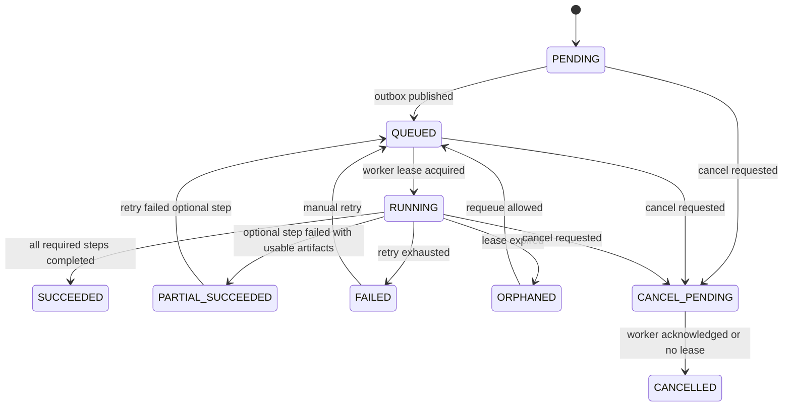

# 本地会议智能系统一期 Spec

> 本文保留为一期总规格。工程和子项目级细化规格已拆到对应目录：`apps/meeting-web/SPEC.md`、`apps/meeting-api/SPEC.md`、`apps/ai-worker/SPEC.md`、`packages/meeting-contracts/SPEC.md`、`infra/meeting-infra/SPEC.md`。`meeting-api` 内部 COLA-V5 子项目规格见各子模块下的 `SPEC.md`。

## 1. 背景与目标

一期目标是交付一个可用的本地会议智能系统闭环：

```text
用户上传会议音频
→ Java 创建会议和处理任务
→ Python ai-worker 本地处理音频、ASR、说话人分离、声纹识别
→ Python 通过 callback 回写 Java
→ Java 通过 llm-gateway 调用 DashScope 生成纪要、待办、决策、风险
→ Java 建立会议与文档知识库
→ 用户进行 RAG 问答、编辑、导出 Markdown / DOCX / PDF
```

系统采用 Java 与 Python 分开部署但一期打通的模式：

1. Java 是主产品入口、业务事实来源、权限来源、任务编排方和统一 UI 后端。
2. Python 是独立部署的 AI 计算层，运行在独立 GPU 机器上；一期最低目标为 RTX 3090 / 4090 24GB 或同等显存 GPU。
3. Java 与 Python 通过 RabbitMQ、TOS URI、结构化 JSON、internal callback API 集成。
4. ASR、说话人分离、声纹 embedding 和匹配在本地 Python 侧处理。
5. ASR 后文本、转录片段、文档文本和 RAG 上下文只有在安全等级允许时才能发送到阿里 DashScope。
6. 一期只开放 `PUBLIC` / `INTERNAL` 会议的自动 LLM 能力；转写后的文本发送第三方 LLM 前不做文本脱敏，必须记录安全等级、调用审计和输入 / 输出 hash。
7. 音频原文件、声纹参考音频、声纹 embedding 不发送到 DashScope。

## 2. 一期范围

### 2.1 必做功能

#### 账号与权限

1. 内置账号体系。
2. 支持用户登录、退出、基础用户管理。
3. 支持租户隔离。
4. PostgreSQL 必须实现 Row-Level Security。
5. 所有业务表包含 `tenant_id`。
6. 所有请求、后台任务、callback、导出任务都必须携带并设置 tenant context。
7. 连接池借出连接后必须在每个事务开始时设置 tenant context，事务结束必须 reset；current tenant 缺失时 fail closed。
8. 超级管理员跨租户访问必须走独立 break-glass 入口，要求 reason、审批人、时间窗口和 audit_event。
9. 一期会议安全等级默认开放 `PUBLIC` / `INTERNAL`；用户可以创建 `CONFIDENTIAL` / `SECRET` 会议用于 schema 和接口验证，但 LLM 相关 step 必须返回 `SECURITY_LEVEL_BLOCKED`，前端显式提示“一期不支持该安全等级的自动 LLM 处理”。

#### 会议音频处理

1. React UI 支持创建会议。
2. 支持上传会议音频。
3. 单场会议音频最长 4 小时。
4. 上传走异步任务，不承诺实时完成。
5. 支持大文件上传断点续传：默认分片 `8 MiB`，单文件最大 part 数 `10000`，upload session 有效期 `24h`；客户端对单个 part 最多重试 `3` 次；服务端按 `(upload_id, part_number, sha256)` 去重，complete 时必须校验全文件 `sha256`。
6. 原始音频存储到火山引擎 TOS。
7. Java 创建处理任务并发送 RabbitMQ 消息。
8. Python ai-worker 消费任务，读取 TOS 音频，执行本地 AI Pipeline。
9. Python 回写任务步骤、产物和最终结果。

#### Python AI Pipeline

1. 音频标准化：先识别并保存 `channel_map`，保留多声道信息；只有明确为多人单通道或确认可混音时，才转为 16kHz mono WAV。
2. 音频质量检测：采样率 `< 16 kHz` 直接 reject；信噪比 `< 5 dB` 标记 `AUDIO_QUALITY_LOW`，默认仍允许 ASR 继续并在 UI 暴露质量警告；阈值配置在 `app.audio.quality.*`。
3. VAD 先识别有效语音区间；ASR 默认 chunk `60s`，允许范围 `30-120s`，overlap 默认 `0.5s`；短于 `30s` 的相邻 VAD 区间可合并；切片策略版本写入 `pipeline_version` 和 `artifact_manifests`。
4. 本地 ASR。
5. 说话人分离，输出 `SPEAKER_00` 等匿名 label。
6. 声纹注册音频 embedding 提取。
7. 会议 speaker embedding 提取。
8. 声纹候选匹配。
9. ASR 与 Diarization 合并为结构化转录。
10. 中间产物写入 TOS。
11. 结构化结果通过 callback 回写 Java。

#### 声纹注册与识别

1. 支持通过上传参考音频注册声纹。
2. Java 管理声纹档案、授权记录、人员绑定、删除和审计。
3. Python 负责参考音频 embedding 提取。
4. Python 负责会议中 speaker label 的 embedding 提取与候选匹配。
5. 前端支持查看候选人、置信度、人工确认和拒绝。
6. 不做全公司无差别声纹搜索。
7. 声纹 embedding 不返回前端。
8. 声纹数据不发送给 DashScope。
9. 声纹 embedding 必须由 Java 侧应用层信封加密存储：算法 `AES-256-GCM`，nonce `12 bytes`，tag `16 bytes`，data key `256 bit` 由 KMS `GenerateDataKey` 生成并由 master key 包裹；数据库只保存 `embedding_ciphertext`、`embedding_nonce`、`embedding_tag`、`embedding_dek_wrapped`、`kms_key_id`、`kms_key_version`、`embedding_checksum`，不存明文 float 数组，不建立明文 pgvector 索引。
10. 撤销声纹授权必须级联：新匹配排除该 profile，历史转录中的 person_id 软屏蔽，相关 RAG chunk 标记 STALE 并重建去标识版，声纹 centroid 异步重建。

#### 转录与编辑

1. 展示结构化转录片段。
2. 每个片段包含 speaker、start/end 时间、文本、置信度、来源版本。
3. 支持人工编辑转录文本。
4. 支持人工确认 speaker label 到具体人员。
5. 编辑转录后，下游纪要、待办、决策、风险、RAG chunk 标记为 STALE。
6. 支持重新生成纪要和重新入库。
7. 转录保存 `original_text`、`edited_text` 和 `current_text`，ASR 评测只能使用 `original_text`。

#### 会议纪要

1. Java 通过 llm-gateway 发起和审计会议纪要生成；长会议分块、合并和质量检查可由 Python LangGraph Agent 编排，但必须经 Java llm-gateway 调用模型。
2. DashScope 输入为 ASR 后文本、结构化转录和必要上下文。
3. 纪要必须包含：
   - 会议信息
   - 参会人
   - 核心结论
   - 议题讨论
   - 已决定事项
   - 待办事项
   - 风险与阻塞
   - 待确认问题
   - 原文依据
4. 待办、决策、风险需要结构化存储。
5. AI 生成的待办默认是建议，用户确认后成为业务待办。
6. 关键结论和待办必须保存 evidence segment 和 `evidence_text_snapshot`。
7. 重生成纪要只能产生 diff 或新建议，不能覆盖用户已确认字段，不能改写已同步外部任务的 status。
8. 纪要、待办、决策、风险必须区分业务 `status` 与内容 `stale_status`。

#### 文档知识库

1. 支持上传知识库文档。
2. MVP 支持：
   - 可提取文本的 PDF
   - DOCX
   - TXT
   - Markdown
3. 不做图片 OCR。
4. 不做扫描 PDF OCR。
5. 不做复杂表格解析。
6. 文档解析由 Java `document` 模块负责，优先使用 Apache Tika 或同类 JVM 解析库；PDF / DOCX 解析不进入 Python AI Pipeline。
7. 文档 chunk 与会议 chunk 使用同一套 RAG 权限过滤和 citation 机制。

#### RAG 问答

1. 一期支持完整 RAG 问答。
2. 入库对象包括：
   - 转录片段
   - 会议纪要
   - 决策事项
   - 待办事项
   - 风险事项
   - 文档知识库
3. 使用 PostgreSQL + pgvector 作为一期向量检索实现。
4. 检索前必须由 Java 计算用户可访问范围。
5. 向量检索结果返回前必须做 PostgreSQL 权限二次校验。
6. RAG 答案必须带引用来源。
7. 会议引用精确到 meeting、speaker、segment、timestamp。
8. 文档引用精确到 document、chunk、页码或段落标识。
9. STALE / DELETED chunk 不允许被召回。
10. RAG 上下文在 `PUBLIC` / `INTERNAL` 范围内可发送到 DashScope，发送前不做文本脱敏；`CONFIDENTIAL` / `SECRET` 一期 fail closed。

#### 导出

1. 支持 Markdown 导出。
2. 支持 DOCX 导出。
3. 支持 PDF 导出。
4. 导出必须异步执行。
5. PDF 可通过 LibreOffice headless 或类似转换服务实现。
6. 导出文件存储到 TOS。
7. 导出绑定输入版本：`minutes_version`、`transcript_version`、`rag_version`。
8. 如果内容已 STALE，导出前必须提示用户确认或先重生成。
9. export 是独立业务域，导出任务进入独立 export 队列和 `export_jobs`，会议模块只持有导出状态摘要。
10. 导出短链必须可撤销；高敏等级预留水印和外发审批字段。

#### 任务与进度

1. 所有长任务进入 `processing_tasks`。
2. 支持步骤级进度。
3. 前端使用 SSE 展示进度。
4. 支持任务取消。
5. 支持失败重试。
6. 支持部分成功。
7. 支持 callback 幂等重放。
8. 业务状态变更和事件发布必须使用 outbox，`domain_events_outbox` 与业务事务同事务提交。
9. Worker 必须支持 lease、heartbeat、ORPHANED 重新入队和 DLQ。
10. 所有 AI 对外结果必须能追溯到 `artifact_manifest`。

#### 落地真值文件

1. DDL 真值文件是 `docs/ddls/001_initial_schema.sql`；本文件只描述模型边界和必须存在的表，不在 Markdown 中复制完整 DDL。
2. 跨应用契约真值文件是 `packages/meeting-contracts/openapi/public-api.yaml`、`packages/meeting-contracts/openapi/internal-callback-api.yaml` 和 `packages/meeting-contracts/schemas/**`。
3. 修改字段、枚举、错误码、状态机或 API 时，必须同步更新真值文件和本 spec 的约束说明；CI 应以真值文件 lint / schema 校验结果为准。

### 2.2 一期不做

1. 实时会议字幕。
2. 在线多人协同编辑。
3. 飞书、企微、Jira、CRM 深度集成。
4. 扫描件 OCR。
5. 图片 OCR。
6. 复杂 Office 表格结构还原。
7. 全公司无差别声纹搜索。
8. CONFIDENTIAL / SECRET 会议的自动 LLM 处理。
9. 多套外置向量库，除非 pgvector 在验收前已明显无法支撑。
10. 本地大语言模型；相关 provider、路由和接口仅预留，未启用时必须 fail closed。

## 3. 总体架构

说明：下图只展示端到端主链路；Outbox、队列拆分、Worker lease、异步 export 和 Pipeline DAG 的细节见 `structure.md`、§6、§7、§11。

```text
React meeting-web
  → Java meeting-api
      → PostgreSQL + pgvector
      → RabbitMQ
      → TOS
      → DashScope
      → Java export module + LibreOffice headless
      → Python ai-worker
          → 本地 ASR / Diarization / Speaker Embedding / Embedding / Rerank
          → TOS
          → Java internal callback API
```

### 3.1 Java meeting-api

技术栈：

```text
Spring Boot + 阿里 COLA-V5
PostgreSQL
pgvector
RabbitMQ
火山 TOS SDK
DashScope OpenAI-compatible API
LibreOffice headless 或等价导出组件
```

Java 后端必须使用阿里 COLA-V5 架构实现。MVP 仍是一个 `meeting-api` 模块化单体，不提前拆成多个 Java 微服务；工程内按 COLA-V5 分层，分层内再按业务域隔离。

COLA-V5 工程模块：

| COLA-V5 模块 | 职责 |
|---|---|
| meeting-api-start | Spring Boot 启动、配置装配、组件扫描、环境配置 |
| meeting-api-client | 对外 DTO、Command、Query、Result、Facade 契约，不放业务实现 |
| meeting-api-adapter | REST API、SSE、internal callback、`export-queue` consumer、前端 BFF 适配 |
| meeting-api-app | 应用服务、用例编排、事务边界、租户上下文、权限编排、领域事件发布 |
| meeting-api-domain | 聚合、实体、值对象、领域服务、领域事件、Repository / Gateway 接口 |
| meeting-api-infrastructure | PostgreSQL / pgvector、TOS、RabbitMQ、DashScope、导出组件、外部网关实现 |

COLA-V5 依赖方向：

```text
adapter -> app / client
app -> domain / client
infrastructure -> domain / client
start -> adapter / app / infrastructure
domain 不依赖 adapter、app、infrastructure
```

业务域模块：

| 业务域 | 职责 |
|---|---|
| api / bff | React API、鉴权、限流、响应聚合 |
| user-auth | 内置账号、用户、角色、租户 |
| meeting | 会议生命周期、转录、纪要、待办、决策、风险 |
| task | 异步任务、状态机、步骤、重试、取消、幂等 |
| storage | TOS 文件元信息、分片上传、下载签名 |
| llm-gateway | DashScope 调用、Prompt、结构化输出、日志 |
| speaker | 声纹档案、注册授权、候选确认、删除 |
| rag | chunk 入库、检索编排、权限过滤、citation |
| document | 文档上传、解析、入库 |
| export | Markdown / DOCX / PDF 异步导出 |
| audit | 处理、查看、导出、权限、声纹访问审计 |

上述业务域不是独立 Java 服务，而是 COLA-V5 各层下的业务包边界。例如 `meeting` 相关的 Controller / CommandExecutor / Aggregate / RepositoryImpl 分别放在 adapter、app、domain、infrastructure 对应模块中。

### 3.2 Python ai-worker

技术栈：

```text
Python
FastAPI
Clean Architecture
Celery / Dramatiq Worker
Prefect / Temporal Workflow
LangGraph Agent
ffmpeg / ffprobe
本地 ASR 模型
Diarization 模型
Speaker Embedding 模型
Embedding / Rerank 模型
RabbitMQ consumer / broker
TOS client
Java callback client
```

Python 端必须采用 FastAPI + Clean Architecture + Celery / Dramatiq Worker + Prefect / Temporal Workflow + LangGraph Agent 的组合：

| 层 / 组件 | 职责 |
|---|---|
| FastAPI | 内部管理 API、健康检查、模型状态、调试接口、workflow 控制入口；不作为客户主产品入口 |
| Clean Architecture | 将接口适配、用例编排、领域对象、基础设施和模型运行隔离 |
| Celery / Dramatiq Worker | 消费 Java 投递的异步任务，执行可重试的 Pipeline step |
| Prefect / Temporal Workflow | 编排音频处理、ASR、分人、声纹、embedding、纪要和回写 DAG，负责重试、取消、恢复和可观测性 |
| LangGraph Agent | 编排需要工具调用和多步骤推理的 AI 流程，例如长会议纪要合并、RAG 问答和质量检查 |

`Celery / Dramatiq` 是 WorkerRuntime 的候选实现，`Prefect / Temporal` 是 WorkflowEngine 的候选实现。MVP 可分别二选一，但代码必须通过 `WorkerRuntime`、`WorkflowEngine` 等端口封装，避免 Pipeline 业务逻辑直接绑定具体 SDK。

Clean Architecture 内部包建议：

```text
ai_worker/
  interfaces/
    api/
    workers/
    callbacks/
  application/
    use_cases/
    workflows/
    agents/
  domain/
    audio/
    transcript/
    speaker/
    task/
    knowledge/
  infrastructure/
    storage/
    mq/
    workflow/
    llm_gateway/
    java_callback/
  pipeline/
    audio/
    asr/
    alignment/
    diarization/
    speaker/
    embedding/
    rag_indexing/
  model_runtime/
  common/
```

Python 不直接写 Java 业务库。所有业务结果通过 Java internal callback API 回写。

### 3.3 一期默认模型选型

| 能力 | 一期默认选型 | 来源 | 权重 / 资源基线 | License 准入 | 内部制品 path | 备选 |
|---|---|---|---|---|---|---|
| ASR | Qwen3-ASR-1.7B | HuggingFace / ModelScope Alibaba | 约 `2B` 参数，FP16 推理显存按 `4-8GB` 预留，冷启动目标 `< 30s` | Apache 2.0 / 模型卡条款需商用准入 | `nexus://models/qwen3-asr-1.7b/v2026.05.1/` | Qwen3-ASR-0.6B、faster-whisper large-v3 |
| Forced Alignment | Qwen3-ForcedAligner-0.6B 或等价模型 | HuggingFace / ModelScope | 约 `0.9B` 参数，按需加载，默认不常驻 GPU | Apache 2.0 / 模型卡条款需确认 | `nexus://models/qwen3-forced-aligner-0.6b/v2026.05.1/` | MFA / whisper timestamp 对齐 |
| Diarization | pyannote/speaker-diarization-3.1 | HuggingFace pyannote | 权重约 `50MB`，显存约 `2GB`，冷启动目标 `< 5s` | MIT / pyannote 模型条款需确认 | `nexus://models/pyannote/v3.1/` | 3D-Speaker SD |
| Speaker Embedding | 3D-Speaker CAM++ | ModelScope | 权重约 `30MB`，显存约 `1GB`，冷启动目标 `< 3s` | Apache 2.0 或模型卡准入 | `nexus://models/cam_plus/v1/` | ERes2NetV2、WeSpeaker |
| Text Embedding | BAAI/bge-m3 | HuggingFace BAAI | 权重约 `2.3GB`，显存约 `3GB`，冷启动目标 `< 10s` | MIT | `nexus://models/bge-m3/v1/` | bge-large-zh |
| Rerank | BAAI/bge-reranker-v2-m3 | HuggingFace BAAI | 权重约 `2.3GB`，显存约 `3GB`，冷启动目标 `< 10s` | Apache 2.0 | `nexus://models/bge-reranker-v2-m3/v1/` | bge-reranker-large |
| LLM | DashScope OpenAI-compatible API | 阿里云 DashScope | 第三方 API，不落本地权重 | DPA、数据保留、跨境、训练使用条款必须准入 | `provider://dashscope/qwen-plus` | 后续 local-vLLM |

每个本地模型进入生产前必须登记 `sha256`、来源 URL、license、审批人、发布时间和镜像 / 权重制品版本；`model_registry` 一期建表但可先由 git 管理准入清单。

### 3.4 Python FastAPI 内部管理接口

Java 是主产品 UI。Python 可通过 FastAPI 暴露非客户主路径的内部管理和调试接口，必要时再挂载简单调试 UI，用于：

1. 上传测试音频。
2. 验证本地 ASR 是否可用。
3. 查看模型加载状态。
4. 查看 worker 健康状态。

这些接口不作为业务事实来源，不替代 Java 会议 UI。

## 4. 核心流程

### 4.1 音频上传到纪要生成

```text
用户创建会议
→ 上传音频到 Java
→ Java 创建 multipart upload / 签名 URL
→ 音频进入 TOS
→ Java 创建 processing_task
→ Java 投递 RabbitMQ
→ Python 消费任务
→ Python 下载或读取 TOS 音频
→ Python 标准化音频
→ Python ASR
→ Python Diarization
→ Python 声纹匹配
→ Python 合并结构化转录
→ Python 回写 Java
→ Java 落库 transcript_segments / meeting_speakers
→ Java 通过 llm-gateway 调用 DashScope 生成纪要和结构化事项
→ Java 入库 RAG chunk
→ 前端展示完成
```

### 4.2 文档知识库流程

```text
用户上传文档
→ Java 保存文件到 TOS
→ Java document 模块解析文本
→ 文本切 chunk
→ Java 创建 embedding 任务
→ Python 生成 embedding 并回写
→ 写入 knowledge_chunks
→ RAG 查询可召回
```

一期文档文本抽取由 Java document 模块负责，优先使用 Apache Tika 或同类 JVM 解析库处理可提取文本的 PDF、DOCX、TXT、Markdown；不把 PDF/DOCX 解析作为 Python AI Pipeline 任务。Embedding 统一由 Python ai-worker 生成。Java 通过任务请求 Python 处理文本 chunk，Python 回写 embedding 或 embedding 产物引用；Java 仍然是知识库状态和权限事实来源。

### 4.3 RAG 问答流程

```text
用户提问
→ Java 鉴权
→ Java 计算 allowed_scope
→ rag 模块执行 metadata filter + vector retrieval + keyword retrieval
→ rerank
→ citation 二次权限和版本校验
→ Java 组装上下文
→ Java 调用 DashScope
→ 返回答案和 citations
```

一期 keyword retrieval 使用 PostgreSQL `tsvector` + `pg_trgm`，与 pgvector 召回结果在 app 层按 chunk 去重、合并和截断。外置搜索引擎不进入一期范围。

## 5. API 规格

### 5.1 账号

```http
POST /api/auth/login
POST /api/auth/logout
GET  /api/auth/me
GET  /api/users
POST /api/users
PATCH /api/users/{userId}
```

### 5.2 会议

```http
POST   /api/meetings
GET    /api/meetings
GET    /api/meetings/{meetingId}
PATCH  /api/meetings/{meetingId}
DELETE /api/meetings/{meetingId}
```

### 5.3 音频上传

```http
POST /api/meetings/{meetingId}/files/audio/uploads
POST /api/meetings/{meetingId}/files/audio/uploads/{uploadId}/parts
POST /api/meetings/{meetingId}/files/audio/uploads/{uploadId}/complete
POST /api/meetings/{meetingId}/files/audio/uploads/{uploadId}/abort
GET  /api/meetings/{meetingId}/files/audio/uploads/{uploadId}
```

### 5.4 处理任务

```http
POST /api/meetings/{meetingId}/processing-tasks
GET  /api/meetings/{meetingId}/processing-tasks/latest
GET  /api/processing-tasks/{taskId}
GET  /api/processing-tasks/{taskId}/events
POST /api/processing-tasks/{taskId}/retry
POST /api/processing-tasks/{taskId}/cancel
```

### 5.5 转录

```http
GET   /api/meetings/{meetingId}/transcript
PATCH /api/meetings/{meetingId}/transcript/segments/{segmentId}
POST  /api/meetings/{meetingId}/transcript/regenerate
PUT   /api/meetings/{meetingId}/speakers/{speakerLabel}
```

### 5.6 声纹

```http
POST   /api/speaker-profiles
POST   /api/speaker-profiles/{profileId}/enrollments
GET    /api/speaker-profiles/{profileId}
POST   /api/speaker-profiles/{profileId}/revoke
DELETE /api/speaker-profiles/{profileId}
POST   /api/meetings/{meetingId}/speakers/{speakerLabel}/confirm
POST   /api/meetings/{meetingId}/speakers/{speakerLabel}/reject
```

`POST /revoke` 表示撤销授权并触发历史去标识级联；`DELETE` 表示按 legal_hold 和删除策略发起物理删除或软删除任务。

### 5.7 纪要与事项

```http
GET  /api/meetings/{meetingId}/minutes
POST /api/meetings/{meetingId}/minutes/regenerate
GET  /api/meetings/{meetingId}/action-items
PATCH /api/meetings/{meetingId}/action-items/{itemId}
POST /api/meetings/{meetingId}/action-items/{itemId}/accept
POST /api/meetings/{meetingId}/action-items/{itemId}/reject
GET  /api/meetings/{meetingId}/decisions
GET  /api/meetings/{meetingId}/risks
```

### 5.8 文档知识库

```http
POST   /api/documents
GET    /api/documents
GET    /api/documents/{documentId}
DELETE /api/documents/{documentId}
POST   /api/documents/{documentId}/reindex
```

### 5.9 RAG

```http
POST /api/rag/query
POST /api/rag/reindex/meetings/{meetingId}
POST /api/rag/reindex/documents/{documentId}
```

### 5.10 导出

```http
POST /api/meetings/{meetingId}/exports
GET  /api/meetings/{meetingId}/exports
GET  /api/exports/{exportId}
POST /api/exports/{exportId}/cancel
POST /api/exports/{exportId}/revoke-link
```

导出请求：

```json
{
  "format": "PDF",
  "includeTranscript": true,
  "includeCitations": true,
  "includeActionItems": true
}
```

### 5.11 合规与管理

```http
POST   /api/legal-holds
GET    /api/legal-holds
GET    /api/legal-holds/{legalHoldId}
PUT    /api/legal-holds/{legalHoldId}/release
DELETE /api/legal-holds/{legalHoldId}

POST /api/admin/deletion-jobs
GET  /api/admin/deletion-jobs
GET  /api/admin/deletion-jobs/{jobId}
GET  /api/admin/deletion-jobs/{jobId}/certificate

POST /api/admin/break-glass/requests
GET  /api/admin/break-glass/requests
POST /api/admin/break-glass/requests/{requestId}/approve
POST /api/admin/break-glass/requests/{requestId}/reject
GET  /api/admin/break-glass/audit
```

### 5.12 Endpoint 落地矩阵

完整 request / response schema 以 `packages/meeting-contracts/openapi/public-api.yaml` 为准。本节固定每类 endpoint 的鉴权、权限、幂等和错误面，避免实现时只按路径猜行为。

| Endpoint 组 | Auth | Permission scope | Idempotent | Rate limit | 2xx | 4xx | 5xx |
|---|---|---|---|---|---|---|---|
| `POST /api/auth/login` | 无 | `auth:login` | No | `auth QPS` | 200 | 400, 401, 423 | 500, 503 |
| `POST /api/auth/logout` | Bearer | `auth:logout` | Yes | `write QPS` | 200 | 401, 403 | 500 |
| `GET /api/auth/me` | Bearer | `auth:read-self` | Safe | `read QPS` | 200 | 401 | 500 |
| `/api/users*` | Bearer | `user:read` / `user:manage` | 写操作需 `Idempotency-Key` | `admin write QPS` | 200, 201 | 400, 401, 403, 404, 409, 422 | 500 |
| `POST /api/meetings` | Bearer | `meeting:create` | No | `write QPS` | 201 | 400, 401, 403, 422 | 500, 503 |
| `GET /api/meetings*` | Bearer | `meeting:read` | Safe | `read QPS` | 200 | 400, 401, 403, 404 | 500 |
| `PATCH /api/meetings/{meetingId}` | Bearer | `meeting:update` | Yes, key + version | `write QPS` | 200 | 400, 401, 403, 404, 409, 422 | 500 |
| `DELETE /api/meetings/{meetingId}` | Bearer | `meeting:delete` | Yes, key | `admin write QPS` | 202 | 400, 401, 403, 404, 409, 423 | 500 |
| `POST /api/meetings/{meetingId}/files/audio/uploads*` | Bearer | `meeting:upload-audio` | Yes, key + file hash | `upload QPS` | 200, 201 | 400, 401, 403, 404, 409, 413, 415, 422 | 500, 503 |
| `POST /api/meetings/{meetingId}/processing-tasks` | Bearer | `task:create` | Yes, key + input version | `write QPS` | 202 | 400, 401, 403, 404, 409, 422 | 500, 503 |
| `GET /api/processing-tasks/{taskId}` | Bearer | `task:read` | Safe | `read QPS` | 200 | 401, 403, 404 | 500 |
| `GET /api/processing-tasks/{taskId}/events` | Bearer | `task:read` | SSE | `sse concurrency` | 200 | 401, 403, 404, 410, 429 | 500, 503 |
| `POST /api/processing-tasks/{taskId}/retry` | Bearer | `task:retry` | Yes, key + attempt | `write QPS` | 202 | 400, 401, 403, 404, 409, 422 | 500, 503 |
| `POST /api/processing-tasks/{taskId}/cancel` | Bearer | `task:cancel` | Yes, key | `write QPS` | 202 | 400, 401, 403, 404, 409 | 500 |
| `GET /api/meetings/{meetingId}/transcript` | Bearer | `transcript:read` | Safe | `read QPS` | 200 | 401, 403, 404 | 500 |
| `PATCH /api/meetings/{meetingId}/transcript/segments/{segmentId}` | Bearer | `transcript:edit` | Yes, key + version | `write QPS` | 200 | 400, 401, 403, 404, 409, 422 | 500 |
| `POST /api/meetings/{meetingId}/transcript/regenerate` | Bearer | `transcript:regenerate` | Yes, key + version | `write QPS` | 202 | 400, 401, 403, 404, 409, 422 | 500, 503 |
| `/api/speaker-profiles*` | Bearer | `speaker:manage` | 写操作需 key | `admin write QPS` | 200, 201, 202 | 400, 401, 403, 404, 409, 422, 423 | 500, 503 |
| `/api/meetings/{meetingId}/speakers/{speakerLabel}/confirm|reject` | Bearer | `speaker:confirm` | Yes, key + transcript version | `write QPS` | 200 | 400, 401, 403, 404, 409, 422 | 500 |
| `/api/meetings/{meetingId}/minutes*` | Bearer | `minutes:read` / `minutes:regenerate` | 写操作需 key + version | `read/write QPS` | 200, 202 | 400, 401, 403, 404, 409, 422 | 500, 503 |
| `/api/meetings/{meetingId}/action-items*` | Bearer | `action-item:read` / `action-item:edit` | 写操作需 key + version | `read/write QPS` | 200 | 400, 401, 403, 404, 409, 422 | 500 |
| `/api/meetings/{meetingId}/decisions|risks` | Bearer | `minutes:read` | Safe | `read QPS` | 200 | 401, 403, 404 | 500 |
| `/api/documents*` | Bearer | `document:read` / `document:manage` | 写操作需 key + file hash | `upload/admin QPS` | 200, 201, 202 | 400, 401, 403, 404, 409, 413, 415, 422, 423 | 500, 503 |
| `POST /api/rag/query` | Bearer | `rag:query` | No | `rag QPS` | 200 | 400, 401, 403, 404, 422, 429 | 500, 503 |
| `/api/rag/reindex/*` | Bearer | `rag:reindex` | Yes, key + source version | `admin write QPS` | 202 | 400, 401, 403, 404, 409, 422 | 500, 503 |
| `/api/meetings/{meetingId}/exports*` / `/api/exports*` | Bearer | `export:read` / `export:create` / `export:manage` | 写操作需 key + input versions | `export QPS` | 200, 202 | 400, 401, 403, 404, 409, 422, 423 | 500, 503 |
| `/api/legal-holds*` | Bearer | `compliance:legal-hold` | 写操作需 key | `admin write QPS` | 200, 201, 202 | 400, 401, 403, 404, 409, 422 | 500 |
| `/api/admin/deletion-jobs*` | Bearer | `compliance:delete` | 写操作需 key | `admin write QPS` | 200, 202 | 400, 401, 403, 404, 409, 422, 423 | 500, 503 |
| `/api/admin/break-glass*` | Bearer | `security:break-glass` | 写操作需 key | `admin write QPS` | 200, 201, 202 | 400, 401, 403, 404, 409, 422 | 500 |

写操作默认要求 `X-Request-Id`、`X-Trace-Id`；除登录外，所有非安全读操作都应支持 `Idempotency-Key`。409 仅用于版本、状态、attempt、lease 或幂等冲突；422 用于语义校验失败。

## 6. Java 与 Python 集成协议

### 6.1 RabbitMQ 任务消息

```json
{
  "taskId": "task_001",
  "taskType": "MEETING_FULL_PIPELINE",
  "tenantId": "t_001",
  "meetingId": "m_001",
  "audioFileId": "file_001",
  "audioUri": "tos://meeting-audio/tenant/t_001/meeting/m_001/raw/file.wav",
  "securityLevel": "INTERNAL",
  "attemptNo": 1,
  "expectedInputVersion": {
    "transcriptVersion": 1,
    "minutesVersion": null,
    "chunkStrategyVersion": "chunk-2026.05.1"
  },
  "language": "zh",
  "channelMap": {
    "channelCount": 2,
    "layout": "stereo",
    "channels": [
      {"index": 0, "label": "local_room"},
      {"index": 1, "label": "remote_room"}
    ]
  },
  "knownParticipants": ["person_001", "person_002"],
  "minSpeakers": 1,
  "maxSpeakers": 12,
  "options": {
    "enableAsr": true,
    "enableDiarization": true,
    "enableSpeakerRecognition": true,
    "enableRagIndexing": true
  },
  "traceId": "trace_001"
}
```

### 6.2 Callback API

```http
PATCH /internal/processing-tasks/{taskId}/steps/{stepName}
POST  /internal/processing-tasks/{taskId}/artifacts
POST  /internal/processing-tasks/{taskId}/transcript
POST  /internal/processing-tasks/{taskId}/speaker-candidates
POST  /internal/processing-tasks/{taskId}/embeddings
POST  /internal/processing-tasks/{taskId}/complete
POST  /internal/processing-tasks/{taskId}/fail
```

Endpoint 语义：

| Endpoint | 语义 | 数据归属 |
|---|---|---|
| `PATCH /steps/{stepName}` | 回写步骤状态、进度、错误码、worker lease 信息 | task |
| `POST /artifacts` | 回写中间产物引用，例如 raw ASR JSON、diarization turns、quality report、embedding artifact URI | task / artifact |
| `POST /transcript` | 回写结构化转录，这是会议事实写入，不等同于普通 artifact | meeting |
| `POST /speaker-candidates` | 回写匿名 speaker label 到候选 person 的匹配结果 | speaker |
| `POST /embeddings` | 回写文本 chunk embedding 批次结果，供 Java 写入 `knowledge_chunks` / pgvector | rag |
| `POST /complete` | 标记 task 终态成功或部分成功，并触发 outbox 事件 | task |
| `POST /fail` | 标记 task 失败，保存稳定 `error_code` 和可重试信息 | task |

Callback 必须携带：

```text
X-Worker-Id
X-Attempt-No
X-Lease-Owner
X-Request-Id
X-Trace-Id
X-Timestamp
X-Nonce
Idempotency-Key
X-Signature
```

一期鉴权：

1. 内网访问控制。
2. HMAC-SHA256 签名。
3. timestamp 允许 5 分钟偏差。
4. nonce 短期去重。
5. callback event 入库，支持幂等重放。
6. Java 必须校验 `X-Attempt-No` 与当前 task attempt 一致，校验 `X-Lease-Owner` 与当前 lease_owner 一致；旧 attempt 或旧 lease 的迟到 callback 必须拒绝或进入幂等冲突处理。

HMAC 签名字符串固定为：

```text
signing_string = X-Timestamp + "\n" +
                 X-Nonce + "\n" +
                 HTTP_METHOD + "\n" +
                 URL_PATH_WITH_QUERY + "\n" +
                 SHA256(request_body).hex
X-Signature    = "hmac-sha256=" + hex(HMAC-SHA256(secret, signing_string))
```

`URL_PATH_WITH_QUERY` 必须是 `/internal/...` 开头的原始路径和 query，不包含 scheme、host、fragment。`request_body` 使用实际发送的 UTF-8 bytes；空 body 的 hash 使用 SHA-256 空串值。`Idempotency-Key` 格式为 `{taskId}:{stepName}:{attemptNo}:{payloadVersion}`，其中 `payloadVersion` 在同一 attempt 内每次 payload 语义结构变化时递增；普通进度 heartbeat 可沿用同一版本，完成 / 失败必须使用新版本。

### 6.3 结构化转录回写

```json
{
  "tenantId": "t_001",
  "meetingId": "m_001",
  "taskId": "task_001",
  "transcriptVersion": 1,
  "segments": [
    {
      "segmentId": "seg_001",
      "startMs": 13000,
      "endMs": 28000,
      "speakerLabel": "SPEAKER_01",
      "text": "预算这块目前还有二十万缺口，如果要按六月底上线，需要这周确认供应商。",
      "asrConfidence": 0.91,
      "diarizationConfidence": 0.84,
      "speakerConfidence": 0.87,
      "timestampPrecision": "SEGMENT"
    }
  ],
  "metadata": {
    "asrModelVersion": "local-asr-v1",
    "diarizationModelVersion": "local-diar-v1",
    "speakerModelVersion": "local-speaker-v1",
    "termDictionaryVersion": "dict-2026.05.1",
    "channelMap": {
      "channelCount": 2,
      "layout": "stereo"
    },
    "vadVersion": "vad-2026.05.1",
    "pipelineVersion": "2026.05.1"
  }
}
```

所有 callback 必须绑定 `artifact_manifest_id` 或足以生成 manifest 的输入字段。Java 落库前校验 task、tenant、meeting、attempt、input_version 和 idempotency key。

## 7. 数据库核心模型

### 7.1 必要表

```text
tenants
users
user_person_links
roles
user_roles
persons
meetings
meeting_files
meeting_participants
processing_tasks
processing_task_steps
callback_events
transcript_segments
transcript_change_events
meeting_speakers
speaker_profiles
speaker_enrollments
speaker_embeddings
meeting_minutes
meeting_action_items
meeting_decisions
meeting_risks
documents
document_chunks
knowledge_chunks
knowledge_chunk_acl
rag_query_logs
export_jobs
llm_call_logs
artifact_manifests
evaluation_runs
human_feedback
term_dictionaries
model_registry
deletion_jobs
deletion_certificates
legal_holds
audit_events
domain_events_outbox
```

一期建表要求：

| 表 | 一期要求 | 语义 |
|---|---|---|
| `user_person_links` | 必建 | 账号 user 与现实人员 person 的绑定，避免 user/person/speaker_profile 混用 |
| `knowledge_chunk_acl` | 可空预留 | materialized ACL 缓存表，只能作为性能优化，不能作为权限事实来源；一期 RAG 权限实时计算，不使用该缓存 |
| `evaluation_runs` | schema 预留 | ASR、Diarization、RAG、数据边界和导出评测运行记录 |
| `human_feedback` | schema 预留 | 用户对纪要、RAG 答案、speaker 匹配的反馈 |
| `term_dictionaries` | schema 预留 | 租户术语表、项目词典、Prompt / ASR 纠错词典版本 |
| `model_registry` | 必建但一期不强制写入 | 模型权重、第三方 API、license / DPA、checksum、审批人和发布时间登记；准入信息可先由 JSON 配置或 git 管理，模型清单超过 5 个或多 provider 灰度时再强制登记 |
| `deletion_jobs` | 必建 | 删除任务、生命周期清理、撤销与去标识重建的异步执行记录 |
| `deletion_certificates` | 必建 | 删除完成后的不可恢复 hash 清单和证明 |
| `legal_holds` | 必建 | 法定保全、审计保全和 break-glass 保全范围，阻止生命周期删除 |
| `artifact_manifests` | 必建 | AI 产物血缘，记录输入、输出、模型、Prompt、配置、代码版本 |
| `domain_events_outbox` | 必建 | 业务状态变更与事件发布同事务提交，避免 DB commit 后 MQ 丢事件 |

### 7.2 RLS 要求

所有租户表必须：

1. 包含 `tenant_id`。
2. 启用 `ENABLE ROW LEVEL SECURITY`。
3. 启用 `FORCE ROW LEVEL SECURITY`。
4. 定义 SELECT / UPDATE / DELETE 的 `USING` policy。
5. 定义 INSERT / UPDATE 的 `WITH CHECK` policy。
6. 应用请求进入事务时设置 `app.tenant_id`。
7. current tenant 缺失时 fail closed。
8. 连接池每次借出连接必须在事务内设置 `app.tenant_id`、`app.user_id`、`app.request_id`，事务结束必须 reset。
9. 表 owner、migration、维护脚本和后台任务必须验证 RLS 行为，禁止用绕过 RLS 的账号执行普通业务查询。

示例：

```sql
ALTER TABLE meetings ENABLE ROW LEVEL SECURITY;
ALTER TABLE meetings FORCE ROW LEVEL SECURITY;

CREATE POLICY tenant_isolation_meetings ON meetings
USING (tenant_id = current_setting('app.tenant_id', true)::text)
WITH CHECK (tenant_id = current_setting('app.tenant_id', true)::text);
```

### 7.3 processing_tasks 状态

```text
PENDING
QUEUED
RUNNING
ORPHANED
PARTIAL_SUCCEEDED
SUCCEEDED
FAILED
CANCEL_PENDING
CANCELLED
```

步骤：

```text
AUDIO_UPLOAD
AUDIO_PREPROCESS
ASR
ALIGNMENT
DIARIZATION
SPEAKER_EMBEDDING
SPEAKER_MATCHING
TRANSCRIPT_MERGE
SUMMARY
EXTRACTION
RAG_INDEXING
EXPORT
```

`ALIGNMENT` 是可选 step；一期默认不全量执行，只在精确引用、报告导出或人工触发时按需进入 `gpu-align-queue`。

`processing_tasks` 必须包含：

```text
lease_owner
lease_expires_at
heartbeat_at
attempt_count
max_attempts
last_error_code
last_error_message
dlq_reason
expected_input_version
artifact_manifest_id
```

`processing_task_steps` 必须包含：

```text
id
tenant_id
task_id
step_name
status
progress
attempt_count
max_attempts
lease_owner
lease_expires_at
heartbeat_at
input_hash
output_hash
error_code
error_message
artifact_manifest_id
started_at
finished_at
created_at
updated_at
```

`callback_events` 必须包含：

```text
id
tenant_id
task_id
step_name
worker_id
attempt_no
lease_owner
idempotency_key
request_body_hash
response_body_hash
http_status
error_code
request_json
response_json
response_body
trace_id
processed_at
expires_at
created_at
```

`domain_events_outbox` 必须包含：

```text
id
tenant_id
aggregate_type
aggregate_id
sequence_no
event_type
event_version
payload_json
dedupe_key
status
retry_count
last_error_code
last_error_message
published_at
created_at
updated_at
```

Outbox publisher 按 `(aggregate_type, aggregate_id, sequence_no)` 保证同一聚合内有序发布；跨聚合可以并发发布。

Worker 心跳要求：

```text
1. worker 领取任务或 step 时写入 lease_owner 和 lease_expires_at。
2. heartbeat 间隔默认 15-30 秒。
3. lease 过期后 task 模块将任务标记为 ORPHANED，并按 attempt_count 重新入队。
4. 旧 attempt 的迟到 callback 必须被拒绝或进入幂等冲突处理。
5. 重试耗尽进入 DLQ，保留 task_id、tenant_id、step_name、error_code、worker_id 和 artifact_manifest_id。
6. `attempt_count` / `max_attempts` 是 step 级语义；task 级状态在所有可重试 step 都耗尽后进入 FAILED。
```

任务状态迁移：



关键转换的触发方和副作用：

| 转换 | 触发方 | 副作用 |
|---|---|---|
| `PENDING -> QUEUED` | outbox publisher | 投递 RabbitMQ；写 `published_at`；失败累计到 outbox 重试 / DLQ |
| `QUEUED -> RUNNING` | worker claim lease | 设置 `attempt_no`、`lease_owner`、`lease_expires_at`、`started_at`；发送 `TASK_STARTED` SSE |
| `RUNNING -> RUNNING` | worker heartbeat callback | 刷新 `heartbeat_at`、`lease_expires_at`、step progress；发送 `TASK_HEARTBEAT` 或 `TASK_STEP_UPDATED` |
| `RUNNING -> ORPHANED` | Java 定时扫描，默认每 `30s` | 不发布业务完成事件；清空过期 lease；等待重入队或失败 |
| `ORPHANED -> QUEUED` | Java task scheduler | `attempt_count < max_attempts` 时重新投递；`attempt_no` 自增 |
| `ORPHANED -> FAILED` | Java task scheduler | 重试耗尽；写 `WORKER_LEASE_EXPIRED`；发送 `TASK_FAILED` |
| `RUNNING -> SUCCEEDED` | ai-worker `/complete` callback | 写 `TASK_COMPLETED` outbox；触发下游 `SUMMARY` / `RAG_INDEXING` 链；发送 `TASK_COMPLETED` SSE |
| `RUNNING -> PARTIAL_SUCCEEDED` | ai-worker `/complete` callback | 标记可用产物和失败 optional step；后续可单独重试 optional step |
| `RUNNING -> FAILED` | ai-worker `/fail` callback | 保存稳定错误码、artifact manifest、retryable；按错误码决定是否重试 |
| `RUNNING -> CANCEL_PENDING` | 用户取消 | 写取消请求审计；callback 到 worker 或等待 lease 过期 |
| `CANCEL_PENDING -> CANCELLED` | worker 确认或 Java lease 扫描 | 终止未完成 step；不覆盖已落库可用 artifact |

### 7.4 STALE 状态机

纪要、待办、决策、风险和 knowledge chunk 必须使用独立 `stale_status`，不能复用业务 `status`。业务 `status` 表示生命周期或人工业务状态，`stale_status` 表示内容是否与上游版本一致。

```text
ACTIVE
STALE
REBUILD_QUEUED
REBUILDING
VALIDATING
FAILED
DELETED
```

重建任务必须携带：

```text
source_transcript_version
expected_transcript_version
source_minutes_version
chunk_strategy_version
embedding_model_version
```

如果重建完成时当前版本与 `expected_*_version` 不一致，结果不得覆盖当前 ACTIVE 版本，只能标记为过期产物并记录审计。

`knowledge_chunks` 必须拆成双状态：

```text
status: ACTIVE / DELETED
stale_status: ACTIVE / STALE / REBUILD_QUEUED / REBUILDING / VALIDATING / FAILED
```

RAG 召回只允许 `status=ACTIVE AND stale_status=ACTIVE` 的 chunk。

## 8. LLM Gateway 与 DashScope

### 8.1 Provider

一期只要求实际启用阿里 DashScope；本地 provider 接口预留但默认禁用。

安全等级路由：

| security_level | 一期策略 |
|---|---|
| PUBLIC | 可调用 DashScope，记录审计 |
| INTERNAL | 可调用 DashScope，发送前不做文本脱敏，必须记录审计 |
| CONFIDENTIAL | 字段预留，一期自动 LLM fail closed |
| SECRET | 字段预留，禁止出网，一期自动 LLM fail closed |

配置示例：

```yaml
llm:
  default-provider: dashscope
  providers:
    dashscope:
      protocol: openai-compatible
      base-url: https://dashscope.aliyuncs.com/compatible-mode/v1
      api-key-env: DASHSCOPE_API_KEY
      model: qwen-plus
      timeout-ms: 120000
    local-vllm:
      enabled: false
      protocol: openai-compatible
      base-url: http://llm-vllm:8000/v1
      api-key-env: LOCAL_VLLM_API_KEY
      model: local-meeting-llm
      timeout-ms: 120000
  data-boundary:
    text-redaction-before-third-party-llm: false
```

### 8.2 可发送内容

以下内容在满足 security_level 后可以发送到 DashScope，发送前不做文本脱敏：

1. ASR 后文本。
2. 结构化转录片段。
3. 会议纪要生成上下文。
4. 待办、决策、风险抽取上下文。
5. 文档解析后的文本。
6. RAG 检索上下文。

以下内容不得发送到 DashScope：

1. 原始音频。
2. 标准化音频。
3. 声纹参考音频。
4. 声纹 embedding。
5. 声纹模型原始输出。
6. `CONFIDENTIAL` / `SECRET` 会议文本。

LLM 调用日志必须记录：

```text
provider
configured_model
actual_model_version
prompt_template_id
prompt_template_version
security_level
text_redaction_before_third_party_llm=false
data_boundary_policy_version
artifact_manifest_id
input_hash
output_hash
latency_ms
token_usage
```

### 8.3 输出校验

1. 纪要结构必须通过 Schema 校验。
2. 待办、决策、风险必须保存 evidence。
3. evidence segment 必须存在且属于当前会议，并保存 `evidence_text_snapshot`。
4. 无 evidence 的关键结论进入待确认。
5. JSON 解析失败、Schema 失败、evidence 失败都要进入可重试或人工确认状态。
6. 所有输出必须绑定 `artifact_manifest_id`，可追溯输入文件、转录版本、模型版本、Prompt 版本、数据边界策略版本和代码版本。

### 8.4 Prompt、参数与失败策略

一期 prompt template 必须版本化存放在 `meeting-api-infrastructure` 的 classpath 资源或 `prompt_templates` 表，生产发布时写入 `artifact_manifests.prompt_template_version`。

| capability | Prompt template | 输入字段 | max input tokens | 输出 schema |
|---|---|---|---|---|
| 会议纪要 | `meeting_minutes_zh` | meeting metadata、participants、transcript segments、speaker map、security level | 30000 | minutes sections、evidence、artifact metadata |
| 待办抽取 | `action_items_zh` | transcript segments、participants、已有 confirmed action items | 24000 | action items、assignee、due date、evidence |
| 决策抽取 | `decisions_zh` | transcript segments、meeting context、existing decisions | 24000 | decisions、status、evidence |
| 风险抽取 | `risks_zh` | transcript segments、documents summary、existing risks | 24000 | risks、severity、owner、evidence |
| RAG 答案 | `rag_answer_zh` | user query、allowed citations、retrieved chunks、conversation summary | 16000 | answer、citations、confidence、refusal reason |

DashScope 默认调用参数：

```yaml
temperature: 0.2
top_p: 0.8
max_tokens: 4096
response_format: json_object
stream: false
timeout_ms: 120000
```

失败策略：

1. `LLM_RATE_LIMIT` 默认重试 `3` 次，指数退避 `500ms / 2s / 8s`。
2. `LLM_PROVIDER_TIMEOUT` 默认重试 `1` 次；重试后仍失败进入可重试任务失败。
3. `LLM_SCHEMA_INVALID` 不自动重试同一输出，进入人工确认或重新生成入口。
4. `LLM_EVIDENCE_INVALID` 可使用同一输入重试 `1` 次；仍失败则关键结论进入待确认。
5. 单次输入文本超过 `30000` 字符时启动 map-reduce：map chunk `8000` 字符、overlap `500` 字符，reduce 使用专用 `*_reduce_zh` prompt。

## 9. RAG 规格

### 9.1 Chunk 来源

```text
PRIMARY_TRANSCRIPT
AI_SUMMARY
DECISION
ACTION_ITEM
RISK
DOCUMENT
```

### 9.2 Chunk 字段

```sql
id
tenant_id
project_id
meeting_id
document_id
source_type
source_id
content
content_hash
embedding
metadata
security_level
chunk_version
source_version
status
stale_status
created_at
updated_at
deleted_at
```

### 9.3 Chunk 策略

| 来源 | 切块策略 |
|---|---|
| PRIMARY_TRANSCRIPT | 默认 `300 tokens` / overlap `50 tokens`，同时按时间窗和 speaker 连续性切块，保留 segment_id 列表、start/end timestamp、transcript_version |
| AI_SUMMARY | 按章节或小节入库，不把完整纪要粗暴等长切块 |
| DECISION | 按单条决策入库，必须保存 evidence_text_snapshot |
| ACTION_ITEM | 按单条待办入库，必须保存 owner、due_date、evidence_text_snapshot |
| RISK | 按单条风险入库，必须保存 severity、evidence_text_snapshot |
| DOCUMENT | 默认 `400 tokens` / overlap `60 tokens`；按标题层级、段落和页码切块；TXT / Markdown 按标题和段落，DOCX / PDF 保留页码或段落标识 |

### 9.4 状态

```text
status: ACTIVE / DELETED
stale_status: ACTIVE / STALE / REBUILD_QUEUED / REBUILDING / VALIDATING / FAILED
```

RAG 查询只允许召回 `status=ACTIVE AND stale_status=ACTIVE` 的 chunk。

### 9.5 检索实现

一期检索由 PostgreSQL 完成：

1. 向量召回使用 pgvector HNSW：`m=16`、`ef_construction=64`；查询会话设置 `hnsw.ef_search=80`。
2. 默认召回 `top_k=20`，rerank 后返回 `top_n=8`；cosine similarity 阈值默认 `0.45`。
3. 关键词召回使用 `tsvector` 全文索引和 `pg_trgm` GIN 索引。
4. app 层用 RRF 融合 vector 与 keyword 候选，默认 `k=60`，按 chunk 去重后做权限二次校验。
5. 外置搜索引擎、Qdrant / Milvus 和独立 rerank 队列都属于后续扩展。

### 9.6 RAG 缓存与重建

1. RAG 答案缓存必须绑定 `permission_version`、`chunk_index_version`、`chunk_strategy_version`、`embedding_model_version` 和 `security_level`。
2. RAG answer 缓存 TTL 默认 `30min`；缓存 key 为 `sha256(query + scope + permission_version + chunk_index_version + chunk_strategy_version + embedding_model_version + security_level)`。
3. 权限、会议成员、security_level、声纹授权或 chunk 状态变化后，相关缓存必须失效。
4. chunk 策略变更必须支持 shadow index 和分批 backfill；切换前查询仍使用旧 ACTIVE 索引。
5. backfill 失败不能污染当前 ACTIVE 索引。

### 9.7 Citation

会议 citation：

```json
{
  "type": "MEETING_SEGMENT",
  "meetingId": "m_001",
  "meetingTitle": "方案评审会",
  "segmentId": "seg_001",
  "speaker": "李四",
  "startMs": 13000,
  "endMs": 28000,
  "content": "..."
}
```

文档 citation：

```json
{
  "type": "DOCUMENT_CHUNK",
  "documentId": "doc_001",
  "documentTitle": "项目方案.docx",
  "chunkId": "chunk_001",
  "page": 3,
  "content": "..."
}
```

## 10. 前端规格

React 前端至少包含：

1. 登录页。
2. 会议列表。
3. 会议创建页。
4. 音频上传页。
5. 任务进度页。
6. 转录查看与编辑页。
7. speaker 确认页。
8. 声纹档案管理页。
9. 纪要页。
10. 待办 / 决策 / 风险页。
11. 文档知识库页。
12. RAG 问答页。
13. 导出任务页。
14. 系统设置页。
15. deletion_jobs / 删除证书页。
16. legal_hold 管理页。
17. 超级管理员 break-glass 审批和审计页。

进度展示必须按步骤展示，不只显示一个线性百分比。

体验约束：

1. STALE 状态必须在纪要、待办 / 决策 / 风险、RAG 问答和导出入口同时可见。
2. citation 点击回放必须处理音频已归档、权限已撤销、segment 已拆分、timestamp_precision 从 WORD 降级到 SEGMENT 四类退化。
3. 任务进度不得伪装成线性百分比；必须展示当前 step、step 状态、可重试状态和 error_code。
4. 导出短链必须可撤销；高敏等级预留水印、外发审批和下载审计。

## 11. 部署规格

### 11.1 Java 服务器

部署：

```text
meeting-web
meeting-api
PostgreSQL + pgvector
RabbitMQ
LibreOffice headless / export runtime
```

可部署在普通服务器。

一期至少配置以下队列：

| 队列 | 资源类型 | 用途 |
|---|---|---|
| audio-cpu-queue | CPU / IO | ffmpeg、VAD、质量检测 |
| gpu-asr-queue | GPU | ASR |
| gpu-diar-queue | GPU | Diarization |
| gpu-speaker-queue | GPU | Speaker embedding / matching |
| embed-queue | GPU / CPU | Text embedding |
| llm-queue | API / GPU | 纪要、抽取、RAG 问答 |
| export-queue | CPU / IO | Markdown / DOCX / PDF 导出 |

`gpu-align-queue` 和 `rerank-queue` 一期接口预留；启用 Forced Alignment 或 Rerank 独立扩容时再打开。

一期 `export-queue` 由 `meeting-api` Java 进程内的 `export` 模块消费，导出实现通过 `ExportGateway` 调用 LibreOffice headless 或等价本地组件。不启动独立 export worker；当 LibreOffice 转换成为资源瓶颈或需要隔离部署时，再拆为独立进程。`export-queue` 不进入 Python `ai-worker`。

### 11.2 Python GPU 服务器

部署：

```text
ai-worker
model_runtime
ffmpeg
本地 ASR 模型
Diarization 模型
Speaker Embedding 模型
Embedding / Rerank 模型
```

运行在独立 GPU 机器。一期最低目标：

```text
GPU: RTX 3090 / 4090 24GB 或同等显存 GPU
ASR RTF: <= 0.3
Diarization RTF: <= 0.4
60 分钟会议端到端: 目标 <= 30 分钟；> 45 分钟告警；> 60 分钟必须记录 RTF 原因和瓶颈 step
```

模型供应链要求：

1. 本地权重模型（Qwen3-ASR、ForcedAligner、pyannote、3D-Speaker / WeSpeaker、bge embedding / reranker）必须完成 license、商用条款、权重分发限制、离线部署和再分发限制准入。
2. 第三方 LLM API（DashScope）必须完成 DPA / 数据处理协议、数据保留、训练使用、跨境传输、日志保留和删除 SLA 准入。
3. 生产启动不得临时联网下载模型权重。
4. 模型权重、镜像和配置必须进入内网制品库，记录 checksum、license、来源 URL、审批人和发布时间。
5. `model_registry` 一期建表但不强制写入；准入信息可先由 JSON 配置或 git 管理。AI 产物仍通过 `artifact_manifests` 记录实际使用的模型版本、checksum 和 provider actual_model_version。

### 11.3 共享外部依赖

```text
火山 TOS
阿里 DashScope
```

### 11.4 资源底线

| 组件 | CPU | RAM | 磁盘 | 副本 | 备注 |
|---|---:|---:|---:|---:|---|
| `meeting-api` | 4 core | 8 GB | 50 GB | prod >= 2 | JVM `Xmx=6g`，G1GC，Hikari maximumPoolSize 默认 20 |
| `meeting-web` nginx | 1 core | 1 GB | 10 GB | prod >= 2 | gzip + brotli，静态资源 immutable cache |
| `ai-worker` | 8 core + 1 GPU 24GB | 32 GB | 200 GB | 1 起步 | 模型权重本地缓存；同 GPU ASR / diarization / speaker actor 默认串行 |
| LibreOffice headless | 2 core | 4 GB | 20 GB | 跟随 export consumer | 字体包 >= 300MB；PDF 转换失败必须保留日志摘要 |
| PostgreSQL + pgvector | 8 core | 16 GB | 500 GB + WAL | 主备 | RLS 强制开启；HNSW 索引需预留内存 |
| RabbitMQ | 2 core | 4 GB | 50 GB | prod 3 节点 | quorum queue；每队列配置 DLQ |
| Prometheus / Grafana / logs | 2 core | 4 GB | 200 GB | 1 起步 | 指标保留按环境配置 |

## 12. 验收标准

### 12.1 端到端

1. 用户可创建会议并上传音频。
2. 4 小时以内音频可进入处理队列。
3. Java 成功投递 RabbitMQ。
4. Python 成功消费任务。
5. Python 成功回写结构化转录。
6. Java 成功生成纪要。
7. Java 成功生成待办、决策、风险。
8. 会议内容成功入库 RAG。
9. RAG 问答能返回答案和 citation。
10. Markdown / DOCX / PDF 导出成功。

### 12.2 声纹

1. 用户可上传参考音频注册声纹。
2. 未授权人员不能创建声纹档案。
3. 声纹 embedding 不返回前端。
4. 会议 speaker 可生成候选人。
5. 低置信候选必须人工确认。
6. 人工确认后转录 speaker 展示更新。
7. 声纹 embedding 由 ai-worker 通过 internal TLS + HMAC callback 明文回写 Java，Java 使用 KMS 信封加密后落库，数据库中不存在明文向量。
8. 撤销授权后，新匹配排除该 profile，历史 person_id 软屏蔽，相关 RAG chunk 进入 STALE / REBUILD_QUEUED。

### 12.3 权限与 RLS

1. 用户不能访问其他租户数据。
2. 故意漏 tenant_id 的查询不能返回其他租户数据。
3. RAG 查询不能召回无权限 chunk。
4. 导出前必须校验当前权限。
5. callback 必须校验 HMAC 和 tenant/task 关系。
6. 连接池复用不能泄露上一个请求的 tenant context。
7. break-glass 跨租户访问必须产生 audit_event，并包含 reason、审批人和时间窗口。
8. PUBLIC / INTERNAL 转写文本可发送第三方 LLM，发送前不做文本脱敏；CONFIDENTIAL / SECRET 不允许出网。

### 12.4 文档知识库

1. 可上传 DOCX。
2. 可上传文本型 PDF。
3. 可上传 TXT。
4. 可上传 Markdown。
5. 扫描 PDF 不做 OCR，并给出明确提示。
6. 文档 chunk 可被 RAG 召回并返回 citation。

### 12.5 任务可靠性

1. 同一个 callback 重放不产生重复 segment。
2. ASR 成功但纪要失败时，转录仍可查看。
3. RAG 入库失败时，会议仍可查看。
4. 任务失败后可按 step 重试。
5. 前端 SSE 断线后可恢复或回退轮询。
6. 业务状态变更和 outbox 事件必须同事务提交。
7. Worker 异常退出后 lease 过期，任务进入 ORPHANED 并重新入队。
8. 旧 attempt 的迟到 callback 不能覆盖新 attempt 结果。
9. transcript 编辑期间发起的重建任务，如果完成时版本已变化，不得覆盖当前 ACTIVE 产物。
10. 所有 AI 结果可通过 artifact_manifest 回溯输入、模型、Prompt、配置和代码版本。

### 12.6 导出

1. Markdown 导出可下载。
2. DOCX 导出可下载。
3. PDF 导出可下载。
4. 导出文件写入 TOS。
5. 导出版本与输入版本绑定。
6. STALE 内容导出前有提示。
7. 导出短链可撤销。

### 12.7 删除与法定保全

1. legal_hold 生效后，相关会议、文件、导出、audit 和 AI 产物不得被生命周期任务删除。
2. legal_hold 创建和解除必须记录 reason、审批人和 audit_event。
3. deletion_job 创建前必须检查 legal_hold。
4. 删除任务完成后必须生成 deletion_certificate。

### 12.8 一期错误码字典

`error_code` 必须稳定、可监控、可用于前端提示和重试决策。

| error_code | 归属步骤 | 含义 | 默认可重试 |
|---|---|---|---|
| AUTH_REQUIRED | AUTH | 未登录或登录态失效 | 否 |
| PERMISSION_DENIED | AUTH | 权限不足 | 否 |
| TENANT_CONTEXT_MISSING | AUTH | 租户上下文缺失 | 否 |
| VALIDATION_FAILED | VALIDATION | 请求参数不符合要求 | 否 |
| VERSION_CONFLICT | VALIDATION | expected version 与当前版本冲突 | 否 |
| IDEMPOTENCY_CONFLICT | VALIDATION | 幂等键被不同请求复用 | 否 |
| AUDIO_UNSUPPORTED_FORMAT | AUDIO_PREPROCESS | 音频格式不支持 | 否 |
| AUDIO_TOO_LONG | AUDIO_PREPROCESS | 超过 4 小时 | 否 |
| AUDIO_CORRUPTED | AUDIO_PREPROCESS | 文件损坏或无法读取 | 否 |
| AUDIO_QUALITY_LOW | AUDIO_PREPROCESS | 音频质量过低 | 否 |
| CHANNEL_MAP_FAILED | AUDIO_PREPROCESS | channel_map 识别失败 | 是 |
| ASR_RUNTIME_ERROR | ASR | ASR 推理异常 | 是 |
| ASR_MODEL_TIMEOUT | ASR | ASR 模型推理超时 | 是 |
| ASR_GPU_OOM | ASR | ASR GPU 显存不足 | 是 |
| DIARIZATION_FAILED | DIARIZATION | 说话人分离失败 | 是 |
| ALIGNMENT_FAILED | ALIGNMENT | 对齐失败 | 是 |
| SPEAKER_EMBEDDING_FAILED | SPEAKER_EMBEDDING | 声纹 embedding 失败 | 是 |
| SPEAKER_MATCH_FAILED | SPEAKER_MATCHING | 声纹匹配失败 | 是 |
| TRANSCRIPT_MERGE_FAILED | TRANSCRIPT_MERGE | ASR / Diarization 合并失败 | 是 |
| CALLBACK_AUTH_FAILED | CALLBACK | callback 鉴权失败 | 否 |
| CALLBACK_IDEMPOTENCY_CONFLICT | CALLBACK | 幂等键冲突且内容不一致 | 否 |
| TASK_ATTEMPT_CONFLICT | TASK | callback attempt 与当前 attempt 不一致 | 否 |
| TASK_LEASE_CONFLICT | TASK | callback lease owner 与当前租约不一致 | 否 |
| LLM_SCHEMA_INVALID | LLM | LLM 输出不满足 Schema | 是 |
| LLM_EVIDENCE_INVALID | LLM | evidence 校验失败 | 是 |
| LLM_RATE_LIMIT | LLM | Provider 限流 | 是 |
| SECURITY_LEVEL_BLOCKED | LLM | CONFIDENTIAL / SECRET 禁止出网 | 否 |
| LLM_DATA_BOUNDARY_BLOCKED | LLM | 数据边界策略阻断 | 否 |
| RAG_INDEX_FAILED | RAG_INDEXING | RAG 入库失败 | 是 |
| VECTOR_SEARCH_FAILED | RAG | 向量检索失败 | 是 |
| EXPORT_FAILED | EXPORT | 导出失败 | 是 |
| WORKER_LEASE_EXPIRED | TASK | worker lease 过期 | 是 |
| WRITEBACK_FAILED | CALLBACK | 回写重试耗尽 | 是 |
| OUTBOX_PUBLISH_FAILED | OUTBOX | outbox 事件发布失败 | 是 |
| STALE_REBUILD_VERSION_MISMATCH | REBUILD | 重建完成时上游版本已变化 | 否 |
| KMS_KEY_UNAVAILABLE | SPEAKER_EMBEDDING | 声纹 embedding 加解密密钥不可用 | 是 |
| LEGAL_HOLD_BLOCKED | COMPLIANCE | 法定保全阻止删除或生命周期清理 | 否 |
| DEPENDENCY_UNAVAILABLE | INFRA | 依赖服务不可用 | 是 |

## 13. 默认配置

```yaml
app:
  max-audio-duration-hours: 4
  max-audio-file-size-gb: 3
  audio:
    quality:
      min-sample-rate-hz: 16000
      min-snr-db: 5
  upload:
    part-size-mib: 8
    session-ttl-hours: 24
    max-part-retries: 3
    max-part-count: 10000
  enabled-security-levels:
    - PUBLIC
    - INTERNAL
  reserved-security-levels:
    - CONFIDENTIAL
    - SECRET

storage:
  provider: volcengine-tos

auth:
  session:
    ttl-minutes: 60
  refresh-token:
    ttl-days: 30
  password:
    algorithm: argon2id
  lockout:
    attempts: 5

cors:
  allowed-origins:
    - http://localhost:5173
  allowed-methods:
    - GET
    - POST
    - PUT
    - PATCH
    - DELETE

kms:
  algorithm: AES-256-GCM
  key-rotation-days: 90

queue:
  provider: rabbitmq
  required-queues:
    - audio-cpu-queue
    - gpu-asr-queue
    - gpu-diar-queue
    - gpu-speaker-queue
    - embed-queue
    - llm-queue
    - export-queue

database:
  provider: postgresql
  rls-enabled: true
  vector: pgvector

llm:
  provider: dashscope
  model: qwen-plus
  record-actual-model-version: true
  text-redaction-before-third-party-llm: false
  secret-fail-closed: true
  dashscope:
    max-retries: 3
    backoff-ms:
      - 500
      - 2000
      - 8000
    timeout-ms: 120000
    temperature: 0.2
    top-p: 0.8
    max-tokens: 4096
    response-format: json_object

task:
  lease:
    ttlSeconds: 120
    heartbeatIntervalSeconds: 20
  step:
    maxAttempts: 3
  dlqRetentionDays: 14
  outbox:
    batchSize: 100
    publisherIntervalMs: 500
  stale:
    debounceSeconds: 180
  orphan-scan-interval-seconds: 30

export:
  formats:
    - MARKDOWN
    - DOCX
    - PDF
  pdf-engine: libreoffice-headless

rag:
  vector-store: pgvector
  vector:
    hnsw:
      m: 16
      ef-construction: 64
      ef-search: 80
  top-k: 20
  rerank-top-n: 8
  similarity-threshold: 0.45
  rrf-k: 60
  answer-cache-ttl-minutes: 30
  require-citation-per-answer: true
  cache-bind:
    - permission_version
    - chunk_index_version
    - chunk_strategy_version
    - embedding_model_version

python-worker:
  deployment: separate-gpu-server
  callback-auth: hmac
  gpu-minimum: RTX_3090_24GB
  asr-rtf-target: 0.3
  diarization-rtf-target: 0.4
  asr-concurrency-per-gpu: 1
  diarization-concurrency-per-gpu: 1

rate-limit:
  meeting-api-read-qps-per-tenant: 50
  meeting-api-write-qps-per-tenant: 10
  concurrent-uploads-per-tenant: 3
  daily-audio-uploads-per-tenant: 50
  llm-summary-concurrency: 2

retention:
  audit-days: 365
  callback-events-days: 30
```

## 14. 后续可扩展项

以下能力不阻塞一期，但接口设计要预留：

P0 预留：

1. CONFIDENTIAL / SECRET 本地 LLM 路由。
2. 声纹撤销后的历史去标识重建和 centroid 重建。
3. deletion_jobs、deletion_certificates、legal_hold、break-glass 审计。
4. AI 结果 diff 化重生成，禁止覆盖人工确认业务事实。

P1 预留：

1. 外置向量库 Qdrant / Milvus。
2. Forced Alignment 独立 `gpu-align-queue`。
3. rerank 独立 `rerank-queue`。
4. shadow index 与分批 backfill。
5. 企业 IAM / SSO。
6. 飞书、企微、Jira 集成。
7. 多 GPU 调度。

P2 预留：

1. OCR。
2. 实时字幕。
3. 更复杂的审批和外发管控。
4. 自动评测集扩展和模型灰度发布平台。

## 15. 关键分层原则

### 15.1 AI 产物不等于业务事实

1. AI 生成的待办、决策、风险默认是建议，用户确认后才成为业务事实。
2. 重生成只能产生 diff、新版本或建议，不得覆盖用户确认字段。
3. 已同步到外部系统的待办 status 不允许被 AI 重生成改写。
4. evidence 必须保存 segment_id 和 `evidence_text_snapshot`；原文编辑后旧 evidence 进入 STALE，不静默改写。
5. 纪要、待办、决策、风险的 `stale_status` 与业务 `status` 必须分离。

### 15.2 删除、法定保全与证书

1. `legal_hold=true` 的会议、文件、导出、audit 和 AI 产物不得被生命周期任务删除。
2. legal_hold 创建和解除必须要求 break-glass reason、审批人和 audit_event。
3. 删除任务必须进入 `deletion_jobs`，完成后生成 `deletion_certificates`。
4. 删除证书必须包含删除对象 hash 清单、时间、执行人、审批人、不可恢复说明和失败项。
