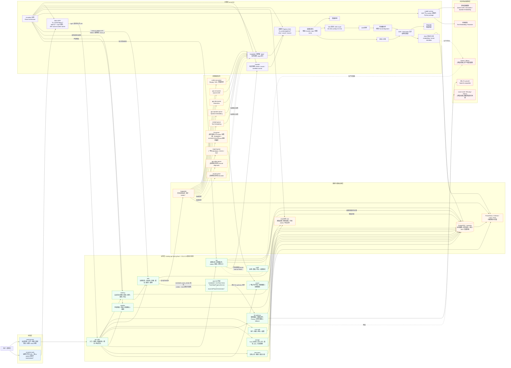

# 本地会议智能系统架构图

基于 `本地会议智能系统技术方案文档-优化版.md` 梳理。核心边界是：Java 使用 Spring Boot + 阿里 COLA-V5 负责业务事实、权限、任务状态、审计和对外 API；Python 负责 AI Pipeline、音频处理和模型调用；所有中间产物进入 PostgreSQL 或 TOS，保证任务可重试、可回放。

## 架构要点

1. MVP 后端采用一个 Spring Boot + 阿里 COLA-V5 模块化单体，不提前拆成多个 Java 微服务；工程按 client / adapter / app / domain / infrastructure / start 分层，分层内按业务域隔离。
2. `meeting-api` 是业务事实来源，`ai-worker` 只负责计算执行，不直接写业务库，也不自行判断用户权限。
3. Java 和 Python 通过队列、TOS URI、结构化 JSON 和 internal callback API 交互。
4. Python 侧采用 FastAPI + Clean Architecture + 基于 pika 的 RabbitMQ 消费者 + 进程内 pipeline DAG（`apps/ai-worker/ai_worker/pipeline/`），RabbitMQ 是唯一 broker；`model-runtime` 在 MVP 是 `ai-worker` 内部包，只有当模型需要独立扩容、依赖隔离或显存隔离时才拆为 HTTP / gRPC 服务。
5. RAG 权限必须由 Java 实时计算，向量库只做候选召回，不能作为权限事实来源。
6. LLM 调用统一经过 `llm-gateway`，集中处理模型路由、数据边界策略、Prompt 版本、结构化输出、fallback 和审计；一期转写文本发送第三方 LLM 前不做脱敏。
7. Pipeline 以进程内 DAG 形式在 `ai-worker` 内执行（`ai_worker/pipeline/`），并按 CPU、ASR、分人、声纹、embedding 拆 RabbitMQ 队列做资源隔离；Forced Alignment 和 Rerank 一期在 `ai-worker` 进程内按需执行或 lazy-load。
8. 一期默认启用 DashScope、pgvector、audio-cpu / gpu-asr / gpu-diar / gpu-speaker / embed / llm / export 队列；不创建 `gpu-align-queue` 和 `rerank-queue`。`llm-queue` 仅在拓扑中保留、无 Python 消费者：`SUMMARY` / `EXTRACTION` 由 Java 进程内消费 `WORKER_DAG_DONE` 事件触发（`TaskStepProgressService` / `JavaLlmPhaseOrchestrator` 经 llm-gateway 调用），不经过 Python。
9. 一期预留但默认不启用：LocalLLM 用于后续高敏或私有化场景，Qdrant / Milvus 用于后续外置向量库，`gpu-align-queue` 用于后续 Forced Alignment 独立扩容，`rerank-queue` 用于后续独立 Rerank 扩容。（会议安全分级与 LLM 阻断门已在 Phase K 移除，会议不分级。）
10. 一期 `export-queue` 由 `meeting-api` Java 进程内的 `export` 模块消费，通过 LibreOffice headless 或等价组件生成 Markdown / DOCX / PDF；不进入 Python `WorkerRunner`。独立 export worker 仅作为后续资源隔离扩展。
11. 数据流向约束：所有 PostgreSQL 业务写操作都源自 `meeting-api`；`ai-worker` 不持有业务库凭证，不直接写 `knowledge_chunks`、`transcript_segments` 或任何声纹表，只能通过 internal callback API 回写结构化结果或 artifact URI。
12. 前端有两个 SPA：`meeting-web`（用户端，仅消费 meeting-api 公开 REST + SSE）和 `ai-worker-web`（运维工作台，由 ai-worker 挂载于 `/workstation/`）。后者采用双后端模式：`/admin/*` 走 ai-worker 的 Admin BFF（`apps/ai-worker/ai_worker/admin/`），`/api/*` 由其透传到 Java 公开 API，鉴权用 Java 签发、ai-worker 校验的 JWT（`aud=ai-worker-admin`）。
